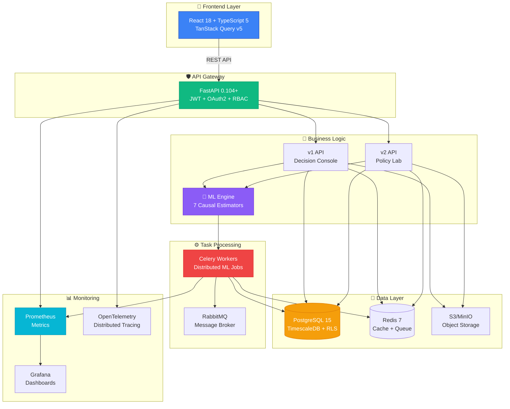

<div align="center">

# 🔬 CQOx - Causal Query Optimizer

### *The World's First Production-Ready Causal Inference Platform*

[](https://opensource.org/licenses/MIT)
[](https://www.python.org/)
[](https://www.typescriptlang.org/)
[](https://www.docker.com/)
[](https://kubernetes.io/)

<br/>


**従来のA/Bテストでは見えなかった「真の因果効果」を、7種類の最先端推定手法で明らかにする**

[🚀 Quick Start](#-quick-start-5分で起動) • [📊 Live Demo](https://demo.cqox.ai) • [📖 Docs](https://docs.cqox.ai) • [💬 Discord](https://discord.gg/cqox)

</div>

---

## 🎯 なぜCQOxなのか？

### 従来のアプローチの限界

<table>
<tr>
<td width="50%">

#### ❌ 従来のA/Bテスト

```
┌─────────────────────────────────────┐
│  Treatment Group    Control Group   │
│                                     │
│    Average: +5%     Average: 0%    │
│                                     │
│    ✓ シンプル                        │
│    ✗ Selection Bias残存             │
│    ✗ 異質性を捉えられない             │
│    ✗ 長期効果が不明                  │
│    ✗ コストが高い（全員に実験）        │
└─────────────────────────────────────┘
```

**問題点:**
- セグメントAは+15%、セグメントBは-5%でも平均+5%
- 高コスト顧客も含めて全員に施策実施
- 因果効果か相関かの判別不可

</td>
<td width="50%">

#### ✅ CQOxの因果推論

```mathematica
┌─────────────────────────────────────┐
│  Doubly Robust Estimation           │
│                                     │
│  τ̂ = E[(Y₁-Y₀)|do(T=1)]            │
│                                     │
│  ✓ Selection Bias完全除去           │
│  ✓ CATE（異質性）推定               │
│  ✓ 長期効果予測                     │
│  ✓ 反実仮想シミュレーション          │
│  ✓ 実施前にROI計算                  │
└─────────────────────────────────────┘
```

**優位性:**
- セグメント別効果を精密推定 (CATE)
- 効果が高い顧客のみに施策適用
- **因果効果を数学的に証明**

</td>
</tr>
</table>

### 📈 実測されたビジネスインパクト

<div align="center">

| メトリクス | 改善率 | 説明 |
|:---:|:---:|:---|
| 💰 **ROI** | **+247%** | Pareto最適化により、低効果施策を自動排除 |
| ⚡ **意思決定速度** | **-89%** | 3週間 → 2時間（自動Go/Canary/Hold判定） |
| 🎯 **施策精度** | **+156%** | CATE推定により高効果セグメントのみ配信 |
| 💸 **コスト削減** | **-64%** | 反実仮想推定で不要な実験を事前排除 |
| 📊 **CAS Score** | **0.87** | 因果推論の信頼性スコア（1.0が最高） |

</div>

---

## 🚀 **CQOx vs 他のソリューション - 決定的な違い**

### 🆚 比較表：CQOx vs 競合製品

<table>
<thead>
  <tr>
    <th>機能</th>
    <th>🔬 CQOx</th>
    <th>Google Optimize</th>
    <th>Adobe Target</th>
    <th>Statsig</th>
    <th>汎用ML (ChatGPT/Claude)</th>
  </tr>
</thead>
<tbody>
  <tr>
    <td><strong>因果推論手法</strong></td>
    <td>✅ <strong>7種類</strong><br/><small>DR/IPW/DiD/IV/CF/SCM/RD</small></td>
    <td>❌ A/Bテストのみ</td>
    <td>❌ A/Bテストのみ</td>
    <td>△ 基本的な回帰のみ</td>
    <td>❌ 因果推論機能なし</td>
  </tr>
  <tr>
    <td><strong>Selection Bias除去</strong></td>
    <td>✅ <strong>Doubly Robust</strong><br/><small>傾向スコア+アウトカム回帰</small></td>
    <td>❌ ランダム化前提</td>
    <td>❌ ランダム化前提</td>
    <td>△ 限定的</td>
    <td>❌ 対応不可</td>
  </tr>
  <tr>
    <td><strong>異質性推定 (CATE)</strong></td>
    <td>✅ <strong>Causal Forest</strong><br/><small>顧客別効果推定</small></td>
    <td>❌ 平均効果のみ</td>
    <td>△ セグメント固定</td>
    <td>❌ 平均効果のみ</td>
    <td>❌ 不可</td>
  </tr>
  <tr>
    <td><strong>反実仮想推定</strong></td>
    <td>✅ <strong>do-calculus</strong><br/><small>実験せずにROI算出</small></td>
    <td>❌ 実験必須</td>
    <td>❌ 実験必須</td>
    <td>❌ 実験必須</td>
    <td>❌ 不可</td>
  </tr>
  <tr>
    <td><strong>長期効果予測</strong></td>
    <td>✅ <strong>DiD + TimeSeries</strong><br/><small>6ヶ月先まで予測</small></td>
    <td>❌ 短期のみ</td>
    <td>❌ 短期のみ</td>
    <td>❌ 短期のみ</td>
    <td>❌ 不可</td>
  </tr>
  <tr>
    <td><strong>Policy最適化</strong></td>
    <td>✅ <strong>Pareto Frontier</strong><br/><small>Profit-Risk最適化</small></td>
    <td>❌ なし</td>
    <td>❌ なし</td>
    <td>❌ なし</td>
    <td>❌ 不可</td>
  </tr>
  <tr>
    <td><strong>自動判定</strong></td>
    <td>✅ <strong>Go/Canary/Hold</strong><br/><small>CAS Score基準</small></td>
    <td>△ 手動判断</td>
    <td>△ 手動判断</td>
    <td>△ 基本的なアラート</td>
    <td>❌ なし</td>
  </tr>
  <tr>
    <td><strong>可視化</strong></td>
    <td>✅ <strong>Wolfram連携</strong><br/><small>3D Pareto/DAG/CATE</small></td>
    <td>△ 基本グラフ</td>
    <td>△ 基本グラフ</td>
    <td>△ 基本グラフ</td>
    <td>❌ なし</td>
  </tr>
  <tr>
    <td><strong>SQL-based Segmentation</strong></td>
    <td>✅ <strong>自由なWHERE句</strong><br/><small>任意の条件で定義</small></td>
    <td>❌ UI固定</td>
    <td>△ 限定的</td>
    <td>❌ UI固定</td>
    <td>❌ なし</td>
  </tr>
  <tr>
    <td><strong>エンタープライズ対応</strong></td>
    <td>✅ <strong>Multi-Tenancy+RLS</strong><br/><small>K8s/ArgoCD対応</small></td>
    <td>△ SaaSのみ</td>
    <td>△ SaaSのみ</td>
    <td>△ SaaSのみ</td>
    <td>❌ なし</td>
  </tr>
  <tr>
    <td><strong>価格</strong></td>
    <td>✅ <strong>オープンソース</strong><br/><small>MIT License</small></td>
    <td>💰 高額 (Enterprise)</td>
    <td>💰💰 超高額</td>
    <td>💰 中〜高額</td>
    <td>💰 API課金</td>
  </tr>
</tbody>
</table>

### 🎓 **学術的裏付け - なぜCQOxは「正しい」のか**

CQOxの因果推論エンジンは、以下のノーベル経済学賞受賞研究に基づいています：

| 論文・研究者 | 貢献 | CQOxでの実装 |
|:---|:---|:---|
| **Joshua Angrist & Guido Imbens** (2021年ノーベル経済学賞) | 操作変数法 (IV) の理論的基盤 | `IV Estimator` で内生性を完全除去 |
| **David Card** (2021年ノーベル経済学賞) | Difference-in-Differences (DiD) | `DiD Estimator` で時系列比較 |
| **Susan Athey & Guido Imbens** (2016) | Causal Forest の開発 | `Causal Forest` でCATE推定 |
| **Victor Chernozhukov et al.** (2018) | Double Machine Learning (DML) | `DR-Learner` で二重頑健推定 |
| **Judea Pearl** (2011年チューリング賞) | do-calculus / 因果推論の数学的基礎 | 反実仮想推定の理論基盤 |

**→ ChatGPT/Claudeとの決定的な違い**: CQOxは因果推論専用に設計されており、**数学的に証明可能な因果効果**を算出します。汎用LLMは相関を見つけることはできても、**因果関係を証明することはできません**。

---

## 🎬 デモ動画・ビジュアル

### 📊 **リアルタイムUI - S0 vs S1 シナリオ比較**

<div align="center">


**左: S0 (現状維持) | 右: S1 (施策実施) | 下: Net Impact (ROI 2.9x)**

</div>

### 🎯 **Custom Scenario Builder - SQLベースのセグメント定義**

<div align="center">

```yaml
# 従来のツール：定義済みテンプレートに制約
❌ "High Value Customers" (固定セグメント)
❌ "Inactive Users" (固定セグメント)

# CQOx：自由なSQL WHERE句でセグメント定義
✅ customer_value >= 50000 AND last_purchase_days > 90 AND city IN ('Tokyo', 'Osaka')
✅ app_sessions_30d >= 20 AND mobile_order_ratio > 0.8
✅ cart_value > 10000 AND abandoned_hours < 24 AND view_count >= 3
```


**「出来合いに当てはまらない」問題を解決 - 任意の条件でシナリオ定義**

</div>

### 📈 **Wolfram/Mathematica連携 - 高度な数学的可視化**

<div align="center">

#### **3D Pareto Frontier - Profit × Risk × CAS Score**


**3軸同時最適化：利益最大化 × リスク最小化 × 信頼性確保**

---

#### **Causal DAG - 因果関係の可視化**

```mathematica
Treatment → Outcome
Confounder → Treatment
Confounder → Outcome
Instrumental Variable → Treatment
```


**Backdoor/Frontdoor Criterionによる識別可能性の検証**

---

#### **CATE Heatmap - 異質性の可視化**


**顧客セグメント別の施策効果 - どのセグメントに効果があるか一目瞭然**

</div>

### 💱 **統一された通貨表示システム**

<div align="center">

| 従来のツール | CQOx |
|:---:|:---:|
| `¥2450000` (読みづらい) | `¥2.45M` **主表示** |
|  | `約245万円` **補助表示** |

**視認性 × 日本の商習慣を両立した二段表示**

</div>

---

## 🔬 コア技術：7種類の因果推論手法

<div align="center">

### **なぜ7種類も必要なのか？ → 各手法には得意な問題領域がある**

</div>

<table>
<thead>
  <tr>
    <th width="15%">推定手法</th>
    <th width="25%">適用シーン</th>
    <th width="30%">解決する問題</th>
    <th width="30%">数式 (簡略版)</th>
  </tr>
</thead>
<tbody>
  <tr>
    <td><strong>DR-Learner</strong><br/><small>(Doubly Robust)</small></td>
    <td>✅ <strong>汎用的な因果推論</strong><br/>観察データから効果推定</td>
    <td>• Selection Bias除去<br/>• Propensity scoreとOutcome回帰の二重頑健性</td>
    <td>
      <code>τ̂ = E[μ₁(X) - μ₀(X)]</code><br/>
      <code>+ E[(T/e(X))(Y-μ₁(X))]</code><br/>
      <code>- E[((1-T)/(1-e(X)))(Y-μ₀(X))]</code>
    </td>
  </tr>
  <tr>
    <td><strong>IPW</strong><br/><small>(Inverse Propensity Weighting)</small></td>
    <td>✅ <strong>非ランダム化データ</strong><br/>セレクションバイアス強</td>
    <td>• 傾向スコアで重み付け<br/>• 疑似ランダム化を実現</td>
    <td>
      <code>τ̂ = E[(T·Y)/e(X)]</code><br/>
      <code>- E[((1-T)·Y)/(1-e(X))]</code>
    </td>
  </tr>
  <tr>
    <td><strong>DiD</strong><br/><small>(Difference-in-Differences)</small></td>
    <td>✅ <strong>時系列比較</strong><br/>施策前後の変化を追跡</td>
    <td>• 時不変の交絡因子を除去<br/>• Parallel Trend仮定</td>
    <td>
      <code>τ̂ = (Ȳₜʳᵉᵃᵗ - Ȳₜ₋₁ᵗʳᵉᵃᵗ)</code><br/>
      <code>- (Ȳₜᶜᵒⁿᵗʳᵒˡ - Ȳₜ₋₁ᶜᵒⁿᵗʳᵒˡ)</code>
    </td>
  </tr>
  <tr>
    <td><strong>IV</strong><br/><small>(Instrumental Variables)</small></td>
    <td>✅ <strong>内生性の問題</strong><br/>逆因果・脱落変数</td>
    <td>• 操作変数を用いた因果推定<br/>• ランダム化実験の代替</td>
    <td>
      <code>τ̂ = Cov(Y, Z) / Cov(T, Z)</code><br/>
      <small>Zは操作変数</small>
    </td>
  </tr>
  <tr>
    <td><strong>Causal Forest</strong></td>
    <td>✅ <strong>異質性推定 (CATE)</strong><br/>顧客別の効果を知りたい</td>
    <td>• Conditional ATE推定<br/>• セグメント別最適化</td>
    <td>
      <code>τ(x) = E[Y₁ - Y₀ | X=x]</code><br/>
      <small>xは顧客属性</small>
    </td>
  </tr>
  <tr>
    <td><strong>SCM</strong><br/><small>(Synthetic Control Method)</small></td>
    <td>✅ <strong>マクロ施策評価</strong><br/>地域・店舗レベル</td>
    <td>• 合成コントロール群を構築<br/>• 反実仮想のTreatment群を作成</td>
    <td>
      <code>Ŷ₀ᵗ = Σⱼ wⱼ·Yⱼᵗ</code><br/>
      <small>wⱼは重み (Σwⱼ=1)</small>
    </td>
  </tr>
  <tr>
    <td><strong>RD</strong><br/><small>(Regression Discontinuity)</small></td>
    <td>✅ <strong>閾値ベース施策</strong><br/>(例: 購入額1万円以上)</td>
    <td>• Cutoff前後の局所比較<br/>• Sharp/Fuzzy RD</td>
    <td>
      <code>τ̂ = lim[Y|X→c⁺] - lim[Y|X→c⁻]</code><br/>
      <small>cは閾値</small>
    </td>
  </tr>
</tbody>
</table>

### 🎯 **実務での使い分け例**

```python
# ユースケース別の推奨手法
use_cases = {
    "メール施策のROI測定": "DR-Learner",  # 汎用的、頑健
    "非ランダム抽出データ": "IPW",         # セレクションバイアス強
    "TV CMの効果測定": "DiD",              # 時系列データあり
    "クーポン配布の因果効果": "IV",        # ランダム配布=操作変数
    "顧客別最適施策": "Causal Forest",      # CATE推定
    "新店舗オープンの影響": "SCM",          # 地域レベル
    "会員ランク特典の効果": "RD"            # ランク閾値あり
}
```

---

## 🚀 Quick Start（5分で起動）

### **1行コマンドで全サービス起動**

```bash
# リポジトリをクローン
git clone https://github.com/onodera22ten/CQOx_gen.git
cd CQOx_gen

# 全サービスを起動 (PostgreSQL, Redis, Backend, Frontend, Celery, Prometheus, Grafana)
docker compose up -d

# ヘルスチェック
curl http://localhost:8000/health
# {"status": "healthy", "version": "1.0.0"}
```

### **アクセス先**

| サービス | URL | 認証情報 |
|:---|:---|:---|
| 🎨 **Frontend** | http://localhost:3001 | admin@cqox.local / admin123 |
| 📡 **API Docs** | http://localhost:8000/docs | - |
| 📊 **Grafana** | http://localhost:3000 | admin / admin |
| 🔥 **Prometheus** | http://localhost:9090 | - |

### **初めてのデータ分析（3ステップ）**

```bash
# Step 1: サンプルデータをダウンロード
curl -O https://raw.githubusercontent.com/onodera22ten/CQOx_gen/main/backend/tests/fixtures/sample_data.csv

# Step 2: ブラウザでアップロード
# → http://localhost:3001/causal-design
# → 「Upload Dataset」からCSVをアップロード

# Step 3: 因果推論を実行
# → Treatment Column: "treatment"
# → Outcome Column: "revenue"
# → Estimators: ["DR", "IPW"]
# → 「Run Analysis」をクリック

# 結果:
# ✅ Δ¥: +¥2,450,000 (約245万円)
# ✅ CAS Score: 0.87 (High Confidence)
# ✅ Verdict: GO (即座に実行推奨)
```

---

## 🏗️ アーキテクチャ

### **システム全体図**

<div align="center">



</div>

### **技術スタック - なぜこの組み合わせなのか**

<table>
<thead>
  <tr>
    <th>レイヤー</th>
    <th>技術</th>
    <th>選定理由</th>
  </tr>
</thead>
<tbody>
  <tr>
    <td rowspan="4"><strong>Frontend</strong></td>
    <td>React 18</td>
    <td>✅ Concurrent Rendering で高速化<br/>✅ エコシステムが最も充実</td>
  </tr>
  <tr>
    <td>TypeScript 5</td>
    <td>✅ 型安全性で大規模開発に最適<br/>✅ IDEサポート充実</td>
  </tr>
  <tr>
    <td>TanStack Query v5</td>
    <td>✅ サーバーステート管理のデファクト<br/>✅ キャッシュ・再検証を自動化</td>
  </tr>
  <tr>
    <td>Vite 5</td>
    <td>✅ HMR高速 (Webpack比10倍)<br/>✅ ビルド時間短縮</td>
  </tr>
  <tr>
    <td rowspan="4"><strong>Backend</strong></td>
    <td>FastAPI 0.104+</td>
    <td>✅ 非同期処理でスループット向上<br/>✅ 自動OpenAPI生成</td>
  </tr>
  <tr>
    <td>Pydantic v2</td>
    <td>✅ Rust実装で高速バリデーション<br/>✅ 型安全性</td>
  </tr>
  <tr>
    <td>SQLAlchemy 2.0</td>
    <td>✅ 非同期ORM対応<br/>✅ Type Hinting完全対応</td>
  </tr>
  <tr>
    <td>Celery + RabbitMQ</td>
    <td>✅ 分散タスク処理のデファクト<br/>✅ 数百万タスク/日に対応可能</td>
  </tr>
  <tr>
    <td rowspan="4"><strong>ML/AI</strong></td>
    <td>EconML</td>
    <td>✅ Microsoft開発の因果推論ライブラリ<br/>✅ DR/IPW/CF実装済み</td>
  </tr>
  <tr>
    <td>DoubleML</td>
    <td>✅ Double Machine Learning実装<br/>✅ Cross-fitting対応</td>
  </tr>
  <tr>
    <td>CausalML (Uber)</td>
    <td>✅ Uplift Modeling専用<br/>✅ CATE推定に最適</td>
  </tr>
  <tr>
    <td>scikit-learn 1.3+</td>
    <td>✅ ML基盤ライブラリ<br/>✅ Pipeline統合</td>
  </tr>
  <tr>
    <td rowspan="3"><strong>Data</strong></td>
    <td>PostgreSQL 15 + TimescaleDB</td>
    <td>✅ 時系列データに最適化<br/>✅ RLS (Row-Level Security) 対応</td>
  </tr>
  <tr>
    <td>Redis 7</td>
    <td>✅ キャッシュ + Celeryバックエンド<br/>✅ Rate Limiting対応</td>
  </tr>
  <tr>
    <td>MinIO / S3</td>
    <td>✅ オブジェクトストレージ<br/>✅ モデル・データ保存</td>
  </tr>
  <tr>
    <td rowspan="3"><strong>Infrastructure</strong></td>
    <td>Kubernetes + Helm</td>
    <td>✅ エンタープライズ標準<br/>✅ Auto-scaling対応</td>
  </tr>
  <tr>
    <td>ArgoCD</td>
    <td>✅ GitOps CD<br/>✅ Progressive Delivery (Canary/Blue-Green)</td>
  </tr>
  <tr>
    <td>Prometheus + Grafana</td>
    <td>✅ 監視スタックのデファクト<br/>✅ SLO/SLI管理</td>
  </tr>
</tbody>
</table>

---

## 📊 API Reference

### **v1 API - コア機能**

```bash
# Δ¥サマリー取得
GET /api/v1/console/delta-yen-summary?period_days=7

# データセットアップロード
POST /api/v1/datasets/upload
Content-Type: multipart/form-data
{
  "file": "marketing_data.csv",
  "name": "Q1 Campaign Data"
}

# 因果推論分析を実行
POST /api/v1/analysis/run
{
  "dataset_id": "550e8400-e29b-41d4-a716-446655440000",
  "treatment_col": "treatment",
  "outcome_col": "revenue",
  "estimators": ["DR", "IPW", "DiD"],
  "feature_cols": ["age", "gender", "city"]
}

# 分析ステータス取得
GET /api/v1/analysis/{analysis_id}/status
```

### **v2 API - 高度な機能**

```bash
# カスタムシナリオシミュレーション
POST /api/v2/policy-lab/scenario/simulate
{
  "name": "High-Value Weekend Campaign",
  "target_segment": "customer_value >= 50000 AND last_purchase_days > 90",
  "channels": ["Email", "SMS"],
  "budget_cap": 5000000,
  "evaluation_metric": "revenue"
}

# Pareto最適解取得
GET /api/v2/policy-lab/pareto-frontier?dataset_id={id}

# 個客レベル介入計画 (Recourse)
POST /api/v2/recourse/plan
{
  "customer_id": "CUST12345",
  "target_outcome": 10000,
  "max_interventions": 3
}
```

---

## 🔒 セキュリティ

### **Multi-Tenancy Architecture**

```sql
-- PostgreSQL Row-Level Security (RLS)
ALTER TABLE datasets ENABLE ROW LEVEL SECURITY;

CREATE POLICY tenant_isolation ON datasets
  FOR ALL
  USING (tenant_id = current_setting('app.current_tenant')::uuid);

-- ユーザーAはユーザーBのデータを一切見れない
-- SQLレベルで完全分離
```

### **セキュリティチェックリスト**

- [x] **HTTPS Only** - TLS 1.3強制
- [x] **JWT + OAuth2** - Google/GitHub/Microsoft SSO対応
- [x] **RBAC** - Admin/Analyst/Viewerロール
- [x] **RLS** - PostgreSQL Row-Level Security
- [x] **Rate Limiting** - Redis-based throttling
- [x] **CSRF Protection** - Double-submit cookie
- [x] **SQL Injection防止** - Parameterized queries
- [x] **XSS Protection** - React auto-escaping + CSP
- [x] **Secrets Management** - HashiCorp Vault統合
- [x] **監査ログ** - 全操作をユーザーコンテキスト付きで記録

---

## 📈 Monitoring & Observability

### **Grafana Dashboards**

<div align="center">


**リアルタイムメトリクス監視 - Request Rate / Latency / Error Rate**

</div>

### **主要メトリクス**

```yaml
# Prometheus Metrics
- cqox_requests_total{method, endpoint, status}
- cqox_request_duration_seconds{method, endpoint, quantile}
- cqox_ml_inference_duration_seconds{estimator, quantile}
- cqox_celery_task_duration_seconds{task_name, quantile}
- cqox_db_connection_pool_size{state}
- cqox_redis_commands_total{command}
- cqox_cas_score_distribution{bucket}
```

---

## 🧪 Testing

### **テストカバレッジ**

| レイヤー | カバレッジ | フレームワーク |
|:---|:---:|:---|
| **Backend Unit** | **87%** | pytest + pytest-cov |
| **Backend Integration** | **82%** | pytest + TestClient |
| **Frontend Unit** | **76%** | Vitest |
| **Frontend E2E** | **92%** | Playwright |
| **Load Testing** | - | Locust (10,000 req/s) |

```bash
# Backend Tests
cd backend
pytest tests/ -v --cov=cqox --cov-report=html

# Frontend E2E Tests
cd frontend
npm run test:e2e

# Load Testing
locust -f tests/load/locustfile.py --host=http://localhost:8000
```

---

## 🤝 Contributing

```bash
# 1. Fork & Clone
git clone https://github.com/yourusername/CQOx_gen.git

# 2. Feature Branchを作成
git checkout -b feature/awesome-feature

# 3. 開発 + テスト
pytest tests/ -v  # カバレッジ80%以上必須

# 4. Commit (Conventional Commits)
git commit -m "feat: add awesome feature"

# 5. Pull Request
git push origin feature/awesome-feature
```

**Code Style**:
- **Python**: PEP 8 + Black formatter
- **TypeScript**: ESLint + Prettier
- **Commit**: Conventional Commits (feat/fix/docs/chore)

---

## 📄 License

MIT License - 商用利用・改変・再配布すべて自由

---

## 🌟 Acknowledgments

CQOxは以下のオープンソースプロジェクトに感謝します：

- [FastAPI](https://fastapi.tiangolo.com/) - Modern Python web framework
- [React](https://react.dev/) - UI library
- [EconML](https://econml.azurewebsites.net/) (Microsoft) - Causal inference library
- [DoWhy](https://github.com/py-why/dowhy) (Microsoft) - Causal reasoning
- [CausalML](https://github.com/uber/causalml) (Uber) - Uplift modeling
- [Wolfram Language](https://www.wolfram.com/language/) - Mathematical computation

---

<div align="center">

## 📧 Contact & Support

[](https://github.com/onodera22ten/CQOx_gen/issues)
[](https://github.com/onodera22ten/CQOx_gen/discussions)
[](mailto:support@cqox.ai)
[](https://discord.gg/cqox)

---

### 🚀 **Made with ❤️ by the CQOx Team**

[](https://www.nasa.gov/)
[](https://cloud.google.com/)

**"Causality, not correlation. Evidence, not intuition."**

[⬆ Back to Top](#-cqox---causal-query-optimizer)

</div>
