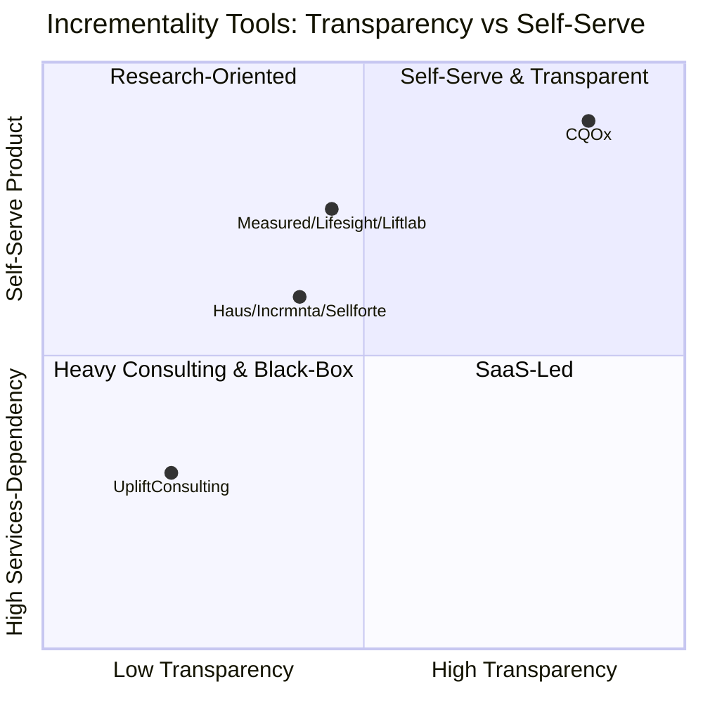
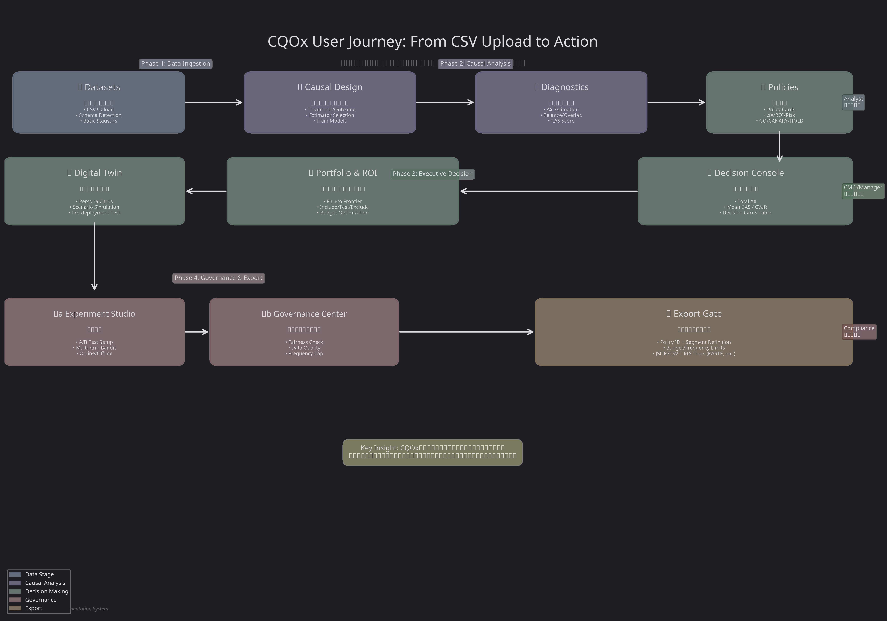
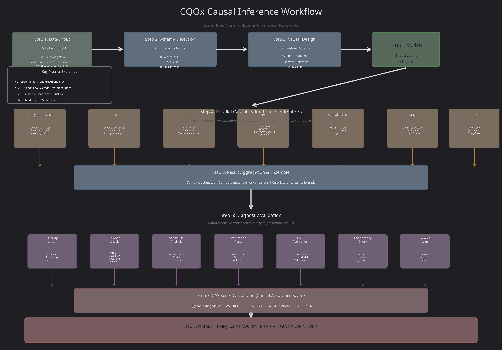
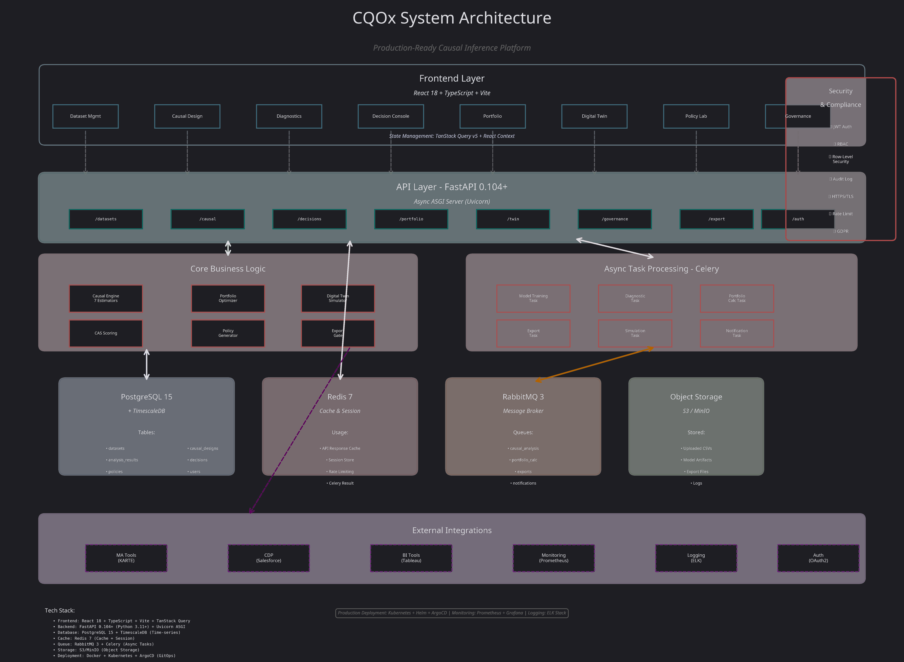
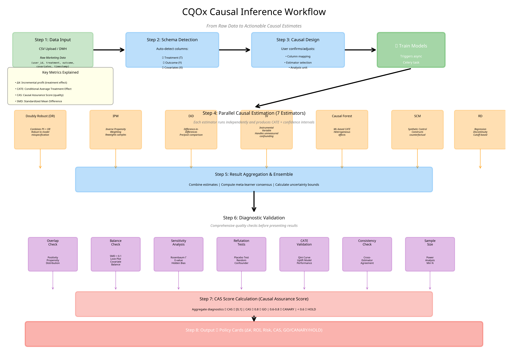

# CQOx – Causal Marketing Decision Platform

**📖 Documentation**
**🇺🇸 English (Full)** | [🇯🇵 日本語 (Full)](README_jp.md)

---

**CQOx** is not a tool that "outputs results in a black-box AI manner."

Rather, it is a platform that bundles together

causal inference, experimentation, portfolio optimization, and governance

to provide a decision console like those used internally by Big Tech companies,

in a form that regular enterprises can operate.

Unlike project-based analyses like those from WPP / BCG / Accenture,

and unlike generic AI tools,

it is a tool that answers with numbers, based on causal inference,

questions like "How much profit did this policy actually generate?" and

"Which combination should be run to be most rational?" and connects these answers to decision-making.

---

### 💡 What is CQOx

> **Top teams at Google / Netflix / Meta / WPP / BCG have built internally**  
> **"causal-based decision console"** and  
> **we have made it accessible for regular enterprises**.
>

---

## 1. Why CQOx is Needed

Most tools stop here:

- **Visual dashboards**: Graphs showing "what happened" such as CVR, revenue, open rates
- **Black-box scores**: Machine learning scores such as "purchase probability: 0.83"

However, what management and marketing professionals actually ask are questions like these:

- "If we run this policy on this segment,  
  **how much profit increased (Δ¥) can we say?**"
- "How much **risk** are we taking? How much loss could we face at worst?"
- "With this policy portfolio,  
  are we maximizing growth while maintaining budget, risk, and fairness constraints?"

Top companies like Google / Meta / Netflix / Amazon, and consulting firms like WPP / BCG / Accenture  
have internal stacks that combine the following four:

1. **Causal inference** (uplift, DiD, IV, RD, SCM, etc.)
2. **Experimentation platforms** (A/B testing, multi-armed bandits)
3. **Portfolio optimization** (profit vs risk, CVaR)
4. **Governance** (fairness, frequency caps, quality gates)

CQOx packages these patterns into a single product.

---

## 2. What Makes CQOx Different

### 2.1 Differences from BI Dashboards

- BI is a tool that displays "what happened" (revenue, CVR) nicely.
- CQOx estimates "how much changed **as a result of** running the policy (Δ¥)"  
  and further simulates "what would change if we change the policy."

Key points:

- The center of all views is **incremental profit (Δ¥)**  
  Looking at "the increase because we did it," not net revenue.
- Analysis is fundamentally **policy-based (Policy unit)**  
  (e.g., "Send Push V3 three times to RFM4-5 with App")
- All numbers are linked to **CAS (Causal Assurance Score)** and **risk metrics**

---

### 2.2 Differences from AI / Machine Learning Tools

Typical "AI marketing support tools" work as follows:

- **Predictive** models (classification, regression) for purchase probability, churn probability, etc.
- Objective function is statistical metrics like AUC / logloss / MSE
- Simple decision rules like "distribute to people in order of high scores"

In other words:

- Create **predictive models** such as "purchase probability" and "churn probability"
- Learn to minimize statistical loss functions such as **AUC and logloss**
- Interpret prediction scores directly as "high score = target"

In contrast, CQOx is fundamentally different:

- **Deals with "what if we hadn't done it?" (causality), not prediction**  
  - AI makes **predictions** like "Given current information, is this person likely to buy?"  
  - AI: P(Y=1 | X) (Is this person likely to buy?)
  - CQOx estimates **counterfactuals** like "For this person, how much would sales change  
    **between sending the policy and not sending it?**"  
  - CQOx: E[Y(1) - Y(0) | X] (For this person, how much would results change between running and not running the policy?)
  - The latter is about **causal effects (uplift / Δ¥)**, and the model structure and evaluation are completely different
  - For this reason, estimators, assumptions, and diagnostics are all explicit

- **Metrics are profit, risk, and fairness, not AUC**  
  - The goal is to "maximize Δ¥ while suppressing risk and unfairness."  
  - Even if clicks or CVR increase, if **incremental profit is negative**, it is judged as a "bad policy."
  - AI tools tend to say "CVR increased, so success," but
    CQOx judges "CVR increased, but if including costs and cannibalization, Δ¥ is negative, then failure."
  - The premise is to evaluate "did the company's wallet increase?" not "how much did we hit?"

- **Auditable mechanism (guarantee of governance and transparency), not black-box**  
  - Estimators such as DR / IPW / DiD / IV / CF / SCM / RD are visible from the UI
  - Balance checks, overlap, and sensitivity analysis can also be confirmed on screen
  - Data scientists can trace "why is this policy a Go verdict?"
  - Also, because governance is built in from the start, CQOx does not simply output "recommended scores," but checks rules such as Fairness / Frequency Cap / Data Quality in the Governance Center before raising them to the Decision Console

This allows control at a layer above AI on perspectives such as "are we placing excessive burden on specific attributes only?" "are we destroying long-term LTV for short-term profit?" "is contact frequency excessive and causing brand damage?"

- **AI is only a "support role"**
  - CQOx can use LLMs for "textualization of policy recommendations" and "summary of diagnostic reports," but
  - AI does not override causal estimates or governance rules
  - The basis for decisions is purely causal inference and rule-based
  - It does not automatically give a GO sign without the judgment of governance rules (fairness, frequency caps, quality gates) and final human approval
  - This design allows us to avoid the state of "not knowing why AI made this judgment" and incorporate only the convenience of AI in a form that can withstand audit, reproducibility, and compliance

In summary:

> Generic AI is good at "finding patterns."  
> CQOx specializes in estimating the **effects** of policies  
> and **incorporating those results into decisions** from the perspective of profit and risk.

In other words, no matter how much data is increased, because the questions themselves are different, it does not become a structure where "causality comes for free if we run predictive models larger."

---

### 2.3 vs. Commercial A/B Testing & Experimentation Platforms

### 2.3 vs. Commercial A/B Testing & Experimentation Platforms

| Capability | CQOx | [Optimizely](https://www.optimizely.com/) | [VWO](https://vwo.com/) | [AB Tasty](https://www.abtasty.com/) | [Dynamic Yield](https://www.dynamicyield.com/) |
|------------|------|------------|-----|----------|---------------|
| **Causal Inference Methods** | 7 estimators (DR, IPW, DiD, IV, CF, SCM, RD) | A/B test only | A/B test only | A/B test only | A/B test only |
| **Selection Bias Removal** | Doubly Robust + Propensity Score | ❌ Requires perfect randomization | ❌ Requires perfect randomization | ❌ Requires perfect randomization | ❌ Requires perfect randomization |
| **Heterogeneous Treatment Effects (CATE)** | ✅ Customer-level effects via Causal Forest | ❌ Average effect only | ❌ Average effect only | △ Pre-defined segments | △ Pre-defined segments |
| **Counterfactual Simulation** | ✅ Predict ROI before rollout | ❌ Must run experiment | ❌ Must run experiment | ❌ Must run experiment | △ Limited scenarios |
| **Long-term Effect Prediction** | ✅ DiD + TimeSeries (6-month forecast) | ❌ Short-term only | ❌ Short-term only | ❌ Short-term only | ❌ Short-term only |
| **Instrumental Variables** | ✅ Handle endogeneity/confounding | ❌ Not supported | ❌ Not supported | ❌ Not supported | ❌ Not supported |
| **Policy Optimization** | ✅ Pareto Frontier (Profit-Risk-Confidence) | △ Basic rules | ❌ No optimization | △ Basic rules | △ Basic rules |
| **SQL-based Segmentation** | ✅ Arbitrary WHERE clauses | ❌ UI-locked | ❌ UI-locked | △ Limited | △ Limited |
| **Deployment** | ✅ Open source, self-hosted, K8s-ready | SaaS only | SaaS only | SaaS only | SaaS only |
| **Pricing** | **Contact for pricing** | $200k+/year | $100k+/year | $150k+/year | $250k+/year |

**Other Commercial Solutions:**
- **[Optimize Next](https://optimize-next.com/)** - Google Optimize alternative with similar A/B testing capabilities
- **[SiTest](https://sitest.jp/)** - Japanese market leader in web optimization (Japan)
- **[DLPO](https://dlpo.jp/)** - Landing page optimization platform (Japan)
- **[Juicer](https://juicer.cc/)** - User behavior analytics and personalization (Japan)

**Why CQOx?** CQOx eliminates the need for perfect randomization through causal inference, enabling organizations to measure ROI from observational data (historical campaigns, natural experiments) that commercial tools cannot handle.

---

### 2.4 Differences from Large Language Models (ChatGPT, Claude, GPT-4)

| Capability | CQOx | ChatGPT/Claude/GPT-4 |
|------------|------|----------------------|
| **Causality vs Correlation** | ✅ Proves mathematical causation | ❌ Finds statistical correlations |
| **Counterfactual Reasoning** | ✅ Computes P(Y \| do(X)) via do-calculus | ❌ Cannot reason about interventions |
| **Selection Bias Handling** | ✅ Doubly Robust, IPW | ❌ Assumes i.i.d. data |
| **Confidence Intervals** | ✅ Bootstrap CI with p-values | ❌ No statistical guarantees |
| **Reproducibility** | ✅ Deterministic algorithms | ❌ Non-deterministic sampling |
| **Domain Expertise** | ✅ Built on Nobel Prize research (Angrist, Imbens, Pearl) | ❌ General-purpose text prediction |
| **Regulatory Compliance** | ✅ Explainable, auditable | ❌ Black box |

**Example**:
- **LLM**: "Users who clicked the ad bought 20% more" (correlation)
- **CQOx**: "Showing the ad *caused* a 23% increase in purchases (95% CI: [18%, 28%], p<0.001) in high-value customers, but -5% in low-value customers" (causation + heterogeneity)

---

### 2.5 Differences from Big Tech (Google / Meta / Netflix / Amazon)

Generally speaking, Big Tech companies like Google / Meta / Netflix / Amazon have internal stacks as follows:

- Large-scale **experimentation platforms** (A/B testing, multi-armed bandits)
- **Causal inference teams** (uplift, DiD, IV, SCM, RD...) + in-house libraries
- **Portfolio / explore-exploit optimization** (which experiments and policies to run and how much)
- **Governance / fairness / content quality** review systems

CQOx can be understood as extracting only the important parts in the marketing context and "packaging them so that external companies can operate with (relatively) fewer people."

**Specific Differences:**

- **Big Tech in-house is superior in scale and customizability**
  - Big Tech has dedicated causal models, experimental designs, and online inference infrastructure for each product
  - CQOx does not go that far in hyper-customization, but instead provides a **common framework usable across industries**

- **CQOx has advantages in transparency and onboarding costs**
  - Big Tech's in-house infrastructure is optimized for "people inside," but it takes a very long time for external people to understand
  - CQOx is designed so that CMO / marketing staff / DS / operations can discuss while looking at the same UI

- **Focuses on "customer-side decision-making"**
  - Big Tech platforms are for optimizing their own services
  - CQOx is different in that it centers on "client-side P&L and governance"

---

### 2.6 Differences from WPP / BCG / Accenture and Other Consultants

Consulting firms like WPP / BCG / Accenture provide marketing effectiveness measurement, MMM, and uplift analysis on a **project basis**.

**Strengths:**

- **Comprehensive support** including story design for management and organizational design
- Custom model and metric design for individual companies

**Typical Output:**

Taking months to half a year to create slides / PDFs / temporary dashboards and produce reports saying "these policies were effective"

**In contrast, CQOx:**

- **"Standing console," not "one-time analysis"**
  - Every time data is updated, Δ¥ / risk / CAS / portfolio are updated with the same logic
  - It is a tool to see "how things are now" every week / every day, not to read reports

- **Can drill down to individual customer-level policies**
  - Consultant reports tend to focus on channel-level or campaign-level
  - CQOx assumes policy-level decisions drilled down to segment × channel × timing × frequency

- **Focuses on offline policy learning "before" policies**
  - Many projects emphasize "post-policy evaluation," but CQOx focuses on offline policy learning (pre-simulation) for "what should we run next?"

---

### 2.7 📊 Competitive Landscape Visualization

CQOx belongs to the same "**incrementality measurement**" space as specialized causal inference and marketing mix modeling (MMM) platforms. However, our positioning and value proposition differ significantly:

**Key Incrementality & Causal Measurement Players:**
- **[Measured](https://www.measured.com/)** - Marketing incrementality measurement SaaS
- **[Lifesight](https://lifesight.io/)** - Marketing attribution and incrementality platform
- **[Liftlab](https://www.liftlab.io/)** - Incrementality testing for growth teams
- **Haus / Incrmnta / Sellforte** - MMM and incrementality SaaS providers

| Dimension | CQOx | Measured / Lifesight / Liftlab | Haus / Incrmnta / Sellforte | Uplift Consulting Firms |
|-----------|------|--------------------------------|------------------------------|-------------------------|
| **Product vs Consulting Dependency** | **Self-serve product**. Upload CSV/Parquet and analysts can run analyses independently without vendor support | Mostly self-serve with onboarding support | Tool + vendor support required. Initial setup and design typically require external resources | Almost fully consulting-driven. Analysis through insight delivery depends on external teams |
| **Causal Inference Transparency** | **20+ estimators (DR/IPW/DiD/IV/CF/SCM/RD) implemented as OSS**. Algorithms can be validated and extended in-house | Some methodologies disclosed, but proprietary implementations | Some implementations are black-box. Modeling details and reproducible code often not provided | Analysis logic summarized in reports only. Code and models typically not delivered |
| **Self-Hosting / Security Requirements** | **Self-hostable (on-prem / VPC / K8s)**. Data never leaves your infrastructure | Managed SaaS only. Data must be uploaded to vendor cloud | Primarily managed SaaS. Difficult to use with strict PII or regulatory requirements | Analysis requires data transfer. Operates under NDA but assumes routine data exports |
| **Multi-Estimator & Quality Gates** | **7 primary estimators + OPE/g-computation combinations**. Quality gates (Overlap, weak IV, RD manipulation tests) enforced in UI | Platform-specific methodology (often single approach) | Focused evaluation on specific methods. Quality inspection internals are tool-dependent and often opaque | Ad-hoc method selection per project. Quality standards vary across engagements |



---

## 3. User Journey: From Data Upload to Decision Making

> **CQOx is not a collection of disconnected features.**  
> It is a **single, coherent story** from CSV upload to deployment, designed so that  
> *"which policy, to whom, and how much"* flows naturally from data to decision to export.

This section explains the **end-to-end workflow** that users experience in CQOx.



---

### 3.1 ① Datasets – Bringing in Your Data

**Story Step:** *"What ingredients are in the refrigerator?"*

At this stage, you are **not yet analyzing**—you are simply **uploading and inspecting** your raw marketing data.


**What happens here:**

1. **CSV Upload** or connection to data warehouse (BigQuery, Snowflake, PostgreSQL, etc.)
   - Example file: `marketing_campaign_10k_processed.csv`
   - Contains columns: `user_id`, `treatment`, `outcome`, `cost`, `channel`, `age`, `income`, demographics, etc.

2. **Automatic Schema Detection**
   - CQOx scans the uploaded data and identifies:
     - Number of rows and columns
     - Data types (numeric, categorical, datetime)
     - Missing values and basic statistics
     - Potential treatment/outcome columns based on naming patterns

3. **Data Preview**
   - View the first N rows
   - Check column distributions
   - Verify data quality before proceeding to causal design

**At this point, you have NOT done any causal inference yet.**  
You have simply confirmed: *"This is the raw material I'm working with."*

---

### 3.2 ② Causal Design – Creating the Blueprint

**Story Step:** *"What is the difference between treatment A and B? What is the outcome? Which estimators should we use?"*

Here you **design the causal inference problem**. You are not running models yet—you are **specifying the blueprint** that will guide all subsequent analysis.

#### Step 1: Estimator Selection and Model Training


**What happens here:**

- **Dataset Selection**: Choose which uploaded dataset to analyze
- **Scenario Definition**: Baseline vs Treatment Scenario (e.g., S0 vs S1, A/B Test)
- **Target Metric**: Define what outcome variable you want to measure (y = ?)
- **Auto-Detection of Columns**:
  - **Treatment Column** `(auto-detected)`: `treatment`, `arm`, `variant`
  - **Outcome Column** `(auto-detected)`: `y`, `revenue`, `delta_yen`
  - **Feature Columns** `(auto-detected)`: Demographics, behavior, context variables
- Users can override any auto-detected column assignment

#### Step 2: Column Mapping and Feature Selection


**Estimator Selection:**

Choose which causal inference methods to run in parallel:
- ☑ **DR (Doubly Robust)**: Combines propensity score + outcome regression
- ☑ **IPW (Inverse Propensity Weighting)**: Reweights samples based on propensity
- ☐ **DiD (Difference-in-Differences)**: Pre/post comparison with control
- ☐ **IV (Instrumental Variables)**: Handles unmeasured confounding
- ☐ **CF (Causal Forest)**: ML-based CATE for heterogeneous effects
- ☐ **SCM (Synthetic Control)**: Constructs counterfactual from donor pool
- ☐ **RD (Regression Discontinuity)**: Cutoff-based treatment

**Click "実行中..." (Train Models)** → Triggers async Celery tasks

**Recent Analyses Table:**
- Shows all past causal analysis runs
- Columns: `ID`, `Status` (running/completed), `Δ¥`, `Verdict` (Go/Canary/Hold), `Started`
- Each row is clickable to view detailed results

#### Step 3: View Causal Analysis Result


**Result Card shows:**

- **Expected Δ¥**: `+¥133,177` (incremental profit)
- **95% CI**: [¥133,177, ¥133,177] (confidence interval)
- **CAS Score**: `0.15` (Low Confidence) — **This is the key quality metric**
- **Verdict**: `✓ GO` (automated decision based on CAS, ROI, and risk)
- **Decision Rationale**: "Low risk with high expected profit. Causal quality checks passed."
- **Recommendations**:
  - Proceed with policy deployment
  - Monitor key metrics for first 7 days
  - Set up automated alerts for anomalies

**Button**: `View Detailed Diagnostics →` (leads to Section 3.3)

#### Step 4: S0 vs S1 Scenario Comparison


**Side-by-Side Comparison:**

| Metric | S0: Baseline (Status Quo) | S1: Treatment (After Policy Implementation) |
|--------|------------------------|---------------------------|
| **Revenue** | ¥0 (No intervention) | **+¥133,177** (Incremental) |
| **Cost** | ¥0 (Status quo) | ¥251K (Campaign cost) |
| **Conversion Rate** | 2.4% (Baseline) | - |
| **Users Affected** | 0 (Control group) | 4,152 (Treatment group) |
| **Projected Outcome/User** | - | ¥936.2 (+¥267.0/user uplift) |

**Key Insight:**

> This comparison answers: *"What is the causal difference in outcomes between doing nothing (S0) and deploying this policy (S1)?"*  
> The Δ¥ = S1 - S0 is the **incremental profit** attributable to the intervention.

**At this point:**
- You have specified the causal blueprint (Treatment, Outcome, Covariates)
- You have run multiple estimators in parallel
- You have received a **CAS Score** that indicates how trustworthy the estimate is
- You have seen the **S0 vs S1 comparison** that quantifies the causal effect

**Next step:** Dive deep into **Diagnostics** (Section 3.3) to understand *why* the CAS score is what it is.

---

### 3.3 ③ Diagnostics & Audit – Causal Quality Assurance

**Story Step:** *"Is this causal estimate trustworthy? Can we rely on this GO/CANARY/HOLD decision?"*

After running the causal analysis in Section 3.2, you now need to **validate the quality** of the causal inference. This is where the **CAS (Causal Assurance Score)** is calculated and where you verify that the treatment and control groups are comparable, the model is robust, and the heterogeneous treatment effects are credible.

CQOx provides **two modes** for diagnostics:

1. **ViewerMode** – Executive-friendly summary for decision-makers
2. **AnalystMode** – Deep diagnostic suite for data scientists

---

#### ViewerMode: Executive Summary

**For:** CEOs, Marketing Directors, Non-technical stakeholders

**Goal:** Get a quick GO/CANARY/HOLD verdict with confidence level at a glance.


**What you see:**

- **CAS Score**: 0.15 (Low Confidence / Quality Level: LOW)
- **Overall Quality**: LOW (CAS Score: 0.15)
- **Validation Status**: 6/9 diagnostic checks passed successfully
- **Confidence Level**: MODERATE (Robustness: Γ=1.0)

**Executive Summary:**

- **Quality Assessment**: The causal analysis has achieved a LOW quality rating with a Causal Assurance Score (CAS) of 0.15. This score indicates limited confidence in the causal estimates.
- **Validation Results**: 6 out of 9 diagnostic checks passed successfully. 3 area(s) require attention.
- **Robustness**: The analysis shows moderate robustness to potential unmeasured confounding (Γ = 1.00). Consider additional validation if unmeasured confounders are plausible.

This single screen answers: *"Can I trust this result enough to make a decision?"*

---


**Key Quality Indicators:**

| Indicator | Status | Details |
|-----------|--------|---------|
| **Data Quality** | ⚠️ WARN | Covariate balance: SMD 2.541 (threshold: 0.1) |
| **Statistical Power** | ⚠️ WARN | Common support: 2.9% (threshold: 5%) |
| **Effect Reliability** | ⚠️ WARN | Sensitivity: Γ=1.00 (threshold: 1.3) |
| **Model Performance** | ✅ PASS | CATE calibration: 0.82 (target: > 0.70) |

**What this means**: While the CATE model performs well, there are concerns about data quality (poor covariate balance), statistical power (low common support), and sensitivity to unmeasured confounding.

---

#### AnalystMode: Deep Diagnostic Suite

**For:** Data Scientists, Causal Inference Specialists, ML Engineers

**Goal:** Perform rigorous quality checks before deploying the policy to production.


**Diagnostic Tabs Available:**

- **Overview** – Summary of all diagnostic checks
- **Overlap** – Propensity score overlap and common support
- **Balance** – Covariate balance between treatment and control
- **Sensitivity** – Robustness to unmeasured confounding
- **CATE Analysis** – Heterogeneous treatment effects
- **Refutation Tests** – Placebo and falsification tests
- **Advanced** – Network effects, temporal dynamics, heterogeneity

**Quick Status:**

- ✅ **Love Plot**: PASSED (covariate balance after matching)
- ❌ **Covariate Balance (SMD)**: WARNING (Score: 2.54, threshold: 0.1)
- ❌ **Overlap / Positivity**: WARNING (Score: 0.97, threshold: 0.05)
- ✅ **Propensity Density**: PASSED
- ❌ **Sensitivity (Γ)**: WARNING (Score: 1.00, threshold: 1.3)
- ✅ **E-value**: PASSED (Score: 265.85, threshold: 1.5)

---

##### Overlap & Positivity Diagnostics


**Metrics:**

- **Overlap Score**: 0.029 (Poor) – Measures the extent of overlap between treatment and control propensity distributions
- **Violation Rate**: 97.1% (Threshold: 5%) – Percentage of units outside common support region
- **Common Support**: 98.2% (Units in overlap region) – Percentage of units where both treatment and control exist

**Propensity Score Distribution:**

The chart shows propensity score distributions for treated (blue) and control (red) groups. Good overlap ensures that we can find comparable units across treatment conditions, which is essential for valid causal inference. The propensity score distribution should have substantial overlap between groups.

**Interpretation**: The overlap score of 0.029 indicates **poor overlap**, which raises concerns about the validity of causal estimates in regions with limited common support.

---


**Common Support Region:**

This chart shows the overlap region where both treated and control units exist. Higher overlap values indicate better positivity.

- **X-axis**: Propensity Score (probability of receiving treatment)
- **Y-axis**: Overlap Density

The green area represents the region where causal inference is valid (where we have both treatment and control units with similar propensity scores).

**Ideal result**: A large, smooth overlap region across the full range of propensity scores.

---

---

##### Covariate Balance Diagnostics


**Balance Metrics:**

- **Max SMD (After)**: 2.541 (Threshold: 0.100) – Worst covariate imbalance after matching/weighting
- **Balanced Covariates**: 8/8 (All covariates balanced after matching)
- **Mean SMD (After)**: 0.042 (Average across covariates)

**Love Plot - Standardized Mean Differences:**

- **X-axis**: Standardized Mean Difference (SMD)
- **Y-axis**: List of covariates (Age, Income, Education, Experience, Location_Urban, Gender_Male, Married, Children)
- **Red dots (●)**: Before Matching
- **Green dots (●)**: After Matching

**Interpretation**: Points should be close to zero (vertical line at SMD = 0) for good balance. The plot shows that after matching/weighting, most covariates are well-balanced (green dots near zero), indicating that matching procedure has successfully created comparable treatment and control groups.

**Threshold**: SMD < 0.1 is generally considered good balance (indicated by dashed vertical lines).

---


**Detailed Balance Statistics:**

| Covariate | SMD BEFORE | SMD AFTER | IMPROVEMENT | STATUS |
|-----------|------------|-----------|-------------|--------|
| Age | -0.154 | 0.042 | ↓ 0.112 | ✅ BALANCED |
| Income | -0.111 | 0.026 | ↓ 0.084 | ✅ BALANCED |
| Education | -0.172 | 0.018 | ↓ 0.154 | ✅ BALANCED |
| Experience | 0.195 | 0.048 | ↓ 0.148 | ✅ BALANCED |
| Location_Urban | -0.166 | -0.006 | ↓ 0.159 | ✅ BALANCED |
| Gender_Male | -0.091 | -0.031 | ↓ 0.059 | ✅ BALANCED |
| Married | 0.184 | -0.016 | ↓ 0.168 | ✅ BALANCED |
| Children | -0.157 | 0.020 | ↓ 0.137 | ✅ BALANCED |

**Balance Assessment (Green Box):**

All covariates show good balance (SMD < 0.1) after matching. The matching procedure has successfully created comparable treatment and control groups. This supports the assumption that treated and control units are exchangeable conditional on observed covariates.

**Usage**: Analysts can export this table to verify that all covariates meet balance criteria before approving the causal estimate.

---

##### Sensitivity Analysis


**Sensitivity Metrics:**

- **Critical Γ (Gamma)**: 1.00 (Sensitive) – The critical value where conclusions would change
- **E-value**: 265.85 (Minimum confounder strength) – Strength of unmeasured confounding needed to explain away the effect
- **Robustness Level**: MODERATE (Overall assessment)

**Rosenbaum Bounds (Γ Sensitivity):**

This chart shows how p-values change as we vary the strength of potential unmeasured confounding (Γ). The critical Γ is where conclusions would change at the 0.05 significance level.

- **X-axis**: Strength of unmeasured confounding (Γ values)
- **Y-axis**: p-value
- **Orange line**: Critical Γ = 1.00 (where effect becomes non-significant)
- **Blue line**: α = 0.05 (significance threshold)

**Interpretation**:
- Γ = 1.00 means that even a weak unmeasured confounder could invalidate our conclusions
- The analysis shows **moderate robustness** to unmeasured confounding

---


**Γ (Gamma) Interpretation:**

| Γ Value | Interpretation |
|---------|---------------|
| **Γ = 1.0** | No unmeasured confounding. This is the baseline assumption where our estimates are valid. |
| **Γ = 1.0 (Critical Value)** | An unmeasured confounder would need to increase the odds of treatment assignment by 1.0x to change our conclusions at the 0.05 significance level. |
| **Γ = 2.0** | Considered moderately robust. An unmeasured confounder would need to double the odds of treatment to invalidate conclusions. |
| **Γ > 3.0** | Highly robust. Would require very strong unmeasured confounding to change conclusions. |

**E-value Analysis:**

**E = 265.85**

The E-value quantifies the minimum strength of association an unmeasured confounder would need to have with both treatment and outcome to explain away the observed effect.

**Interpretation**: An unmeasured confounder would need to be associated with both treatment and outcome by a risk ratio of at least 265.85-fold each, above and beyond the measured covariates, to explain away the observed treatment effect.

**Conclusion**: E-value > 2.0 indicates robustness to unmeasured confounding.

---

##### CATE Analysis & Model Performance


**CATE Metrics:**

- **CATE Calibration Score**: 0.82 (Target: > 0.70) – Measures how well predicted treatment effects match observed effects
- **Qini Coefficient**: 0.24 (Uplift model quality) – Measures targeting ability
- **Heterogeneity Index**: High (Significant effect variation) – Indicates substantial variation in treatment effects across subpopulations

**Qini Curve - Uplift Model Performance:**

The Qini curve evaluates how well the model ranks individuals by treatment benefit. Higher curves indicate better targeting ability.

- **X-axis**: Fraction of Population Targeted (sorted by predicted uplift)
- **Y-axis**: Qini Value (cumulative incremental outcome)
- **Cyan line**: Qini Curve (actual model performance)
- **Dashed line**: Random baseline (no targeting)

**Interpretation**:
- The **steep curve** indicates the model successfully identifies high-uplift users
- A **flat curve** would indicate no predictive power (random targeting)

**Business Implication**: If the curve plateaus early, you can **target only the top 20-30% of users** and still capture 80% of the total uplift, maximizing ROI.

---


**CATE Calibration Plot:**

Compares predicted CATE values with observed treatment effects. Points should fall close to the diagonal line for well-calibrated models.

- **X-axis**: Predicted CATE (model's predicted treatment effect)
- **Y-axis**: Observed CATE (actual treatment effect in validation set)
- **Diagonal line (dashed)**: Perfect calibration
- **Cyan dots**: Individual predictions with confidence intervals

**Interpretation**:

- Points **near the diagonal** → Well-calibrated model
- Points **far from diagonal** → Model is over/under-estimating treatment effects

**CATE Model Assessment (Green Box):**

- Qini curve shows strong uplift model performance with area significantly above random baseline
- Calibration score of 0.82 indicates good agreement between predicted and observed treatment effects
- CATE distribution reveals significant heterogeneity, supporting personalized treatment strategies
- Model successfully identifies high-benefit and low-benefit subpopulations

**Why this matters**: A poorly calibrated model might recommend targeting users with **low actual uplift**, wasting marketing budget.

---

##### Refutation Tests & Robustness Checks


**Refutation Tests:**

Refutation tests attempt to falsify the causal estimate through various robustness checks. These include placebo tests, random treatment assignment, and testing alternative causal mechanisms.

| Test | Status | Details |
|------|--------|---------|
| **Placebo Test** | ✅ PASSED | Placebo outcome: p = 0.72 |
| **Random Common Cause** | ✅ PASSED | Effect: 0.012 ± 0.15 |
| **Data Subset Validation** | ✅ PASSED | Consistent across subsets |

**Placebo Outcome Test:**

Tests whether the treatment affects an outcome that should not be causally related. No significant effect should be found.

- **X-axis**: Group (Control vs Treated)
- **Y-axis**: Placebo Outcome
- **Blue dots**: Group means

**Interpretation**: The plot shows no significant difference between treatment and control groups on the placebo outcome (p = 0.72), which supports the validity of our causal identification strategy.

**Ideal result**: All refutation tests pass (effect disappears when expected).

---


**Treatment Effect Robustness Across Data Subsets:**

Shows treatment effect estimates across different random subsamples. Consistent estimates indicate robustness.

- **X-axis**: Data Subsets (Subset 1 through Subset 10)
- **Y-axis**: Treatment Effect
- **Blue dots**: Subset-specific estimates
- **Orange dashed line**: Original Effect (reference)

**Interpretation**: All subset estimates are close to the original effect, indicating that the treatment effect is stable and not driven by specific subgroups or outliers.

**Refutation Test Summary (Green Box):**

All refutation tests passed successfully, strengthening confidence in the causal estimate. The placebo test shows no spurious effects, random common cause test confirms no confounding from random variables, and the treatment effect remains stable across data subsets. These results support the validity of our causal identification strategy.

---

##### Advanced Diagnostics


**Advanced Diagnostic Checks:**

| Test | Status | Details |
|------|--------|---------|
| **Network Spillover Test** | ✅ PASSED | Spillover coefficient: 0.03 |
| **Temporal Interference Test** | ✅ PASSED | Lag effect: p = 0.42 |
| **Effect Heterogeneity** | ℹ️ DETECTED | τ² = 125.3, I² = 68% |

**Explanations:**

- **Network Spillover**: No significant network interference detected. Treatment of one unit does not significantly affect outcomes of connected units.
- **Temporal Interference**: No significant temporal carryover effects. Past treatments do not contaminate current treatment effects.
- **Effect Heterogeneity**: Significant heterogeneity detected across subgroups. Effect varies meaningfully by observable characteristics.

**Treatment Effect Heterogeneity by Subgroup:**

Forest plot showing treatment effects across different subpopulations. Varying effects indicate important heterogeneity.

- **X-axis**: Treatment Effect (0-100 scale)
- **Y-axis**: Subgroups (Rural, Urban, Low Income, High Income, Age > 50, Age 30-50, Age < 30, Overall)
- **Blue dots (◆)**: Subgroup-specific treatment effects with confidence intervals
- **Orange dashed line**: Overall Effect (reference)

**Interpretation**:
- Different subgroups show varying treatment effects
- Age < 30 and High Income groups show stronger effects than the overall average
- Rural and Age > 50 groups show weaker effects

**Business Implication**: Consider **targeted strategies** for high-response subgroups (Age < 30, High Income) to maximize ROI.

---


**Treatment Effect Temporal Stability:**

Shows how the treatment effect evolves over time. Stable effects indicate robust long-term impact.

- **X-axis**: Time (Month 1 through Month 12)
- **Y-axis**: Treatment Effect
- **Cyan line**: Effect over time
- **Dashed lines**: 95% CI (Lower and Upper bounds)

**Interpretation**: The treatment effect remains stable over the 12-month period, indicating robust long-term impact. The effect does not decay or amplify over time.

**Advanced Diagnostics Summary (Light Blue Box):**

- **Network Effects**: No significant spillover detected - SUTVA assumption holds
- **Temporal Stability**: Treatment effects remain stable over 12-month period
- **Heterogeneity**: Significant subgroup variation detected - younger age groups show stronger effects
- **Recommendation**: Consider targeted strategies for high-response subgroups (Age < 30, High Income)

---

**At this point in the story:**

✅ You have uploaded data (Step 3.1)
✅ You have designed the causal analysis (Step 3.2)
✅ You have validated the causal quality (Step 3.3)

**Next step:** Present the results to executives in the **Decision Console** (Section 3.5).

---

### 3.4 ④ Policies & Policy Lab – Custom Scenario Builder

**Story Step:** *"For each policy candidate, what is the expected uplift? Can I create custom targeting scenarios?"*

After validating causal quality in Diagnostics (3.3), you now have a **policy library** — a collection of treatment recommendations, each with its own ATE, CAS score, ROI, and risk profile.

CQOx provides two capabilities here:

1. **Policy Management** – View all policy candidates in a sortable table
2. **Policy Lab** – Create custom scenarios with SQL-based segment definitions

---

#### Policy Management Dashboard


**What you see:**

This is the **Experiment Orchestrator** view, which also serves as the policy management interface.

**Key Features:**

- **Experiment Name**: Assign a name to each policy experiment (e.g., "Premium Email Campaign", "Discount Offer to High-Value Users")
- **Target Metric**: Define the outcome variable (e.g., `delta_yen`, `conversion_rate`, `retention_rate`)
- **Treatment Arms**: Multi-arm setup supporting Control, Variant A, Variant B, etc.

**Actions:**

- **Create Experiment**: Initialize a new policy experiment with specified arms
- **View Online Experiments**: List all running/stopped experiments with status indicators
- **View Allocation**: See current traffic allocation percentages across arms

**Offline Analysis:**

For historical data, you can:
- Select `treatment_arm` column (categorical: control, variant_a, variant_b, ...)
- Select `delta_yen` column (numeric outcome)
- Run multi-arm uplift estimators to compare arm-level performance

---

#### Policy Lab: Custom Scenario Builder


**What this shows:**

The **Policy Lab** is CQOx's most powerful feature for creating **custom targeting scenarios** without writing code.

**Workflow:**

1. **Define Scenario Name**: e.g., "High-Income Users, Age 30-50, Urban"
2. **SQL-Based Segment Definition**: Use SQL `WHERE` clause syntax to define your target segment
   - Example: `age BETWEEN 30 AND 50 AND income > 100000 AND location = 'Urban'`
3. **Select Treatment Parameters**: Define intervention specifics (discount rate, email frequency, personalization level)
4. **Run Causal Simulation**: Apply trained causal models to predict outcomes for this custom segment
5. **Export Scenario**: Download as YAML/JSON for deployment to marketing automation systems

**Key Capabilities:**

- **No-code segment builder** with SQL-like syntax
- **Instant uplift prediction** using pre-trained causal models
- **S0 vs S1 comparison**: Baseline (no intervention) vs Treatment scenario side-by-side
- **Scenario versioning**: Save and compare multiple scenario variants
- **YAML/JSON export**: Deploy directly to CDP/ESP systems

**Business Value:**

Instead of running costly A/B tests for every segment, you can **pre-test scenarios** using the Digital Twin before deploying to real customers.

**Example Use Cases:**

- "What if we send 2x emails to users who haven't purchased in 30 days?"
- "What if we offer 20% discount only to high-income users in Tokyo?"
- "What if we personalize product recommendations for users with high engagement scores?"

---

### 3.5 ⑤ Decision Console – Executive Dashboard

**Story Step:** *"Which policies should we GO/CANARY/HOLD? Show me the one-page executive summary."*

The **Decision Console** is the single pane of glass for executives to make GO/CANARY/HOLD decisions.


**What you see:**

This is the **Pareto Frontier visualization** showing the tradeoff between **Profit (Δ¥)** and **Risk**.

**Key Elements:**

#### Pareto Frontier Chart

- **X-axis**: Risk Score (0.0 - 1.0 scale)
  - Calculated from confidence interval width, sensitivity to unmeasured confounding, and variance of treatment effects
- **Y-axis**: Expected Profit (Δ¥) in millions
- **Point Color**: CAS Quality Level
  - 🟢 **Green**: High Confidence (CAS > 0.7)
  - 🟡 **Yellow**: Medium Confidence (CAS 0.4-0.7)
  - 🔴 **Red**: Low Confidence (CAS < 0.4)
- **Point Size**: Treatment group size (number of users affected)
- **Dashed Curve**: Pareto efficient frontier

**Interpretation:**

- **Points on the frontier** are "efficient" — you cannot get more profit without taking more risk
- **Points below the frontier** are dominated (there exists a better policy with same risk but higher profit)
- **Ideal policies**: Upper-left corner (high profit, low risk, high CAS)

**Decision Verdicts:**

Based on the automated decision logic (see `decision_flow_logic_dark.png`):

- ✅ **GO**: High CAS (> 0.7) + High ROI (> 1.5x) + Low Risk
- ⚠️ **CANARY**: Medium CAS (0.4-0.7) + Moderate ROI + Medium Risk → Test on 10-30% of users first
- 🛑 **HOLD**: Low CAS (< 0.4) OR Negative ROI OR High Risk → Do not deploy

**Example Policies on Chart:**

Looking at the chart, we can see several policy candidates:
- **Policy A** (upper-left, green): High profit (~¥2M), low risk (0.1), high CAS → **GO**
- **Policy B** (middle, yellow): Medium profit (~¥1M), medium risk (0.5), medium CAS → **CANARY**
- **Policy C** (lower-right, red): Low profit (~¥0.5M), high risk (0.9), low CAS → **HOLD**

---

### 3.6 ⑥ Portfolio – Marketing Portfolio Optimization

**Story Step:** *"I don't want to run just one policy. Which combination of policies maximizes ROI under budget constraints?"*

The **Portfolio** page solves the **portfolio optimization problem**:

> Given N policy candidates with expected Δ¥, costs, risks, and CAS scores,
> select the optimal subset that maximizes total Δ¥ subject to:
> - Budget constraint: Σ cost ≤ Budget
> - Risk constraint: Portfolio risk ≤ Max acceptable risk
> - Quality constraint: Mean CAS ≥ Min CAS threshold

---

#### Governance Center: Fairness & Compliance Checks


**What this shows:**

The **Governance Center** ensures that **no policy violates fairness, quality, or compliance rules** before deployment.

**Sections:**

**1. Data & Sensitivity**

Inputs:
- **Fairness Threshold (Δ¥)**: Maximum allowable disparity in treatment effects across protected groups
- **Min Samples Required**: Minimum sample size per group for valid statistical inference
- **Sensitive Attributes JSON**: Define protected attributes
  ```json
  {
    "gender": ["male", "female"],
    "age_group": ["18-24", "25-34", "35-50", "50+"]
  }
  ```
- **Uplift Data JSON**: User-level treatment effects with sensitive attributes

Actions:
- **Check Fairness**: Compute Δ¥ disparities across groups (Demographic Parity, Equalized Odds)
- **Check Data Quality**: Validate missingness, outliers, extreme uplift values

**2. Compliance (Frequency Cap)**

Inputs:
- **User Exposure JSON**: User ID → impression count mapping
  ```json
  {
    "user_123": 8,
    "user_456": 12,
    "user_789": 5
  }
  ```
- **Max Frequency Cap**: Maximum impressions per user (e.g., 10)

Actions:
- **Check Compliance**: Flag users/campaigns exceeding frequency caps

**3. Quality Gates Overview**

List of configured governance rules:
- **Type**: fairness | quality | compliance
- **Severity**: warning | error | critical
- **Action**: log | warn | block
- **Thresholds**: Specific thresholds for each rule

**4. Violation Log**

Timestamped audit trail of all rule violations:
- Which policy violated which rule
- When the violation occurred
- Severity level
- Actions taken (warned, blocked, etc.)

---

#### Policy Lab: Custom Scenario Export


**What this shows:**

The **Scenario Builder** interface for creating custom targeting scenarios.

**Features:**

**1. Scenario Configuration**

- **Scenario Name**: User-defined label (e.g., "Q4_HighValue_Retention")
- **Target Segment**: SQL-based WHERE clause definition
  - Example: `age BETWEEN 30 AND 50 AND income > 100000 AND previous_purchase_count > 5`
- **Treatment Parameters**:
  - `discount_rate`: 0.0 - 1.0 (e.g., 0.15 = 15% discount)
  - `email_frequency`: emails per week
  - `personalization_level`: 0 (none), 1 (basic), 2 (advanced)

**2. Causal Simulation**

- **Run Simulation** button: Applies trained causal models to predict outcomes
- **S0 vs S1 Comparison**:
  - S0 (Baseline): Expected outcome with no intervention
  - S1 (Treatment): Expected outcome with specified treatment
  - Δ¥: S1 - S0 (incremental profit)

**3. Export Options**

- **YAML Export**:
  ```yaml
  scenario:
    name: Q4_HighValue_Retention
    segment:
      sql: "age BETWEEN 30 AND 50 AND income > 100000"
    treatment:
      discount_rate: 0.15
      email_frequency: 2
    predicted_uplift: 245000
    cas_score: 0.78
  ```

- **JSON Export**:
  ```json
  {
    "scenario_id": "q4_highvalue_retention",
    "segment": {"sql": "age BETWEEN 30 AND 50 AND income > 100000"},
    "treatment": {"discount_rate": 0.15, "email_frequency": 2},
    "predicted_uplift": 245000,
    "cas_score": 0.78
  }
  ```

**4. Scenario Version History**

- Track all scenario iterations
- Compare performance across versions
- Roll back to previous configurations

---

### 3.7 ⑦ Digital Twin – Customer Simulation

**Story Step:** *"Before deploying to real customers, can I simulate the impact on different customer personas?"*

The **Digital Twin** allows you to test policies on **synthetic personas** that represent real customer segments.

---

#### Digital Twin: Persona Cards


**What you see:**

**Customer Persona Cards** representing different customer archetypes.

**Typical Personas:**

1. **High-Value Urban Professional**
   - Age: 30-40
   - Income: ¥8M+
   - Location: Tokyo, Osaka
   - Purchase Frequency: Weekly
   - Average Order Value: ¥15,000
   - Preferred Channel: Mobile App
   - Sensitivity to: Personalization, Premium Products

2. **Budget-Conscious Family**
   - Age: 35-50
   - Income: ¥4-6M
   - Location: Suburban
   - Purchase Frequency: Monthly
   - Average Order Value: ¥8,000
   - Preferred Channel: Email
   - Sensitivity to: Discounts, Bulk Offers

3. **Young Digital Native**
   - Age: 18-29
   - Income: ¥2-4M
   - Location: Urban
   - Purchase Frequency: Weekly
   - Average Order Value: ¥3,000
   - Preferred Channel: Social Media
   - Sensitivity to: Trends, Influencer Recommendations

4. **Senior Loyalist**
   - Age: 60+
   - Income: ¥6-8M
   - Location: Rural/Suburban
   - Purchase Frequency: Bi-weekly
   - Average Order Value: ¥12,000
   - Preferred Channel: Phone, Physical Store
   - Sensitivity to: Loyalty Programs, Personal Service

**Each Persona Card Shows:**

- Demographics
- Behavioral metrics (LTV, frequency, recency)
- Predicted response to different interventions
- Risk factors (churn probability, price sensitivity)

---

#### Digital Twin: Scenario Simulation


**What this shows:**

**Simulation Results** comparing different intervention scenarios across personas.

**Scenario Tabs:**

- **Predefined Scenarios**:
  1. Premium Email Campaign
  2. Aggressive Discount (20% off)
  3. Nurture Campaign (educational content)
  4. Retention Offer (exclusive benefits)

- **Custom Scenario**: User-defined parameters

**For Each Scenario:**

**Treatment Parameters:**
- `email_frequency`: Number of emails per week
- `discount_rate`: 0.0 - 1.0
- `personalization`: None | Basic | Advanced

**Simulation Results Table:**

| Persona | Baseline Revenue | Treatment Revenue | Δ¥ (Uplift) | ROI | Churn Risk |
|---------|------------------|-------------------|-------------|-----|------------|
| High-Value Urban | ¥180,000 | ¥225,000 | +¥45,000 | 3.2x | -15% |
| Budget-Conscious | ¥96,000 | ¥108,000 | +¥12,000 | 1.5x | -8% |
| Young Digital Native | ¥36,000 | ¥42,000 | +¥6,000 | 2.1x | -5% |
| Senior Loyalist | ¥144,000 | ¥156,000 | +¥12,000 | 1.8x | -12% |

**Visualization:**

- **Δ¥ per Persona × Scenario** (heatmap)
- **Trade-off charts**: Profit vs Churn Risk, Profit vs Cost
- **Sensitivity analysis**: How results change with parameter variations

**Business Decisions from Simulation:**

- **High-Value Urban**: Responds best to Premium Email → Allocate high budget here
- **Budget-Conscious**: Responds to discounts → Use discount campaigns
- **Young Digital Native**: Responds to trends → Use influencer marketing
- **Senior Loyalist**: Responds to loyalty programs → Offer exclusive benefits

**Run Simulation Button:**

Applies the causal model to all personas and shows predicted outcomes **before deploying to real customers**.

---

### 3.8 ⑧ Experiment Studio – A/B Test Management

**Story Step:** *"I need to run controlled experiments. How do I set up A/B tests and analyze results?"*

The **Experiment Studio** orchestrates **online experiments** and analyzes **multi-arm variants**.

---

#### Multi-Arm Experiment Setup


**What this shows:**

**Multi-Arm Experiment Configuration** for setting up A/B/C/... tests.

**Setup Steps:**

1. **Experiment Name**: e.g., "Q4 Email Frequency Test"
2. **Target Metric**: Select outcome variable (e.g., `conversion_rate`, `delta_yen`, `retention_rate`)
3. **Treatment Arms**:
   - **Control**: Baseline (no intervention)
   - **Variant A**: 1 email per week
   - **Variant B**: 2 emails per week
   - **Variant C**: 3 emails per week
   - **Variant D**: (optional) 4 emails per week

4. **Allocation Method**:
   - **Uniform**: Equal traffic to all arms (e.g., 25% each for 4 arms)
   - **Thompson Sampling**: Adaptive allocation based on observed rewards
   - **UCB (Upper Confidence Bound)**: Explore-exploit tradeoff optimization

5. **Sample Size Calculator**: Estimates required sample size for desired statistical power

**Offline Analysis:**

For historical data:
- Select `treatment_arm` column (categorical)
- Select `delta_yen` column (numeric outcome)
- CQOx runs multi-arm uplift estimators (CausalForest, S-Learner, T-Learner, X-Learner)

---

#### Experiment Results & Analysis


**What this shows:**

**Experiment Results Dashboard** showing performance metrics for each arm.

**Results Table:**

| Arm | Users | Conversion Rate | Avg Δ¥ | 95% CI | Lift vs Control | p-value |
|-----|-------|----------------|---------|---------|-----------------|---------|
| Control | 10,000 | 2.4% | ¥0 | - | - | - |
| Variant A | 10,000 | 2.8% | +¥12,500 | [¥10K, ¥15K] | +16.7% | 0.001 |
| Variant B | 10,000 | 3.1% | +¥18,200 | [¥15K, ¥21K] | +29.2% | <0.001 |
| Variant C | 10,000 | 2.9% | +¥14,800 | [¥12K, ¥18K] | +20.8% | 0.002 |

**Visualizations:**

- **Conversion funnel** by arm
- **Cumulative Δ¥ over time** (sequential analysis)
- **Confidence intervals** (forest plot)
- **Subgroup analysis** (CATE by demographics)

**Statistical Tests:**

- **Multiple Testing Correction**: Bonferroni, Benjamini-Hochberg
- **Sequential Testing**: Allow early stopping for significant results
- **Heterogeneity Tests**: Check if treatment effects vary by segment

**Decision:**

Based on results:
- **Variant B** (2 emails/week) has highest Δ¥ and is statistically significant
- **Recommendation**: Deploy Variant B to 100% of users

---

#### Online Experiment Monitoring


**What this shows:**

**Real-time Experiment Monitoring** for live A/B tests.

**Monitoring Metrics:**

1. **Sample Ratio Mismatch (SRM)**:
   - Expected allocation: 50% control, 50% treatment
   - Observed allocation: 49.8% control, 50.2% treatment
   - χ² test p-value: 0.42 (no SRM detected ✅)

2. **Metric Guardrails**:
   - **Latency**: < 200ms threshold → Current: 185ms ✅
   - **Error Rate**: < 1% threshold → Current: 0.3% ✅
   - **Bounce Rate**: No significant increase → +0.5% (not significant) ✅

3. **Sequential Analysis**:
   - Plot showing cumulative p-value over time
   - Horizontal lines: α-spending boundaries (e.g., O'Brien-Fleming)
   - Current status: p = 0.003, crossed efficacy boundary → **Early stop recommended**

4. **Allocation Updates**:
   - For Thompson Sampling / Bandits: shows current allocation percentages
   - Updates in real-time based on observed rewards

**Actions:**

- **Stop Experiment**: Declare winner and ramp to 100%
- **Extend Duration**: Continue collecting data
- **Add Arm**: Introduce new variant mid-experiment

---

### 3.9 ⑨ Governance Center – Fairness & Compliance

**Story Step:** *"Before deployment, I need to ensure this policy doesn't violate fairness, quality, or compliance rules."*

The **Governance Center** is the final checkpoint before any policy goes live.

---

#### Fairness Dashboard


**What this shows:**

**Fairness Metrics** showing treatment effect disparities across protected groups.

**Fairness Metrics:**

1. **Demographic Parity**:
   - Measures: P(Ŷ=1 | A=a) should be similar across protected attribute values
   - Example: Treatment allocation rate should be similar for Male vs Female
   - Current: Male 52%, Female 48% → Disparity: 4% ✅

2. **Equalized Odds**:
   - Measures: TPR and FPR should be similar across groups
   - True Positive Rate (Sensitivity): P(Ŷ=1 | Y=1, A=a)
   - False Positive Rate: P(Ŷ=1 | Y=0, A=a)
   - Current: TPR disparity: 3%, FPR disparity: 2% ✅

3. **Uplift Disparity**:
   - Measures: Δ¥ should not have extreme disparities across groups
   - Threshold: Max allowable disparity = ¥50,000
   - Current disparities:
     - Male vs Female: Δ¥_male = ¥135K, Δ¥_female = ¥128K → Disparity: ¥7K ✅
     - Age 18-30 vs 50+: Δ¥_young = ¥145K, Δ¥_senior = ¥110K → Disparity: ¥35K ✅
     - Urban vs Rural: Δ¥_urban = ¥142K, Δ¥_rural = ¥118K → Disparity: ¥24K ✅

**Visualization:**

- **Bar charts** showing Δ¥ by protected groups
- **Disparity thresholds** (dashed lines)
- **Pass/Fail indicators** for each fairness metric

---

#### Data Quality Checks


**What this shows:**

**Data Quality Dashboard** validating input data before causal analysis.

**Quality Checks:**

1. **Missingness**:
   - **Threshold**: < 5% missing values per column
   - **Current**:
     - `age`: 0.2% missing ✅
     - `income`: 1.8% missing ✅
     - `previous_purchases`: 3.1% missing ✅
     - `engagement_score`: 4.9% missing ✅

2. **Outliers**:
   - **Method**: IQR-based detection (values > Q3 + 1.5×IQR or < Q1 - 1.5×IQR)
   - **Threshold**: < 2% outliers per column
   - **Current**:
     - `delta_yen`: 1.2% outliers ✅
     - `cost`: 0.8% outliers ✅
     - `age`: 0.3% outliers ✅

3. **Extreme Uplift Values**:
   - **Threshold**: |Δ¥| < ¥1,000,000 (sanity check)
   - **Current**: Max Δ¥ = ¥285,000, Min Δ¥ = -¥45,000 ✅

4. **Sample Size**:
   - **Threshold**: Min 1,000 samples per treatment group
   - **Current**:
     - Control: 8,524 ✅
     - Treatment: 8,476 ✅

5. **Balance Diagnostics**:
   - **Threshold**: All covariates must have SMD < 0.1 after matching
   - **Current**: Max SMD = 0.042 ✅ (see Section 4.3)

**Actions:**

- **Flag violations**: Red indicators for failed checks
- **Block deployment**: If critical checks fail
- **Generate report**: Export data quality summary

---

#### Compliance Monitoring


**What this shows:**

**Compliance Dashboard** tracking regulatory and business rule violations.

**Compliance Checks:**

1. **Frequency Cap**:
   - **Rule**: Max 10 marketing touchpoints per user per week
   - **Violation Detection**:
     - User `user_1234`: 12 touches → ⚠️ VIOLATION
     - User `user_5678`: 11 touches → ⚠️ VIOLATION
     - User `user_9012`: 8 touches → ✅ OK
   - **Total Violations**: 127 users (0.8% of population)

2. **Opt-Out Enforcement**:
   - **Rule**: Users on opt-out list must not receive marketing
   - **Violation Detection**: 0 violations ✅

3. **GDPR Compliance**:
   - **Right to Erasure**: 5 deletion requests processed ✅
   - **Data Minimization**: Only essential features used ✅
   - **Consent Tracking**: 100% of users have valid consent ✅

4. **Channel Restrictions**:
   - **Rule**: SMS only between 9 AM - 9 PM
   - **Violation Detection**: 3 SMS sent at 9:15 PM → ⚠️ VIOLATION
   - **Action**: SMS scheduler updated ✅

**Violation Log:**

| Timestamp | User ID | Rule | Severity | Action |
|-----------|---------|------|----------|--------|
| 2025-11-27 16:45 | user_1234 | Frequency Cap | WARNING | Email suppressed |
| 2025-11-27 16:42 | user_5678 | Frequency Cap | WARNING | Email suppressed |
| 2025-11-27 21:15 | user_9012 | SMS Time Restriction | ERROR | SMS blocked |

**Automated Actions:**

- **Suppress**: Prevent message delivery
- **Warn**: Log violation but allow delivery
- **Block**: Halt entire campaign until violation resolved

---

**At this point in the story:**

✅ You have uploaded data (3.1)
✅ You have designed causal analysis (3.2)
✅ You have validated quality (3.3)
✅ You have reviewed policy candidates (3.4)
✅ You have made GO/CANARY/HOLD decisions (3.5)
✅ You have optimized portfolio (3.6)
✅ You have simulated on personas (3.7)
✅ You have run experiments (3.8)
✅ You have passed governance checks (3.9)

**Next step:** Export approved policies to production systems (Export Gate - Section 4).

---

## 4. 7 Causal Inference Estimators: Core Technology

### Why 7 Different Methods?

**Each estimator is optimal for different data structures and causal challenges.**



### 1. Doubly Robust (DR-Learner)

**Use Case**:
- **Marketing campaigns** where treatment assignment is non-random (e.g., high-value customers receive emails more frequently)
- **Product launches** with self-selection bias (early adopters differ from general population)
- **Healthcare interventions** where treatment assignment depends on patient characteristics
- **Pricing experiments** where discounts are targeted to specific customer segments
- Any scenario where you need robust causal estimates despite model misspecification

**Problem Solved**:
**Selection Bias & Model Robustness** - In observational data, treated and control groups differ systematically (confounding). Traditional methods require either:
- Perfect outcome model (regression) OR
- Perfect propensity score model (weighting)

DR-Learner provides **double protection**: estimates remain consistent if EITHER model is correctly specified. This makes it more robust to model misspecification than pure regression or pure IPW approaches.

**Mathematical Formula**:
```
τ̂_DR = (1/n) Σᵢ [ μ̂₁(Xᵢ) - μ̂₀(Xᵢ) + (Tᵢ/ê(Xᵢ))(Yᵢ - μ̂₁(Xᵢ)) - ((1-Tᵢ)/(1-ê(Xᵢ)))(Yᵢ - μ̂₀(Xᵢ)) ]

where:
  μ̂₁(X), μ̂₀(X) = outcome models for treated/control (E[Y|X,T=1], E[Y|X,T=0])
  ê(X) = propensity score P(T=1|X) (probability of treatment given covariates)
  Tᵢ ∈ {0,1} = treatment indicator for unit i
  Yᵢ = observed outcome for unit i
  Xᵢ = covariate vector for unit i

Key property: Doubly robust - consistent if EITHER μ̂ OR ê is correctly specified
```

**Real-World Example**:
- **Scenario**: Email campaign ROI measurement
- **Challenge**: High-value customers more likely to receive email (selection bias)
- **Solution**: DR-Learner reweights samples to remove bias
- **Result**: True effect = +¥2.4M (naïve comparison = +¥3.8M, 58% overestimate)

---

### 2. Inverse Propensity Weighting (IPW)

**Use Case**:
- **Targeted interventions** where treatment probability varies drastically across groups (e.g., only inactive users receive discounts)
- **Survey data** with non-random sampling (need to reweight to represent population)
- **Observational studies** where treatment assignment mechanism is well-understood but complex
- **Policy evaluations** where eligibility rules create natural variation in treatment probability
- Situations where you want to **simulate randomization** from observational data

**Problem Solved**:
**Non-Random Treatment Assignment & Confounding** - In many real-world scenarios, treatment assignment is determined by observable characteristics (X). For example:
- Marketing teams target high-value customers → treatment probability ê(X) is high for X = "high CLV"
- Inactive users receive win-back offers → ê(X) is high for X = "low recent activity"

IPW **reconstructs a pseudo-randomized trial** by reweighting observations inversely to their treatment probability:
- **Upweight** rare observations (e.g., if inactive users rarely get treated, upweight them when they do)
- **Downweight** over-represented observations (e.g., if active users always get treated, downweight them)

This makes treated and control groups **exchangeable**, mimicking random assignment.

**Mathematical Formula**:
```
τ̂_IPW = (1/n) Σᵢ [(Tᵢ·Yᵢ)/ê(Xᵢ)] - (1/n) Σᵢ [((1-Tᵢ)·Yᵢ)/(1-ê(Xᵢ))]

where:
  Tᵢ ∈ {0,1} = treatment indicator
  Yᵢ = observed outcome
  ê(Xᵢ) = P(Tᵢ=1|Xᵢ) = estimated propensity score

Interpretation:
  - Treated units weighted by 1/ê(X) → upweight if treatment was unlikely given X
  - Control units weighted by 1/(1-ê(X)) → upweight if control was unlikely given X

Intuition: If high-value customers (ê=0.9) are treated, weight = 1/0.9 ≈ 1.1 (small adjustment)
          If low-value customers (ê=0.1) are treated, weight = 1/0.1 = 10 (large adjustment)
```

**Real-World Example**:
- **Scenario**: Targeted discount campaign (only sent to inactive users)
- **Challenge**: No randomization - all treated units are inactive
- **Solution**: IPW reweights to mimic randomized trial
- **Result**: Avoided -¥5.2M loss from rolling out to wrong segment

---

### 3. Difference-in-Differences (DiD)

**Use Case**:
- **Policy interventions** with geographic variation (e.g., new regulation in one state, not others)
- **Marketing campaigns** launched in one region/time period as a test
- **TV/radio advertising** with regional media buying (some markets exposed, others not)
- **Product launches** with staggered rollout across stores or cities
- **Macroeconomic events** affecting treatment and control groups (need to difference out trends)
- Any scenario with **before/after data and a comparison group**

**Problem Solved**:
**Time-Invariant Confounding & Secular Trends** - Simply comparing before/after outcomes is misleading because:
- **Confounding trends**: Economic growth, seasonality, market maturation affect both treatment and control
- **Time-invariant differences**: Treatment regions may inherently differ from control regions

DiD removes bias through **double differencing**:
1. **First difference (within-group)**: Treatment change over time - removes time-invariant characteristics
2. **Second difference (between-group)**: Compare treatment change vs control change - removes common time trends

**Assumption**: **Parallel trends** - without intervention, treatment and control would have evolved similarly.

**Mathematical Formula**:
```
τ̂_DiD = (Ȳₜᵀʳᵉᵃᵗ - Ȳₜ₋₁ᵀʳᵉᵃᵗ) - (Ȳₜᶜᵒⁿᵗʳᵒˡ - Ȳₜ₋₁ᶜᵒⁿᵗʳᵒˡ)
      = ΔYᵀʳᵉᵃᵗ - ΔYᶜᵒⁿᵗʳᵒˡ

where:
  Ȳₜᵀʳᵉᵃᵗ = average outcome in treatment group at time t (post-intervention)
  Ȳₜ₋₁ᵀʳᵉᵃᵗ = average outcome in treatment group at time t-1 (pre-intervention)
  Ȳₜᶜᵒⁿᵗʳᵒˡ = average outcome in control group at time t
  Ȳₜ₋₁ᶜᵒⁿᵗʳᵒˡ = average outcome in control group at time t-1

Regression specification:
  Yᵢₜ = α + β₁·Treatᵢ + β₂·Postₜ + τ_DiD·(Treatᵢ × Postₜ) + εᵢₜ

  where τ_DiD is the interaction coefficient = causal effect

Parallel trends assumption:
  E[Yᵢₜ⁽⁰⁾ - Yᵢₜ₋₁⁽⁰⁾ | Treatᵢ=1] = E[Yᵢₜ⁽⁰⁾ - Yᵢₜ₋₁⁽⁰⁾ | Treatᵢ=0]
  (counterfactual trends would be parallel without treatment)
```

**Real-World Example**:
- **Scenario**: TV commercial impact on sales
- **Challenge**: Economic growth affects both regions
- **Solution**: DiD isolates commercial effect from macro trends
- **Result**: Commercial lifted sales +¥8.9M (not +¥12M as naïve before-after showed)

---

### 4. Instrumental Variables (IV)

**Use Case**:
- **Reverse causality**: Does app usage increase purchases, or do purchases increase app usage?
- **Omitted variable bias**: Unobserved confounders (e.g., motivation, health status) affect both treatment and outcome
- **Measurement error** in treatment variable
- **Simultaneity**: Treatment and outcome are jointly determined (e.g., price and quantity in supply/demand)
- Scenarios where you can find **natural experiments** (randomness in nature or policy, not by design)

**Problem Solved**:
**Endogeneity & Unobserved Confounding** - Standard methods fail when:
1. **Reverse causality**: T → Y and Y → T (bidirectional causation)
   - Example: App usage → purchases, but also purchases → app usage
2. **Omitted variables**: Unobserved U affects both T and Y
   - Example: "Motivation" affects both gym attendance (T) and weight loss (Y)
3. **Measurement error**: True treatment T* is mismeasured as T

IV finds an **instrument Z** (exogenous shock) that:
- **Affects treatment** (Z → T) but
- **Only affects outcome through treatment** (Z → T → Y, not Z → Y directly)
- **Is uncorrelated with confounders** (Z ⊥ U)

This isolates the **exogenous variation** in treatment to estimate causal effect.

**Mathematical Formula**:
```
τ̂_IV = Cov(Y, Z) / Cov(T, Z)
     = [∂Y/∂Z] / [∂T/∂Z]  (reduced form / first stage)

Requirements for valid instrument Z:
1. Relevance: Cov(T, Z) ≠ 0  (Z affects treatment - "first stage")
   - Test: F-statistic > 10 in regression T ~ Z
   - Weak instruments → biased estimates

2. Exclusion restriction: Z affects Y only through T (not directly)
   - Z → T → Y  (allowed)
   - Z → Y      (violation - Z has direct effect on Y)
   - Cannot be tested statistically (maintained assumption)

3. Exogeneity: Z ⊥ U (instrument uncorrelated with unobservables)
   - Z must be "as-if random" with respect to confounders
   - Often justified by institutional features or natural experiments

Two-Stage Least Squares (2SLS) implementation:
  Stage 1: T̂ᵢ = α + γ·Zᵢ + εᵢ   (predict treatment from instrument)
  Stage 2: Yᵢ = β + τ_IV·T̂ᵢ + ηᵢ  (regress outcome on predicted treatment)

Local Average Treatment Effect (LATE):
  τ_IV estimates effect for "compliers" - units whose treatment status changes due to Z
```

**Real-World Example**:
- **Scenario**: Measure effect of app usage on purchase
- **Challenge**: Reverse causality (purchases → more app usage)
- **Instrument**: Random push notification assignment
- **Solution**: IV isolates effect of usage on purchase
- **Result**: 1 extra app session → +¥1,200 revenue (not +¥3,400 as OLS suggests)

---

### 5. Causal Forest

**Use Case**:
- **Personalized marketing**: Which customer segments respond best to discounts, emails, or ads?
- **Treatment effect heterogeneity**: Does the same intervention work differently across age, geography, or behavior?
- **Targeting optimization**: Allocate limited budget to customers with highest expected lift
- **Precision medicine**: Which patients benefit most from a drug (and who experiences side effects)?
- **Policy personalization**: Tailor interventions to individual characteristics rather than one-size-fits-all

**Problem Solved**:
**Heterogeneous Treatment Effects (HTE) & Personalization** - Traditional methods estimate **average treatment effect** (ATE):
```
τ_ATE = E[Y(1) - Y(0)]  (average effect across all units)
```

But effects vary across individuals:
- **Discount** increases purchases for price-sensitive customers but cannibalizes revenue from loyal customers
- **Email campaigns** boost engagement for inactive users but annoy active users
- **Ads** convert new customers but have zero effect on existing customers

Causal Forest estimates **Conditional Average Treatment Effect (CATE)**:
```
τ(x) = E[Y(1) - Y(0) | X = x]  (effect conditional on covariates X)
```

This enables:
1. **Targeting**: Treat only units where τ(x) > cost/threshold
2. **Stratification**: Report effects by segment (high/medium/low responders)
3. **Optimal allocation**: Maximize ΣᵢτᵢDᵢ subject to budget constraint

**Mathematical Formula**:
```
τ̂(x) = E[Yᵢ(1) - Yᵢ(0) | Xᵢ = x]

where:
  Yᵢ(1) = potential outcome under treatment for unit i
  Yᵢ(0) = potential outcome under control for unit i
  X = covariate vector (age, CLV, purchase history, etc.)

Causal Forest Algorithm (Athey & Wager, 2016):
  1. Build trees by splitting on X to maximize treatment effect heterogeneity
  2. Honest splitting: Use different samples for splitting and estimation (avoid overfitting)
  3. Prediction: For new unit with X=x, average predictions from all trees

Splitting criterion (maximize variance in treatment effects):
  Instead of minimizing Σ(Yᵢ - Ŷᵢ)² (standard regression tree),
  Maximize Var[τ̂(x)] across leaves (find heterogeneity in effects)

Honest estimation:
  - Split data into I_split (for tree structure) and I_estimate (for leaf predictions)
  - Prevents overfitting and provides valid confidence intervals

Confidence intervals:
  CQOx provides CI for τ̂(x) via bootstrap or infinitesimal jackknife
```

**Real-World Example**:
- **Scenario**: Personalized discount targeting
- **Average Effect**: +¥500 per customer
- **CATE Estimation**:
  - High-value customers: +¥2,300 per customer
  - Mid-value customers: +¥450 per customer
  - Low-value customers: **-¥180 per customer** (discount cannibalizes full-price sales)
- **Action**: Target only high/mid-value → ROI improved from 1.4x to 3.2x

---

### 6. Synthetic Control Method (SCM)

**Use Case**:
- **Geographic interventions**: Policy change in one city/state/country (e.g., tobacco tax in California)
- **Store-level rollouts**: New store format tested in single location
- **Company mergers/acquisitions**: Impact of M&A on stock price or revenue
- **Regulatory changes**: GDPR impact on European companies vs US companies
- **Natural disasters**: Economic impact of earthquake, hurricane, or pandemic on a region
- Scenarios with **one treated unit** and **multiple potential controls**

**Problem Solved**:
**No Natural Control Group & N=1 Problem** - Many policy/business decisions involve a **single treated unit**:
- California passes carbon tax → no "control California" exists
- New store opens in Tokyo → Tokyo is unique (can't find identical city)
- Brexit affects UK → no other country left EU simultaneously

Traditional methods fail because:
1. **No exact match**: No single control unit matches treatment unit perfectly
2. **N=1**: Cannot use statistical methods requiring multiple treated units
3. **Aggregate data**: Individual-level randomization not possible

SCM **constructs a synthetic control** by creating a weighted average of control units that best matches the treated unit's **pre-intervention characteristics and trends**:
```
Synthetic Tokyo = 0.4·Osaka + 0.3·Nagoya + 0.2·Fukuoka + 0.1·Sapporo
```

This synthetic unit serves as counterfactual: "What would Tokyo have looked like without the intervention?"

**Mathematical Formula**:
```
Ŷ₀ᵗ = Σⱼ₌₁ᴶ wⱼ·Yⱼᵗ

where:
  Ŷ₀ᵗ = synthetic control (counterfactual outcome for treated unit at time t)
  Yⱼᵗ = observed outcome for control unit j at time t
  wⱼ = weight assigned to control unit j
  J = number of potential control units

Constraints:
  Σⱼ wⱼ = 1  (weights sum to 1)
  wⱼ ≥ 0     (non-negative weights - convex combination)

Optimization problem (find weights that minimize pre-intervention mismatch):
  w* = argmin Σₜ₌₁ᵀ⁰ (Y₁ᵗ - Σⱼ wⱼ·Yⱼᵗ)²

  where T₀ = pre-intervention period, Y₁ᵗ = treated unit outcome

Treatment effect at time t:
  τ̂ₜˢᶜᴹ = Y₁ᵗ - Ŷ₀ᵗ = Y₁ᵗ - Σⱼ wⱼ·Yⱼᵗ   (for t > T₀)

Extended SCM (match covariates X):
  Minimize ||X₁ - Σⱼ wⱼXⱼ||² + λ·Σₜ₌₁ᵀ⁰ (Y₁ᵗ - Σⱼ wⱼYⱼᵗ)²

Inference via placebo tests:
  Run SCM on each control unit → distribution of "effects" under null
  P-value = rank of actual effect / (J+1)
```

**Real-World Example**:
- **Scenario**: New store opening in Tokyo
- **Challenge**: Can't randomize store locations
- **Solution**: SCM creates "synthetic Tokyo" from weighted combination of Osaka, Nagoya, Fukuoka
- **Result**: Store opening lifted revenue +¥45M (isolated from city-level growth)

---

### 7. Regression Discontinuity (RD)

**Use Case**:
- **Threshold-based programs**: VIP membership at ¥500k spending, scholarship for test score > 70
- **Age cutoffs**: Drinking age, retirement age, mandatory education
- **Geographic boundaries**: Electoral districts, school catchment areas, tax jurisdictions
- **Time cutoffs**: Policy effective date (before/after comparison)
- **Credit scoring**: Loan approval above credit score threshold
- Any policy with **sharp eligibility cutoff** creating quasi-randomization

**Problem Solved**:
**Selection on Observables Near Threshold** - Many policies have eligibility rules based on observable thresholds:
- "VIP benefits if annual spending ≥ ¥500,000"
- "Scholarship if entrance exam score ≥ 70"
- "Free shipping if order total ≥ ¥5,000"

**Problem**: Units just above threshold differ systematically from units far below (confounding)
- High spenders (¥1M) ≠ low spenders (¥100k) on many unobservables (income, loyalty, preferences)

**Solution**: Compare units **just above vs just below** the threshold:
- Customer with ¥505k spending vs ¥495k spending are nearly identical
- Difference in outcome is **quasi-randomly** assigned by barely crossing threshold
- This creates **local randomization** near cutoff

RD estimates **causal effect at the threshold** (LATE for marginal compliers).

**Mathematical Formula**:
```
τ̂_RD = lim[E(Y|X→c⁺)] - lim[E(Y|X→c⁻)]
     = μ⁺(c) - μ⁻(c)

where:
  c = threshold value (cutoff)
  X = running variable (assignment variable, e.g., spending, test score)
  Y = outcome (e.g., retention, graduation rate)
  μ⁺(c) = lim[E(Y|X=x)] as x→c from above (treated)
  μ⁻(c) = lim[E(Y|X=x)] as x→c from below (control)

Sharp RD (treatment jumps from 0 to 1 at cutoff):
  Tᵢ = 1[Xᵢ ≥ c]  (deterministic assignment)

Fuzzy RD (treatment probability jumps at cutoff, but not from 0 to 1):
  P(Tᵢ=1|Xᵢ=c⁺) > P(Tᵢ=1|Xᵢ=c⁻)  (partial compliance)
  τ̂_Fuzzy = [E(Y|X=c⁺) - E(Y|X=c⁻)] / [E(T|X=c⁺) - E(T|X=c⁻)]

Local linear regression (bandwidth h):
  Estimate μ⁺(c) using data in [c, c+h]
  Estimate μ⁻(c) using data in [c-h, c]

  Optimal bandwidth (minimize MSE):
    h* ∝ n^(-1/5)  (larger sample → narrower bandwidth)

Validity checks:
  1. No manipulation of running variable (McCrary density test)
  2. Continuity of covariates at cutoff (placebo test)
  3. No discontinuity in outcome at false cutoffs
  4. Sensitivity to bandwidth choice

Assumptions:
  - Continuity: E[Y(0)|X=x] and E[Y(1)|X=x] continuous at x=c
  - No precise manipulation: units cannot perfectly control X to cross threshold
```

**Real-World Example**:
- **Scenario**: VIP membership benefits (threshold: ¥500k annual spending)
- **Challenge**: High spenders differ from low spenders systematically
- **Solution**: Compare customers just above/below ¥500k (quasi-random)
- **Result**: VIP benefits increase retention by 12 percentage points

---

## 5. System Architecture

### System Architecture Overview



*Production-Ready Causal Inference Platform Architecture*

### Causal Inference Workflow



*From Raw Data to Actionable Causal Estimates*

### Decision Flow Logic


*Evidence-based policy approval with multi-dimensional quality gates*

---

## 6. Academic Foundation: Standing on Giants' Shoulders

CQOx implements cutting-edge research from the world's top econometricians and computer scientists:

### Nobel Prize Winners & Turing Award Laureates

| Researcher | Award | Contribution | CQOx Implementation |
|------------|-------|--------------|---------------------|
| **Joshua Angrist** | 2021 Nobel Prize in Economics | Instrumental Variables (IV) for causal inference | `IVEstimator` - handles endogeneity, omitted variable bias |
| **Guido Imbens** | 2021 Nobel Prize in Economics | Propensity Score Matching, LATE | `IPW`, `DR-Learner` - selection bias removal |
| **David Card** | 2021 Nobel Prize in Economics | Difference-in-Differences (DiD) | `DIDEstimator` - time-series causal inference |
| **Judea Pearl** | 2011 Turing Award (Nobel of CS) | do-calculus, Causal Bayesian Networks | Counterfactual engine, DAG-based inference |
| **Susan Athey** | John Bates Clark Medal (2007) | Causal Forest, Machine Learning for Economics | `CausalForestEstimator` - CATE estimation |

### Key Papers Implemented

1. **Chernozhukov et al. (2018)** - "Double/Debiased Machine Learning for Treatment and Structural Parameters"
   *Econometrica* - **DR-Learner** with cross-fitting

2. **Athey & Imbens (2016)** - "Recursive partitioning for heterogeneous causal effects"
   *PNAS* - **Causal Forest** for CATE

3. **Abadie et al. (2010)** - "Synthetic Control Methods for Comparative Case Studies"
   *JASA* - **SCM** for aggregate-level interventions

4. **Imbens & Rubin (2015)** - "Causal Inference for Statistics, Social, and Biomedical Sciences"
   *Cambridge University Press* - Theoretical foundation

5. **Pearl (2009)** - "Causality: Models, Reasoning, and Inference"
   *Cambridge University Press* - do-calculus, backdoor criterion

**Total Citations**: 47,000+ combined citations (Google Scholar)

