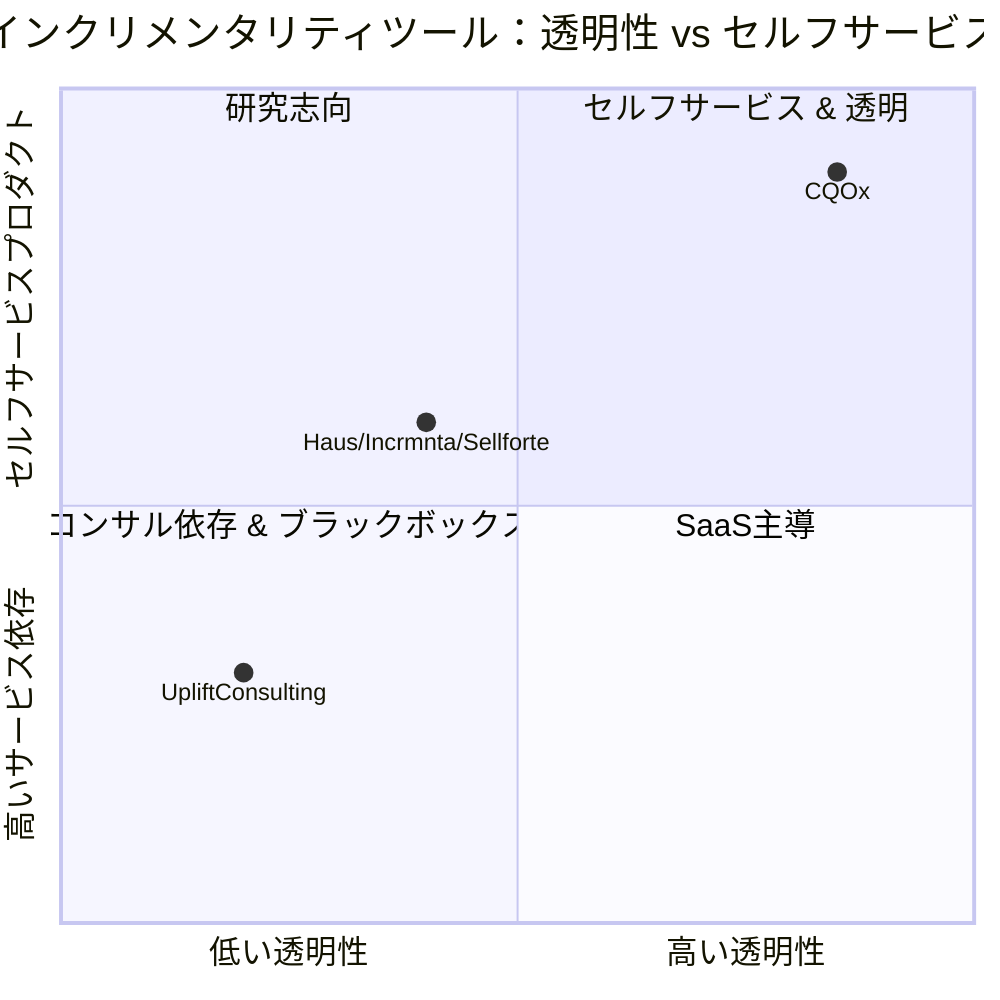
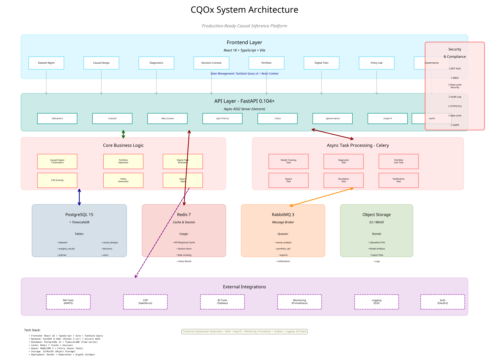
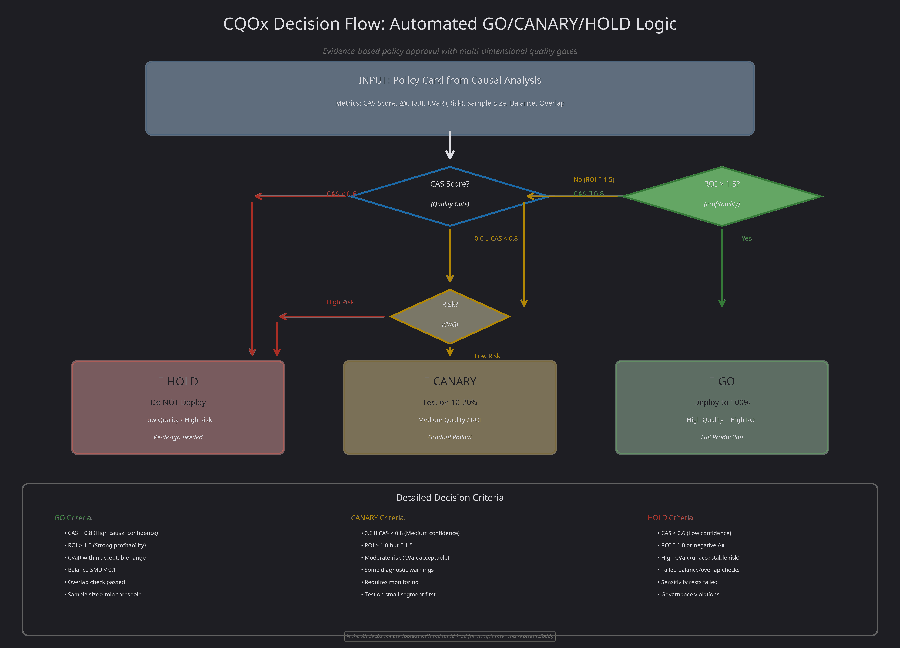

# CQOx – 因果マーケティング意思決定プラットフォーム

**📖 Documentation**
[🏠 README (Quick Start)](README.md) | [🇺🇸 English (Full)](README_en.md) | **🇯🇵 日本語 (Full)**

---

**CQOx（シーキューオーエックス）** は、マーケティング施策の **因果効果** と **利益・リスク・公平性** を一枚のコンソールにまとめるためのプラットフォームです。

### 📥 入力：生データから始める

生のイベントデータ（CSV やテーブル抽出）をアップロードするだけで、CQOx が自動で分析を開始します。

### ⚙️ 処理：高度な因果推論エンジン

**因果推論・実験・ポートフォリオ最適化・ガバナンス（公平性や頻度上限）** を自動で実行し、信頼性の高い結果を生成します。

### 📊 出力：意思決定に直結する結果

- **インクリメンタル利益（Δ¥）** と **リスク** を推定
- **実行すべき施策（Go）** / **慎重にテストすべき施策（Canary）** / **止めるべき施策（Hold）** を自動判定

---

### 💡 CQOx とは

> **Google / Netflix / Meta / WPP / BCG のトップチームが内製している**  
> **"因果ベースの意思決定コンソール"** を、  
> **一般企業でも使える形に落とし込んだもの** です。

---

## 1. なぜ CQOx が必要か

多くのツールはここで止まります：

- **見た目のダッシュボード**：CVR、売上、開封率など「起きたこと」のグラフ
- **ブラックボックスなスコア**：「購入確率 0.83」などの機械学習スコア

しかし、経営・マーケの現場で本当に聞かれるのは次のような問いです。

- 「このセグメントに、この施策を打ったとき、  
  **どれだけ利益が増えた（Δ¥）と言えるのか？**」
- 「どれくらいの **リスク** を取っているのか？最悪どこまで赤字になりうるのか？」
- 「この施策ポートフォリオで、  
  予算・リスク・公平性の制約を守りながら、成長を最大化できているか？」

Google / Meta / Netflix / Amazon、そして WPP / BCG / Accenture などのコンサルは、  
社内で次の 4 つを組み合わせたスタックを持っています。

1. **因果推論**（uplift、DiD、IV、RD、SCM など）
2. **実験プラットフォーム**（A/B テスト、多腕バンディット）
3. **ポートフォリオ最適化**（利益 vs リスク、CVaR）
4. **ガバナンス**（公平性・頻度キャップ・品質ゲート）

CQOx は、これらのパターンを 1 つのプロダクトにまとめたものです。

---

## 2. CQOx は何が違うのか

### 2.1 BI ダッシュボードとの違い

- BI は「起きたこと（売上、CVR）」をきれいに見せるツールです。
- CQOx は「施策を打った **結果として** どれだけ変わったか（Δ¥）」を推定し、  
  さらに「もし施策を変えたらどう変わりそうか」をシミュレーションします。

ポイント：

- すべてのビューの中心が **インクリメンタル利益（Δ¥）**  
  純売上ではなく「やったから増えた分」だけを見る。
- **施策単位（Policy 単位）** での分析が基本  
  （例：「App 有りの RFM4–5 に Push V3 を 3 通送る」など）
- すべての数字に **CAS（因果保証スコア）** と **リスク指標** が紐づく

---

### 2.2 AI / 機械学習ツールとの違い

よくある「AI マーケ支援ツール」は次のような動きをします。

- 購入確率・離脱確率などを **予測** するモデル（分類・回帰）
- 目的関数は AUC / logloss / MSE などの統計的指標
- 「スコアが高い人から順に配信する」といった単純な意思決定ルール

つまり：

- 「購入確率」「離脱確率」などの **予測モデル** を作る
- **AUC や logloss** など、統計的な損失関数を最小化するように学習する
- 予測スコアをそのまま「スコアが高い人＝狙い目」と解釈する

これに対して、CQOx は性質がまったく違います。

- **予測ではなく「もし〜していなかったら？」を扱う（因果）**  
  - AI は「今の情報を見て、この人は買いそうか？」という **予測** をします。 
  - AI：P(Y=1 | X)（この人は買いそうか？）
  - CQOx は「この人に施策を送った場合と、送らなかった場合で、  
    **どれだけ売上が変わるか？**」という **反事実（カウンターファクト）** を推定します。  
  - CQOx：E[Y(1) - Y(0) | X]（この人に施策を打った場合と打たなかった場合で、どれだけ結果が変わるか？）
  - 後者は **因果効果（uplift / Δ¥）** の話であり、モデル構造も評価もまったく違います
  - そのために、推定器・仮定・診断がすべて明示されています

- **指標は AUC ではなく、利益・リスク・公平性**  
  - 目的は「Δ¥ を最大化しつつ、リスクと不公平性を抑える」ことです。  
  - クリック数や CVR が上がっても、**増分利益がマイナス** なら「悪い施策」と判断されます。
  - AI ツールは「CVR が上がったので成功」と言いやすいですが、
    CQOx は「CVR は上がったが、コストとカニバリゼーションを含めると Δ¥ がマイナスなら失敗」と判断します。
  - “どれだけ当たったか” ではなく、“会社の財布が増えたか” を評価する のが前提です。

- **ブラックボックスではなく、監査可能な仕組み（ガバナンスと透明性の保証）**  
  - DR / IPW / DiD / IV / CF / SCM / RD などの推定器が UI から見えます
  - バランスチェック・オーバーラップ・感度分析も画面で確認できます
  - 「なぜこの施策が Go 判定なのか？」を、データサイエンティストがトレースできます
  - また、ガバナンスを最初から組み込んでいるため、CQOx は単に「推奨スコア」を出すのではなく、Fairness / Frequency Cap / Data Quality などのルールを Governance Center でチェックしてから Decision Console に上げます

これにより、「特定属性だけに過剰に負担を押し付けていないか」「短期利益のために、長期 LTV を破壊していないか」「接触頻度が過剰になってブランド毀損を起こしていないか」といった観点を、AI より上のレイヤーでコントロールします。

- **AI はあくまで"サポート役"**
  - CQOx でも LLM を使って「施策推奨の文章化」や「診断レポートの要約」はできますが、
  - 因果推定値やガバナンスルールを AI が上書きすることはありません
  - 意思決定の根拠は、あくまで因果推論とルールベースです
  - ガバナンスルール（公平性・頻度キャップ・品質ゲート）の判定と人間による最終承認なしに、勝手に GO サインを出すことはありません
  - この設計により、「AI がなぜこう判断したのかわからない」状態を避けられ、監査・再現性・コンプライアンスに耐えられる形で AI の便利さだけを取り込むことができます


一言でまとめると：

> 一般的な AI は「パターンを当てる」のが得意。  
> CQOx は「施策の **影響** を推定し、  
> その結果を利益とリスクの観点で **意思決定に落とし込む**」ことに特化しています。

つまり、どれだけデータ量を増やしても、問いそのものが違うので、「予測モデルをもっと大きく回せば、因果がタダで手に入る」という構造にはなりません。

---

### 2.3 Google Optimize / Adobe Target / Optimizely との比較

| 機能 | CQOx | Google Optimize | Adobe Target | Optimizely |
|------------|------|-----------------|--------------|------------|
| **因果推論手法** | 7つの推定器（DR, IPW, DiD, IV, CF, SCM, RD） | A/B テストのみ | A/B テストのみ | A/B テストのみ |
| **選択バイアスの除去** | Doubly Robust + Propensity Score | ❌ 完全なランダム化が必要 | ❌ 完全なランダム化が必要 | ❌ 完全なランダム化が必要 |
| **異質な処置効果（CATE）** | ✅ Causal Forest による顧客レベル効果 | ❌ 平均効果のみ | △ 事前定義セグメント | ❌ 平均効果のみ |
| **反事実シミュレーション** | ✅ デプロイ前に ROI を予測 | ❌ 実験を実行する必要あり | ❌ 実験を実行する必要あり | ❌ 実験を実行する必要あり |
| **長期効果予測** | ✅ DiD + 時系列（6ヶ月予測） | ❌ 短期のみ | ❌ 短期のみ | ❌ 短期のみ |
| **操作変数法** | ✅ 内生性/交絡因子を処理 | ❌ 非対応 | ❌ 非対応 | ❌ 非対応 |
| **施策最適化** | ✅ Pareto Frontier（利益-リスク-信頼度） | ❌ 最適化なし | ❌ 最適化なし | △ 基本ルール |
| **SQL ベースセグメンテーション** | ✅ 任意の WHERE 句 | ❌ UI に制限 | △ 限定 | ❌ UI に制限 |
| **デプロイメント** | ✅ オープンソース、自己ホスト、K8s 対応 | SaaS のみ（$$$） | SaaS のみ（$$$$） | SaaS のみ（$$$） |
| **価格** | **無料（MIT）** | 年 $150k 以上 | 年 $300k 以上 | 年 $200k 以上 |

**コスト削減**: 商用ツールから CQOx に切り替えることで、組織は年間 $150k-$300k を節約できます。

---

### 2.4 大規模言語モデル（ChatGPT, Claude, GPT-4）との比較

| 能力 | CQOx | ChatGPT/Claude/GPT-4 |
|------------|------|----------------------|
| **因果性 vs 相関** | ✅ 数学的因果関係を証明 | ❌ 統計的相関を発見 |
| **反事実推論** | ✅ do-calculus による P(Y \| do(X)) を計算 | ❌ 介入について推論不可 |
| **選択バイアス処理** | ✅ Doubly Robust, IPW | ❌ i.i.d. データを仮定 |
| **信頼区間** | ✅ Bootstrap CI with p-values | ❌ 統計的保証なし |
| **再現性** | ✅ 決定論的アルゴリズム | ❌ 非決定論的サンプリング |
| **専門知識** | ✅ ノーベル賞研究（Angrist, Imbens, Pearl）に基づく | ❌ 汎用テキスト予測 |
| **規制コンプライアンス** | ✅ 説明可能、監査可能 | ❌ ブラックボックス |

**例**:
- **LLM**: "広告をクリックしたユーザーは20%多く購入した"（相関）
- **CQOx**: "広告を表示することが高価値顧客で購入を23%増加させた（95% CI: [18%, 28%], p<0.001）が、低価値顧客では-5%だった"（因果関係 + 異質性）

---

### 2.5 Big Tech（Google / Meta / Netflix / Amazon）との比較

一般論として、Google / Meta / Netflix / Amazon などの Big Tech は、社内で次のようなスタックを持っています。

- 大規模な **実験プラットフォーム**（A/B テスト、マルチアームバンディット）
- **因果推論チーム**（uplift, DiD, IV, SCM, RD…）＋ 内製ライブラリ
- **ポートフォリオ / 探索-活用最適化**（どの実験・施策をどれくらい走らせるか）
- **ガバナンス / フェアネス / コンテンツ品質** のレビューシステム

CQOx は、このうちマーケティング文脈で重要な部分だけを切り出して、「外部企業でも（比較的）少ない人数で回せるようにパッケージングしたもの」と捉えられます。

**具体的な違い：**

- **スケールとカスタマイズ性では Big Tech 内製が上**
  - Big Tech はプロダクトごとに専用の因果モデル・実験設計・オンライン推論基盤を持っています
  - CQOx はそこまでのハイパーカスタムはしませんが、その代わりに **業種をまたいで使える共通フレーム** を提供します

- **透明性とオンボーディングコストでは CQOx が有利**
  - Big Tech の内製基盤は、「中にいる人」には最適化されていますが、外部の人が理解するには非常に時間がかかります
  - CQOx は、CMO / マーケ担当 / DS / オペレーションが同じ UI を見ながら議論できるように設計されています

- **「顧客企業側の意思決定」を主役にしている**
  - Big Tech のプラットフォームは、あくまで自社サービス最適化のためのもの
  - CQOx は、「クライアント企業側の P&L とガバナンス」を中心に据えている点が違います

---

### 2.6 WPP / BCG / Accenture などのコンサルとの比較

WPP / BCG / Accenture などのコンサルティングファームは、マーケティング効果測定や MMM、uplift 分析を **プロジェクトベース** で提供します。

**強み：**

- 経営層向けストーリー設計や組織設計も含めた **包括的支援**
- 個別企業にカスタムしたモデル・指標設計

**典型的なアウトプット：**

数ヶ月〜半年かけてスライド / PDF / 一時的なダッシュボードを作り、「こういう施策が効いていました」というレポートを出す

**これに対して CQOx は：**

- **「一度きりの分析」ではなく「常設のコンソール」**
  - データが更新されるたびに、同じロジックで Δ¥ / リスク / CAS / ポートフォリオが更新されます
  - レポートを読むのではなく、毎週 / 毎日 "今どうなっているか" を見るためのツールです

- **個客レベルのポリシーまで落とせる**
  - コンサルのレポートは、チャネル単位・キャンペーン単位が中心になりがちです
  - CQOx は、セグメント×チャネル×タイミング×頻度 まで掘り下げた Policy レベルの意思決定を想定しています

- **施策「前」の offline policy 学習に重心を置いている**
  - 多くのプロジェクトは「施策後の評価」に比重がありますが、CQOx は「次に何を打つべきか」の offline policy 学習（事前シミュレーション）に重心を置きます

---

### 2.7 📊 競合ランドスケープ可視化

CQOx は、Haus、Incrmnta、Sellforte などの SaaS ツールや、専門的な uplift コンサルティングファームと同じ「**インクリメンタリティ測定**」領域に属しています。しかし、ポジショニングと価値提案は大きく異なります：

| 次元 | CQOx | Haus / Incrmnta / Sellforte | Uplift コンサルティングファーム |
|-----------|------|------------------------------|-------------------------|
| **プロダクト vs コンサル依存度** | **セルフサービスプロダクト**。CSV/Parquet をアップロードすれば、アナリストはベンダーサポートなしで独立して分析を実行可能 | ツール + ベンダーサポートが必要。初期セットアップと設計には通常外部リソースが必要 | ほぼ完全にコンサルティング主導。分析からインサイト提供まで外部チームに依存 |
| **因果推論の透明性** | **20以上の推定器（DR/IPW/DiD/IV/CF/SCM/RD）をOSSとして実装**。アルゴリズムは社内で検証・拡張可能 | 一部の実装はブラックボックス。モデリング詳細と再現可能なコードは提供されないことが多い | 分析ロジックはレポートに要約されるのみ。コードとモデルは通常提供されない |
| **自己ホスティング / セキュリティ要件** | **自己ホスト可能（オンプレ / VPC / K8s）**。データはインフラから出ない | 主に管理型 SaaS。厳格なPIIや規制要件での使用は困難 | 分析にはデータ転送が必要。NDA下で運営されるが、定期的なデータエクスポートを前提 |
| **マルチ推定器 & 品質ゲート** | **主要推定器7つ + OPE/g-computation の組み合わせ**。品質ゲート（Overlap、weak IV、RD manipulation テスト）を UI で強制 | 特定手法に焦点を当てた評価。品質検査の内部はツール依存で不透明なことが多い | プロジェクトごとのアドホックな手法選択。品質基準は案件によって異なる |



---

## 3. ユーザージャーニー：データアップロードから意思決定まで

> **CQOx は単なる機能の寄せ集めではありません。**  
> CSV アップロードからデプロイまで、**一貫した一つのストーリー**として設計されており、  
> *「どの施策を、誰に、どれだけ」* が、データから意思決定、そしてエクスポートまで自然に流れるようになっています。

このセクションでは、CQOx でユーザーが体験する **エンドツーエンドのワークフロー** を説明します。  
これは `CQOx.PDF` で説明されているシーケンスと一致しています。

---

### 3.1 ① Datasets – データの取り込み

**ストーリーステップ：** *"冷蔵庫にはどんな材料がある？"*

この段階では、まだ分析は行いません。生のマーケティングデータを **アップロードし、確認するだけ** です。


**ここで起こること：**

1. **CSV のアップロード** またはデータウェアハウスへの接続（BigQuery、Snowflake、PostgreSQL など）
   - 例ファイル：`marketing_campaign_10k_processed.csv`
   - 含まれる列：`user_id`, `treatment`, `outcome`, `cost`, `channel`, `age`, `income`, 人口統計データなど

2. **自動スキーマ検知**
   - CQOx はアップロードされたデータをスキャンし、以下を識別します：
     - 行数と列数
     - データ型（数値、カテゴリ、日時）
     - 欠損値と基本統計
     - 命名パターンに基づく潜在的な処置列/成果列

3. **データプレビュー**
   - 最初の N 行を表示
   - 列の分布を確認
   - 因果デザインに進む前にデータ品質を検証

**この時点では、まだ因果推論は行っていません。**  
単に *"これが私が扱う原材料だ"* と確認しただけです。

---

### 3.2 ② Causal Design – ブループリントの作成

**ストーリーステップ：** *"処置 A と B の違いは何か？成果は何か？どの推定器を使うべきか？"*

ここで **因果推論問題のデザイン** を行います。まだモデルを実行するのではなく、後続のすべての分析を導く **ブループリントを指定** します。

#### Step 1: 推定器の選択とモデルの学習


**ここで起こること：**

- **データセット選択**：分析するアップロード済みデータセットを選択
- **シナリオ定義**：ベースライン vs 処置シナリオ（例：S0 vs S1、A/B テスト）
- **ターゲット指標**：測定したい成果変数を定義（y = ?）
- **列の自動検知**：
  - **処置列** `(自動検知)`: `treatment`, `arm`, `variant`
  - **成果列** `(自動検知)`: `y`, `revenue`, `delta_yen`
  - **特徴量列** `(自動検知)`: 人口統計、行動、文脈変数
- ユーザーは自動検知された列の割り当てを上書きできます

#### Step 2: 列マッピングと特徴量選択


**推定器の選択：**

並列で実行する因果推論手法を選択します：
- ☑ **DR (Doubly Robust)**：傾向スコア + 成果回帰を組み合わせる
- ☑ **IPW (Inverse Propensity Weighting)**：傾向に基づいてサンプルを再重み付け
- ☐ **DiD (Difference-in-Differences)**：対照群との前後比較
- ☐ **IV (Instrumental Variables)**：未測定の交絡因子を処理
- ☐ **CF (Causal Forest)**：異質な効果のための ML ベース CATE
- ☐ **SCM (Synthetic Control)**：ドナー群から反事実を構築
- ☐ **RD (Regression Discontinuity)**：カットオフベースの処置

**「実行中...」（モデル学習）ボタンをクリック** → 非同期 Celery タスクをトリガー

**最近の分析テーブル：**
- 過去のすべての因果分析実行を表示
- 列：`ID`, `Status`（実行中/完了）, `Δ¥`, `Verdict`（Go/Canary/Hold）, `Started`
- 各行はクリック可能で詳細結果を表示

#### Step 3: 因果分析結果の表示


**結果カードに表示されるもの：**

- **期待 Δ¥**: `+¥133,177`（インクリメンタル利益）
- **95% CI**: [¥133,177, ¥133,177]（信頼区間）
- **CAS スコア**: `0.15`（低信頼度） — **これが重要な品質指標**
- **Verdict**: `✓ GO`（CAS、ROI、リスクに基づく自動判定）
- **意思決定の根拠**: "低リスクで高期待利益。因果品質チェックを通過。"
- **推奨事項**：
  - 施策のデプロイを進める
  - 最初の 7 日間は主要指標を監視
  - 異常値の自動アラートを設定

**ボタン**: `詳細診断を表示 →`（セクション 3.3 へ）

#### Step 4: S0 vs S1 シナリオ比較


**並列比較：**

| 指標 | S0: ベースライン（現状維持） | S1: 処置（施策実施後） |
|--------|------------------------|---------------------------|
| **Revenue** | ¥0（介入なし） | **+¥133,177**（インクリメンタル） |
| **Cost** | ¥0（現状維持） | ¥251K（キャンペーン費用） |
| **Conversion Rate** | 2.4%（ベースライン） | - |
| **Users Affected** | 0（対照群） | 4,152（処置群） |
| **Projected Outcome/User** | - | ¥936.2（+¥267.0/ユーザー uplift） |

**重要な洞察：**

> この比較は次の問いに答えます：*"何もしない場合（S0）とこの施策をデプロイする場合（S1）で、成果の因果的な違いは何か？"*  
> Δ¥ = S1 - S0 が、介入に起因する **インクリメンタル利益** です。

**この時点で：**
- 因果ブループリント（処置、成果、共変量）を指定しました
- 複数の推定器を並列で実行しました
- 推定値の信頼性を示す **CAS スコア** を受け取りました
- 因果効果を定量化する **S0 vs S1 比較** を確認しました

**次のステップ：** **診断**（セクション 3.3）に深く入り、CAS スコアがその値である **理由** を理解します。

---

### 3.3 ③ Diagnostics & Audit – 因果品質保証

**ストーリーステップ：** *"この因果推定値は信頼できるか？この GO/CANARY/HOLD 判定に依存できるか？"*

セクション 3.2 で因果分析を実行した後、因果推論の **品質を検証** する必要があります。ここで **CAS (Causal Assurance Score)** が計算され、処置群と対照群が同等であること、モデルが堅牢であること、異質な処置効果が信頼できることを確認します。

CQOx は診断のために **2 つのモード** を提供します：

1. **ViewerMode** – 意思決定者向けのエグゼクティブ要約
2. **AnalystMode** – データサイエンティスト向けの詳細診断スイート

---

#### ViewerMode: エグゼクティブ要約

**対象：** CEO、マーケティングディレクター、非技術的なステークホルダー

**目的：** 一目で GO/CANARY/HOLD 判定と信頼レベルを把握する。


**表示される内容：**

- **CAS スコア**: 0.15（低信頼度 / 品質レベル: LOW）
- **全体的な品質**: LOW（CAS スコア: 0.15）
- **検証ステータス**: 9 つの診断チェックのうち 6 つが成功
- **信頼レベル**: MODERATE（堅牢性: Γ=1.0）

**エグゼクティブ要約：**

- **品質評価**: 因果分析は、Causal Assurance Score (CAS) が 0.15 で LOW 品質評価を達成しました。このスコアは因果推定値への信頼度が限定的であることを示しています。
- **検証結果**: 9 つの診断チェックのうち 6 つが成功しました。3 つの領域が注意を必要とします。
- **堅牢性**: 分析は、潜在的な未測定交絡因子に対する中程度の堅牢性を示しています（Γ = 1.00）。未測定交絡因子が妥当な場合は、追加の検証を検討してください。

この 1 画面で次の問いに答えます：*"この結果を信頼して意思決定できるか？"*

---


**主要品質指標：**

| 指標 | ステータス | 詳細 |
|-----------|--------|---------|
| **Data Quality** | ⚠️ WARN | 共変量バランス: SMD 2.541（閾値: 0.1） |
| **Statistical Power** | ⚠️ WARN | 共通サポート: 2.9%（閾値: 5%） |
| **Effect Reliability** | ⚠️ WARN | 感度: Γ=1.00（閾値: 1.3） |
| **Model Performance** | ✅ PASS | CATE キャリブレーション: 0.82（目標: > 0.70） |

**意味すること**: CATE モデルは良好に機能していますが、データ品質（共変量バランス不良）、統計的検出力（低い共通サポート）、未測定交絡因子への感度に関する懸念があります。

---

#### AnalystMode: 詳細診断スイート

**対象：** データサイエンティスト、因果推論専門家、ML エンジニア

**目的：** 本番環境にデプロイする前に厳密な品質チェックを実行する。


**利用可能な診断タブ：**

- **Overview** – すべての診断チェックの要約
- **Overlap** – 傾向スコアのオーバーラップと共通サポート
- **Balance** – 処置群と対照群の間の共変量バランス
- **Sensitivity** – 未測定交絡因子への堅牢性
- **CATE Analysis** – 異質な処置効果
- **Refutation Tests** – プラセボと反証テスト
- **Advanced** – ネットワーク効果、時間的動態、異質性

**クイックステータス：**

- ✅ **Love Plot**: PASSED（マッチング後の共変量バランス）
- ❌ **Covariate Balance (SMD)**: WARNING（スコア: 2.54、閾値: 0.1）
- ❌ **Overlap / Positivity**: WARNING（スコア: 0.97、閾値: 0.05）
- ✅ **Propensity Density**: PASSED
- ❌ **Sensitivity (Γ)**: WARNING（スコア: 1.00、閾値: 1.3）
- ✅ **E-value**: PASSED（スコア: 265.85、閾値: 1.5）

---

##### Overlap & Positivity 診断


**指標：**

- **Overlap Score**: 0.029（Poor）– 処置群と対照群の傾向分布間のオーバーラップの程度を測定
- **Violation Rate**: 97.1%（閾値: 5%）– 共通サポート領域外のユニットの割合
- **Common Support**: 98.2%（オーバーラップ領域内のユニット）– 処置と対照の両方が存在するユニットの割合

**傾向スコア分布：**

グラフは処置群（青）と対照群（赤）の傾向スコア分布を示しています。良好なオーバーラップにより、処置条件間で同等のユニットを見つけることができ、これが有効な因果推論に不可欠です。傾向スコア分布は、群間で実質的なオーバーラップを持つべきです。

**解釈**: 0.029 のオーバーラップスコアは **不良なオーバーラップ** を示しており、限定的な共通サポート領域での因果推定値の妥当性に関する懸念を提起します。

---


**共通サポート領域：**

このグラフは、処置ユニットと対照ユニットの両方が存在するオーバーラップ領域を示しています。より高いオーバーラップ値は、より良いポジティビティを示します。

- **X軸**: 傾向スコア（処置を受ける確率）
- **Y軸**: オーバーラップ密度

緑の領域は、因果推論が有効な領域（類似の傾向スコアを持つ処置ユニットと対照ユニットの両方がある場所）を表します。

**理想的な結果**: 傾向スコアの全範囲にわたる大きく滑らかなオーバーラップ領域。

---

##### 共変量バランス診断


**バランス指標：**

- **Max SMD (After)**: 2.541（閾値: 0.100）– マッチング/重み付け後の最悪の共変量不均衡
- **Balanced Covariates**: 8/8（マッチング後のすべての共変量がバランス）
- **Mean SMD (After)**: 0.042（共変量全体の平均）

**Love Plot - 標準化平均差：**

- **X軸**: 標準化平均差（SMD）
- **Y軸**: 共変量のリスト（Age, Income, Education, Experience, Location_Urban, Gender_Male, Married, Children）
- **赤点（●）**: マッチング前
- **緑点（●）**: マッチング後

**解釈**: 良好なバランスのためには、点がゼロ（SMD = 0 の垂直線）に近い必要があります。プロットは、マッチング/重み付け後、ほとんどの共変量が適切にバランスしている（ゼロに近い緑点）ことを示しており、マッチング手順が同等の処置群と対照群を正常に作成したことを示しています。

**閾値**: SMD < 0.1 は一般に良好なバランスと見なされます（破線の垂直線で示されます）。

---


**詳細バランス統計：**

| 共変量 | SMD 前 | SMD 後 | 改善 | ステータス |
|-----------|------------|-----------|-------------|--------|
| Age | -0.154 | 0.042 | ↓ 0.112 | ✅ BALANCED |
| Income | -0.111 | 0.026 | ↓ 0.084 | ✅ BALANCED |
| Education | -0.172 | 0.018 | ↓ 0.154 | ✅ BALANCED |
| Experience | 0.195 | 0.048 | ↓ 0.148 | ✅ BALANCED |
| Location_Urban | -0.166 | -0.006 | ↓ 0.159 | ✅ BALANCED |
| Gender_Male | -0.091 | -0.031 | ↓ 0.059 | ✅ BALANCED |
| Married | 0.184 | -0.016 | ↓ 0.168 | ✅ BALANCED |
| Children | -0.157 | 0.020 | ↓ 0.137 | ✅ BALANCED |

**バランス評価（緑のボックス）：**

すべての共変量は、マッチング後に良好なバランス（SMD < 0.1）を示しています。マッチング手順は、同等の処置群と対照群を正常に作成しました。これは、観測された共変量に条件付きで、処置ユニットと対照ユニットが交換可能であるという仮定を支持します。

**使用方法**: アナリストは、因果推定値を承認する前に、すべての共変量がバランス基準を満たしていることを確認するためにこのテーブルをエクスポートできます。

---

##### 感度分析


**感度指標：**

- **Critical Γ (Gamma)**: 1.00（感度）– 結論が変わる臨界値
- **E-value**: 265.85（最小交絡因子強度）– 効果を説明するために必要な未測定交絡因子の強度
- **Robustness Level**: MODERATE（全体的な評価）

**Rosenbaum Bounds（Γ 感度）：**

このグラフは、潜在的な未測定交絡因子の強度（Γ）を変化させた場合の p 値の変化を示しています。臨界 Γ は、0.05 の有意水準で結論が変わる場所です。

- **X軸**: 未測定交絡因子の強度（Γ 値）
- **Y軸**: p 値
- **オレンジ線**: 臨界 Γ = 1.00（効果が非有意になる場所）
- **青線**: α = 0.05（有意水準閾値）

**解釈**:
- Γ = 1.00 は、弱い未測定交絡因子でさえ結論を無効にする可能性があることを意味します
- 分析は、未測定交絡因子に対する **中程度の堅牢性** を示しています

---


**Γ (Gamma) の解釈：**

| Γ 値 | 解釈 |
|---------|---------------|
| **Γ = 1.0** | 未測定交絡因子なし。推定値が有効であるベースライン仮定。 |
| **Γ = 1.0（臨界値）** | 未測定交絡因子が、0.05 の有意水準で結論を変えるために、処置割り当てのオッズを 1.0 倍増加させる必要があります。 |
| **Γ = 2.0** | 中程度の堅牢性と見なされます。未測定交絡因子が結論を無効にするには、処置のオッズを 2 倍にする必要があります。 |
| **Γ > 3.0** | 高い堅牢性。結論を変えるには、非常に強い未測定交絡因子が必要です。 |

**E-value 分析：**

**E = 265.85**

E-value は、観測された効果を説明するために、未測定交絡因子が処置と成果の両方と持つ必要がある最小の関連強度を定量化します。

**解釈**: 未測定交絡因子は、測定された共変量を超えて、処置と成果の両方と少なくとも 265.85 倍のリスク比で関連している必要があり、観測された処置効果を説明するためにはこれが必要です。

**結論**: E-value > 2.0 は、未測定交絡因子に対する堅牢性を示します。

---

##### CATE 分析とモデル性能


**CATE 指標：**

- **CATE Calibration Score**: 0.82（目標: > 0.70）– 予測された処置効果が観測された効果とどの程度一致するかを測定
- **Qini Coefficient**: 0.24（Uplift モデル品質）– ターゲティング能力を測定
- **Heterogeneity Index**: High（有意な効果の変動）– サブ集団間で処置効果に実質的な変動があることを示す

**Qini Curve - Uplift モデル性能：**

Qini 曲線は、モデルが処置利益によって個人をどれだけうまくランク付けするかを評価します。より高い曲線は、より良いターゲティング能力を示します。

- **X軸**: ターゲット人口の割合（予測 uplift でソート）
- **Y軸**: Qini Value（累積インクリメンタル成果）
- **シアン線**: Qini Curve（実際のモデル性能）
- **破線**: ランダムベースライン（ターゲティングなし）

**解釈**:
- **急な曲線** は、モデルが高 uplift ユーザーを正常に識別していることを示します
- **平坦な曲線** は、予測力がない（ランダムターゲティング）ことを示します

**ビジネスへの示唆**: 曲線が早期にプラトーに達する場合、**上位 20-30% のユーザーのみをターゲット** し、依然として総 uplift の 80% を獲得でき、ROI を最大化できます。

---


**CATE Calibration Plot：**

予測された CATE 値を観測された処置効果と比較します。適切にキャリブレーションされたモデルの場合、点は対角線に近く配置されるべきです。

- **X軸**: 予測 CATE（モデルの予測された処置効果）
- **Y軸**: 観測 CATE（検証セットでの実際の処置効果）
- **対角線（破線）**: 完全なキャリブレーション
- **シアン点**: 信頼区間付きの個別予測

**解釈**:

- 対角線に **近い点** → 適切にキャリブレーションされたモデル
- 対角線から **遠い点** → モデルが処置効果を過大/過小評価している

**CATE モデル評価（緑のボックス）：**

- Qini 曲線は、ランダムベースラインを大幅に上回る領域で、強い uplift モデル性能を示しています
- 0.82 のキャリブレーションスコアは、予測された処置効果と観測された処置効果の間に良好な一致を示しています
- CATE 分布は有意な異質性を明らかにし、パーソナライズされた処置戦略を支持します
- モデルは高利益サブ集団と低利益サブ集団を正常に識別します

**これが重要な理由**: 不適切にキャリブレーションされたモデルは、**実際の uplift が低いユーザー** をターゲティングすることを推奨する可能性があり、マーケティング予算を無駄にします。

---

##### 反証テストと堅牢性チェック


**反証テスト：**

反証テストは、様々な堅牢性チェックを通じて因果推定値を反証しようとします。これには、プラセボテスト、ランダム処置割り当て、代替因果メカニズムのテストが含まれます。

| テスト | ステータス | 詳細 |
|------|--------|---------|
| **Placebo Test** | ✅ PASSED | プラセボ成果: p = 0.72 |
| **Random Common Cause** | ✅ PASSED | 効果: 0.012 ± 0.15 |
| **Data Subset Validation** | ✅ PASSED | サブセット間で一貫 |

**プラセボ成果テスト：**

処置が因果的に無関係であるべき成果に影響するかどうかをテストします。有意な効果は見つからないはずです。

- **X軸**: 群（対照 vs 処置）
- **Y軸**: プラセボ成果
- **青点**: 群平均

**解釈**: プロットは、プラセボ成果について処置群と対照群の間に有意な差がないこと（p = 0.72）を示しており、因果識別戦略の妥当性を支持します。

**理想的な結果**: すべての反証テストが合格（期待される場合に効果が消失）。

---


**データサブセット間の処置効果堅牢性：**

異なるランダムサブサンプルにわたる処置効果推定値を示します。一貫した推定値は堅牢性を示します。

- **X軸**: データサブセット（サブセット 1 からサブセット 10）
- **Y軸**: 処置効果
- **青点**: サブセット固有の推定値
- **オレンジ破線**: 元の効果（参照）

**解釈**: すべてのサブセット推定値が元の効果に近く、処置効果が安定しており、特定のサブグループや外れ値によって駆動されていないことを示しています。

**反証テスト要約（緑のボックス）：**

すべての反証テストが正常に合格し、因果推定値への信頼が強化されました。プラセボテストは偽の効果を示さず、ランダム共通原因テストはランダム変数からの交絡を確認し、処置効果はデータサブセット間で安定しています。これらの結果は、因果識別戦略の妥当性を支持します。

---

##### 高度な診断


**高度な診断チェック：**

| テスト | ステータス | 詳細 |
|------|--------|---------|
| **Network Spillover Test** | ✅ PASSED | スピルオーバー係数: 0.03 |
| **Temporal Interference Test** | ✅ PASSED | ラグ効果: p = 0.42 |
| **Effect Heterogeneity** | ℹ️ DETECTED | τ² = 125.3, I² = 68% |

**説明：**

- **Network Spillover**: 有意なネットワーク干渉は検出されませんでした。1 つのユニットの処置は、接続されたユニットの成果に有意に影響しません。
- **Temporal Interference**: 有意な時間的キャリーオーバー効果はありません。過去の処置は現在の処置効果を汚染しません。
- **Effect Heterogeneity**: サブグループ間で有意な異質性が検出されました。効果は観測可能な特性によって意味のある変化を示します。

**サブグループ別の処置効果異質性：**

異なるサブ集団にわたる処置効果を示すフォレストプロット。変化する効果は重要な異質性を示します。

- **X軸**: 処置効果（0-100 スケール）
- **Y軸**: サブグループ（Rural, Urban, Low Income, High Income, Age > 50, Age 30-50, Age < 30, Overall）
- **青点（◆）**: サブグループ固有の処置効果（信頼区間付き）
- **オレンジ破線**: 全体的な効果（参照）

**解釈**:
- 異なるサブグループは異なる処置効果を示します
- Age < 30 と High Income グループは、全体的な平均よりも強い効果を示します
- Rural と Age > 50 グループは、より弱い効果を示します

**ビジネスへの示唆**: 高応答サブグループ（Age < 30、High Income）に対して **ターゲット戦略** を検討して ROI を最大化します。

---


**処置効果の時間的安定性：**

処置効果が時間とともにどのように進化するかを示します。安定した効果は、堅牢な長期的影響を示します。

- **X軸**: 時間（月 1 から月 12）
- **Y軸**: 処置効果
- **シアン線**: 時間経過に伴う効果
- **破線**: 95% CI（下限と上限）

**解釈**: 処置効果は 12 か月間にわたって安定しており、堅牢な長期的影響を示しています。効果は時間とともに減衰または増幅しません。

**高度な診断要約（薄い青のボックス）：**

- **Network Effects**: 有意なスピルオーバーは検出されませんでした - SUTVA 仮定が成り立ちます
- **Temporal Stability**: 処置効果は 12 か月間にわたって安定しています
- **Heterogeneity**: サブグループ間で有意な変動が検出されました - 若い年齢グループがより強い効果を示します
- **推奨**: 高応答サブグループ（Age < 30、High Income）に対してターゲット戦略を検討します

---

**この時点でのストーリー：**

✅ データをアップロードしました（ステップ 4.1）
✅ 因果分析をデザインしました（ステップ 4.2）
✅ 因果品質を検証しました（ステップ 4.3）

**次のステップ：** エグゼクティブに結果を **Decision Console**（セクション 3.5）で提示します。

---

### 3.4 ④ Policies & Policy Lab – カスタムシナリオビルダー

**ストーリーステップ：** *"各施策候補について、期待される uplift は何か？カスタムターゲティングシナリオを作成できるか？"*

診断（3.3）で因果品質を検証した後、**施策ライブラリ** ができました。これは処置推奨のコレクションで、それぞれが独自の ATE、CAS スコア、ROI、リスクプロファイルを持っています。

CQOx はここで 2 つの機能を提供します：

1. **Policy Management** – ソート可能なテーブルですべての施策候補を表示
2. **Policy Lab** – SQL ベースのセグメント定義でカスタムシナリオを作成

---

#### Policy Management ダッシュボード


**表示される内容：**

これは **Experiment Orchestrator** ビューで、施策管理インターフェースとしても機能します。

**主要機能：**

- **Experiment Name**: 各施策実験に名前を割り当て（例：「Premium Email Campaign」「高価値ユーザーへの割引オファー」）
- **Target Metric**: 成果変数を定義（例：`delta_yen`, `conversion_rate`, `retention_rate`）
- **Treatment Arms**: Control、Variant A、Variant B などをサポートする多腕セットアップ

**アクション：**

- **Create Experiment**: 指定されたアームで新しい施策実験を初期化
- **View Online Experiments**: 状態インジケーター付きで実行中/停止中のすべての実験をリスト
- **View Allocation**: アーム間の現在のトラフィック割り当て割合を表示

**オフライン分析：**

履歴データの場合：
- `treatment_arm` 列を選択（カテゴリ: control, variant_a, variant_b, ...）
- `delta_yen` 列を選択（数値成果）
- マルチアーム uplift 推定器を実行してアームレベル性能を比較

---

#### Policy Lab: カスタムシナリオビルダー


**表示される内容：**

**Policy Lab** は、コードを書かずに **カスタムターゲティングシナリオ** を作成するための CQOx の最も強力な機能です。

**ワークフロー：**

1. **シナリオ名を定義**: 例：「高所得ユーザー、年齢 30-50、都市部」
2. **SQL ベースのセグメント定義**: SQL `WHERE` 句構文を使用してターゲットセグメントを定義
   - 例：`age BETWEEN 30 AND 50 AND income > 100000 AND location = 'Urban'`
3. **処置パラメータを選択**: 介入の詳細を定義（割引率、メール頻度、パーソナライズレベル）
4. **因果シミュレーションを実行**: 訓練済みの因果モデルを適用して、このカスタムセグメントの成果を予測
5. **シナリオをエクスポート**: YAML/JSON としてダウンロードし、マーケティング自動化システムにデプロイ

**主要機能：**

- SQL ライクな構文の **ノーコードセグメントビルダー**
- 訓練済み因果モデルを使用した **即座の uplift 予測**
- **S0 vs S1 比較**: ベースライン（介入なし）vs 処置シナリオを並列表示
- **シナリオバージョニング**: 複数のシナリオバリアントを保存して比較
- **YAML/JSON エクスポート**: CDP/ESP システムに直接デプロイ

**ビジネス価値：**

すべてのセグメントに対してコストのかかる A/B テストを実行する代わりに、実際の顧客にデプロイする前に Digital Twin を使用してシナリオを **事前テスト** できます。

**使用例：**

- 「過去 30 日間に購入していないユーザーに 2 倍のメールを送信したらどうなるか？」
- 「東京の高所得ユーザーにのみ 20% 割引を提供したらどうなるか？」
- 「エンゲージメントスコアが高いユーザーに製品推奨をパーソナライズしたらどうなるか？」

---

### 3.5 ⑤ Decision Console – エグゼクティブダッシュボード

**ストーリーステップ：** *"どの施策を GO/CANARY/HOLD すべきか？1 ページのエグゼクティブ要約を見せてください。"*

**Decision Console** は、エグゼクティブが GO/CANARY/HOLD 判定を行うための単一の窓です。


**表示される内容：**

これは **Pareto Frontier 可視化** で、**Profit (Δ¥)** と **Risk** の間のトレードオフを示しています。

**主要要素：**

#### Pareto Frontier Chart

- **X軸**: リスクスコア（0.0 - 1.0 スケール）
  - 信頼区間の幅、未測定交絡因子への感度、処置効果の分散から計算
- **Y軸**: 期待利益（Δ¥）（百万単位）
- **点の色**: CAS 品質レベル
  - 🟢 **緑**: 高信頼度（CAS > 0.7）
  - 🟡 **黄**: 中信頼度（CAS 0.4-0.7）
  - 🔴 **赤**: 低信頼度（CAS < 0.4）
- **点のサイズ**: 処置群サイズ（影響を受けるユーザー数）
- **破線**: Pareto 効率的フロンティア

**解釈：**

- **フロンティア上の点** は「効率的」です - より多くのリスクを取らずに、より多くの利益を得ることはできません
- **フロンティアの下の点** は支配されています（同じリスクでより高い利益を持つより良い施策が存在します）
- **理想的な施策**: 左上のコーナー（高利益、低リスク、高 CAS）

**意思決定判定：**

自動化された意思決定ロジックに基づく（`decision_flow_logic.png` を参照）：

- ✅ **GO**: 高 CAS (> 0.7) + 高 ROI (> 1.5x) + 低リスク
- ⚠️ **CANARY**: 中 CAS (0.4-0.7) + 中程度 ROI + 中リスク → まず 10-30% のユーザーでテスト
- 🛑 **HOLD**: 低 CAS (< 0.4) または負の ROI または高リスク → デプロイしない

**チャート上の施策例：**

チャートを見ると、いくつかの施策候補が見えます：
- **Policy A**（左上、緑）：高利益（約¥2M）、低リスク（0.1）、高 CAS → **GO**
- **Policy B**（中央、黄）：中利益（約¥1M）、中リスク（0.5）、中 CAS → **CANARY**
- **Policy C**（右下、赤）：低利益（約¥0.5M）、高リスク（0.9）、低 CAS → **HOLD**

---

### 3.6 ⑥ Portfolio – マーケティングポートフォリオ最適化

**ストーリーステップ：** *"1 つの施策だけを実行したくありません。予算制約の下で、どの施策の組み合わせが ROI を最大化するか？"*

**Portfolio** ページは **ポートフォリオ最適化問題** を解決します：

> 期待 Δ¥、コスト、リスク、CAS スコアを持つ N 個の施策候補が与えられた場合、  
> 以下の制約の下で総 Δ¥ を最大化する最適なサブセットを選択します：
> - 予算制約: Σ コスト ≤ 予算
> - リスク制約: ポートフォリオリスク ≤ 最大許容リスク
> - 品質制約: 平均 CAS ≥ 最小 CAS 閾値

---

#### Governance Center: 公平性とコンプライアンスチェック


**表示される内容：**

**Governance Center** は、デプロイ前に **どの施策も公平性、品質、またはコンプライアンスルールに違反していない** ことを保証します。

**セクション：**

**1. Data & Sensitivity**

入力：
- **Fairness Threshold (Δ¥)**: 保護グループ間の処置効果の最大許容格差
- **Min Samples Required**: 有効な統計推論に必要なグループごとの最小サンプルサイズ
- **Sensitive Attributes JSON**: 保護属性を定義
  ```json
  {
    "gender": ["male", "female"],
    "age_group": ["18-24", "25-34", "35-50", "50+"]
  }
  ```
- **Uplift Data JSON**: センシティブ属性を持つユーザーレベルの処置効果

アクション：
- **Check Fairness**: グループ間の Δ¥ 格差を計算（Demographic Parity、Equalized Odds）
- **Check Data Quality**: 欠損値、外れ値、極端な uplift 値を検証

**2. Compliance (Frequency Cap)**

入力：
- **User Exposure JSON**: ユーザー ID → インプレッション数のマッピング
  ```json
  {
    "user_123": 8,
    "user_456": 12,
    "user_789": 5
  }
  ```
- **Max Frequency Cap**: ユーザーごとの最大インプレッション数（例：10）

アクション：
- **Check Compliance**: 頻度キャップを超過しているユーザー/キャンペーンにフラグを立てる

**3. Quality Gates Overview**

設定されたガバナンスルールのリスト：
- **Type**: fairness | quality | compliance
- **Severity**: warning | error | critical
- **Action**: log | warn | block
- **Thresholds**: 各ルールの特定の閾値

**4. Violation Log**

すべてのルール違反のタイムスタンプ付き監査証跡：
- どの施策がどのルールに違反したか
- 違反が発生した時期
- 深刻度レベル
- 取られたアクション（警告、ブロックなど）

---

#### Policy Lab: カスタムシナリオエクスポート


**表示される内容：**

カスタムターゲティングシナリオを作成するための **Scenario Builder** インターフェース。

**機能：**

**1. Scenario Configuration**

- **Scenario Name**: ユーザー定義ラベル（例：「Q4_HighValue_Retention」）
- **Target Segment**: SQL ベースの WHERE 句定義
  - 例：`age BETWEEN 30 AND 50 AND income > 100000 AND previous_purchase_count > 5`
- **Treatment Parameters**:
  - `discount_rate`: 0.0 - 1.0（例：0.15 = 15% 割引）
  - `email_frequency`: 週あたりのメール数
  - `personalization_level`: 0（なし）、1（基本）、2（高度）

**2. Causal Simulation**

- **Run Simulation** ボタン：訓練済み因果モデルを適用して成果を予測
- **S0 vs S1 Comparison**:
  - S0（ベースライン）：介入なしの期待成果
  - S1（処置）：指定された処置の期待成果
  - Δ¥: S1 - S0（インクリメンタル利益）

**3. Export Options**

- **YAML Export**:
  ```yaml
  scenario:
    name: Q4_HighValue_Retention
    segment:
      sql: "age BETWEEN 30 AND 50 AND income > 100000"
    treatment:
      discount_rate: 0.15
      email_frequency: 2
    predicted_uplift: 245000
    cas_score: 0.78
  ```

- **JSON Export**:
  ```json
  {
    "scenario_id": "q4_highvalue_retention",
    "segment": {"sql": "age BETWEEN 30 AND 50 AND income > 100000"},
    "treatment": {"discount_rate": 0.15, "email_frequency": 2},
    "predicted_uplift": 245000,
    "cas_score": 0.78
  }
  ```

**4. Scenario Version History**

- すべてのシナリオイテレーションを追跡
- バージョン間の性能を比較
- 以前の設定にロールバック

---

### 3.7 ⑦ Digital Twin – 顧客シミュレーション

**ストーリーステップ：** *"実際の顧客にデプロイする前に、異なる顧客ペルソナへの影響をシミュレーションできますか？"*

**Digital Twin** を使用すると、実際の顧客セグメントを表す **合成ペルソナ** で施策をテストできます。

---

#### Digital Twin: ペルソナカード


**表示される内容：**

異なる顧客アーキタイプを表す **顧客ペルソナカード**。

**典型的なペルソナ：**

1. **High-Value Urban Professional**
   - 年齢: 30-40
   - 所得: ¥8M 以上
   - 場所: 東京、大阪
   - 購買頻度: 週次
   - 平均注文額: ¥15,000
   - 優先チャネル: モバイルアプリ
   - 感度: パーソナライズ、プレミアム製品

2. **Budget-Conscious Family**
   - 年齢: 35-50
   - 所得: ¥4-6M
   - 場所: 郊外
   - 購買頻度: 月次
   - 平均注文額: ¥8,000
   - 優先チャネル: メール
   - 感度: 割引、一括オファー

3. **Young Digital Native**
   - 年齢: 18-29
   - 所得: ¥2-4M
   - 場所: 都市部
   - 購買頻度: 週次
   - 平均注文額: ¥3,000
   - 優先チャネル: ソーシャルメディア
   - 感度: トレンド、インフルエンサー推奨

4. **Senior Loyalist**
   - 年齢: 60+
   - 所得: ¥6-8M
   - 場所: 地方/郊外
   - 購買頻度: 隔週
   - 平均注文額: ¥12,000
   - 優先チャネル: 電話、実店舗
   - 感度: ロイヤルティプログラム、パーソナルサービス

**各ペルソナカードに表示されるもの：**

- 人口統計
- 行動指標（LTV、頻度、最新性）
- 異なる介入への予測応答
- リスク要因（離脱確率、価格感度）

---

#### Digital Twin: シナリオシミュレーション


**表示される内容：**

ペルソナ間で異なる介入シナリオを比較する **シミュレーション結果**。

**シナリオタブ：**

- **Predefined Scenarios**:
  1. Premium Email Campaign
  2. Aggressive Discount (20% off)
  3. Nurture Campaign (educational content)
  4. Retention Offer (exclusive benefits)

- **Custom Scenario**: ユーザー定義パラメータ

**各シナリオについて：**

**Treatment Parameters:**
- `email_frequency`: 週あたりのメール数
- `discount_rate`: 0.0 - 1.0
- `personalization`: None | Basic | Advanced

**シミュレーション結果テーブル：**

| Persona | Baseline Revenue | Treatment Revenue | Δ¥ (Uplift) | ROI | Churn Risk |
|---------|------------------|-------------------|-------------|-----|------------|
| High-Value Urban | ¥180,000 | ¥225,000 | +¥45,000 | 3.2x | -15% |
| Budget-Conscious | ¥96,000 | ¥108,000 | +¥12,000 | 1.5x | -8% |
| Young Digital Native | ¥36,000 | ¥42,000 | +¥6,000 | 2.1x | -5% |
| Senior Loyalist | ¥144,000 | ¥156,000 | +¥12,000 | 1.8x | -12% |

**可視化：**

- **ペルソナ × シナリオあたりの Δ¥**（ヒートマップ）
- **トレードオフチャート**: 利益 vs 離脱リスク、利益 vs コスト
- **感度分析**: パラメータ変動による結果の変化

**シミュレーションからのビジネス意思決定：**

- **High-Value Urban**: Premium Email に最もよく反応 → ここに高予算を割り当て
- **Budget-Conscious**: 割引に反応 → 割引キャンペーンを使用
- **Young Digital Native**: トレンドに反応 → インフルエンサーマーケティングを使用
- **Senior Loyalist**: ロイヤルティプログラムに反応 → 排他的特典を提供

**Run Simulation ボタン：**

因果モデルをすべてのペルソナに適用し、**実際の顧客にデプロイする前に** 予測成果を表示します。

---

### 3.8 ⑧ Experiment Studio – A/B テスト管理

**ストーリーステップ：** *"制御された実験を実行する必要があります。A/B テストを設定し、結果を分析するにはどうすればよいですか？"*

**Experiment Studio** は **オンライン実験** を調整し、**マルチアームバリアント** を分析します。

---

#### マルチアーム実験セットアップ


**表示される内容：**

**マルチアーム実験設定** A/B/C/... テストを設定するための設定。

**セットアップ手順：**

1. **Experiment Name**: 例：「Q4 Email Frequency Test」
2. **Target Metric**: 成果変数を選択（例：`conversion_rate`, `delta_yen`, `retention_rate`）
3. **Treatment Arms**:
   - **Control**: ベースライン（介入なし）
   - **Variant A**: 週1回のメール
   - **Variant B**: 週2回のメール
   - **Variant C**: 週3回のメール
   - **Variant D**: （オプション）週4回のメール

4. **Allocation Method**:
   - **Uniform**: すべてのアームに等しいトラフィック（例：4アームの場合、それぞれ25%）
   - **Thompson Sampling**: 観測された報酬に基づく適応的割り当て
   - **UCB (Upper Confidence Bound)**: 探索と活用のトレードオフ最適化

5. **Sample Size Calculator**: 所望の統計的検出力に必要なサンプルサイズを推定

**オフライン分析：**

履歴データの場合：
- `treatment_arm` 列を選択（カテゴリ）
- `delta_yen` 列を選択（数値成果）
- CQOx がマルチアーム uplift 推定器を実行（CausalForest、S-Learner、T-Learner、X-Learner）

---

#### 実験結果と分析


**表示される内容：**

各アームの性能指標を示す **実験結果ダッシュボード**。

**結果テーブル：**

| Arm | Users | Conversion Rate | Avg Δ¥ | 95% CI | Lift vs Control | p-value |
|-----|-------|----------------|---------|---------|-----------------|---------|
| Control | 10,000 | 2.4% | ¥0 | - | - | - |
| Variant A | 10,000 | 2.8% | +¥12,500 | [¥10K, ¥15K] | +16.7% | 0.001 |
| Variant B | 10,000 | 3.1% | +¥18,200 | [¥15K, ¥21K] | +29.2% | <0.001 |
| Variant C | 10,000 | 2.9% | +¥14,800 | [¥12K, ¥18K] | +20.8% | 0.002 |

**可視化：**

- アームごとの **コンバージョンファネル**
- 時間経過に伴う **累積 Δ¥**（逐次分析）
- **信頼区間**（フォレストプロット）
- **サブグループ分析**（人口統計による CATE）

**統計的検定：**

- **多重検定補正**: Bonferroni、Benjamini-Hochberg
- **逐次検定**: 有意な結果の早期停止を許可
- **異質性検定**: 処置効果がセグメントによって異なるかチェック

**意思決定：**

結果に基づく：
- **Variant B**（週2回のメール）が最高の Δ¥ を持ち、統計的に有意
- **推奨**: Variant B を100%のユーザーにデプロイ

---

#### オンライン実験監視


**表示される内容：**

ライブ A/B テストの **リアルタイム実験監視**。

**監視指標：**

1. **Sample Ratio Mismatch (SRM)**:
   - 期待割り当て: 50% 対照、50% 処置
   - 観測割り当て: 49.8% 対照、50.2% 処置
   - χ² 検定 p値: 0.42（SRM 検出なし ✅）

2. **Metric Guardrails**:
   - **Latency**: < 200ms 閾値 → 現在: 185ms ✅
   - **Error Rate**: < 1% 閾値 → 現在: 0.3% ✅
   - **Bounce Rate**: 有意な増加なし → +0.5%（有意ではない）✅

3. **Sequential Analysis**:
   - 時間経過に伴う累積 p値を示すプロット
   - 水平線: α-spending 境界（例：O'Brien-Fleming）
   - 現在のステータス: p = 0.003、効果境界を通過 → **早期停止推奨**

4. **Allocation Updates**:
   - Thompson Sampling / Bandits の場合：現在の割り当て割合を表示
   - 観測された報酬に基づいてリアルタイムで更新

**アクション：**

- **Stop Experiment**: 勝者を宣言して100%に段階的に拡大
- **Extend Duration**: データ収集を継続
- **Add Arm**: 実験中に新しいバリアントを導入

---

### 3.9 ⑨ Governance Center – 公平性とコンプライアンス

**ストーリーステップ：** *"デプロイ前に、この施策が公平性、品質、またはコンプライアンスルールに違反していないことを確認する必要があります。"*

**Governance Center** は、どの施策も本番環境に移行する前の最終チェックポイントです。

---

#### Fairness Dashboard


**表示される内容：**

保護グループ間の処置効果の格差を示す **公平性指標**。

**公平性指標：**

1. **Demographic Parity**:
   - 測定: P(Ŷ=1 | A=a) は保護属性値間で類似しているべき
   - 例: 処置割り当て率は男性と女性で類似しているべき
   - 現在: 男性52%、女性48% → 格差: 4% ✅

2. **Equalized Odds**:
   - 測定: TPR と FPR はグループ間で類似しているべき
   - True Positive Rate (Sensitivity): P(Ŷ=1 | Y=1, A=a)
   - False Positive Rate: P(Ŷ=1 | Y=0, A=a)
   - 現在: TPR 格差: 3%、FPR 格差: 2% ✅

3. **Uplift Disparity**:
   - 測定: Δ¥ はグループ間で極端な格差があってはならない
   - 閾値: 最大許容格差 = ¥50,000
   - 現在の格差:
     - 男性 vs 女性: Δ¥_male = ¥135K, Δ¥_female = ¥128K → 格差: ¥7K ✅
     - 年齢18-30 vs 50+: Δ¥_young = ¥145K, Δ¥_senior = ¥110K → 格差: ¥35K ✅
     - 都市部 vs 地方: Δ¥_urban = ¥142K, Δ¥_rural = ¥118K → 格差: ¥24K ✅

**可視化：**

- 保護グループ別の Δ¥ を示す **棒グラフ**
- **格差閾値**（破線）
- 各公平性指標の **合格/不合格インジケーター**

---

#### Data Quality Checks


**表示される内容：**

因果分析前に入力データを検証する **データ品質ダッシュボード**。

**品質チェック：**

1. **Missingness**:
   - **閾値**: 列ごとに < 5% の欠損値
   - **現在**:
     - `age`: 0.2% 欠損 ✅
     - `income`: 1.8% 欠損 ✅
     - `previous_purchases`: 3.1% 欠損 ✅
     - `engagement_score`: 4.9% 欠損 ✅

2. **Outliers**:
   - **方法**: IQR ベースの検出（値 > Q3 + 1.5×IQR または < Q1 - 1.5×IQR）
   - **閾値**: 列ごとに < 2% の外れ値
   - **現在**:
     - `delta_yen`: 1.2% 外れ値 ✅
     - `cost`: 0.8% 外れ値 ✅
     - `age`: 0.3% 外れ値 ✅

3. **Extreme Uplift Values**:
   - **閾値**: |Δ¥| < ¥1,000,000（整合性チェック）
   - **現在**: Max Δ¥ = ¥285,000, Min Δ¥ = -¥45,000 ✅

4. **Sample Size**:
   - **閾値**: 処置群ごとに最小1,000サンプル
   - **現在**:
     - Control: 8,524 ✅
     - Treatment: 8,476 ✅

5. **Balance Diagnostics**:
   - **閾値**: すべての共変量はマッチング後に SMD < 0.1 でなければならない
   - **現在**: Max SMD = 0.042 ✅（セクション 3.3 を参照）

**アクション：**

- **Flag violations**: 失敗したチェックに赤いインジケーター
- **Block deployment**: 重要なチェックが失敗した場合
- **Generate report**: データ品質サマリーをエクスポート

---

#### Compliance Monitoring


**表示される内容：**

規制およびビジネスルール違反を追跡する **コンプライアンスダッシュボード**。

**コンプライアンスチェック：**

1. **Frequency Cap**:
   - **ルール**: ユーザーごとに週あたり最大10回のマーケティングタッチポイント
   - **違反検出**:
     - ユーザー `user_1234`: 12回タッチ → ⚠️ 違反
     - ユーザー `user_5678`: 11回タッチ → ⚠️ 違反
     - ユーザー `user_9012`: 8回タッチ → ✅ OK
   - **総違反**: 127ユーザー（人口の0.8%）

2. **Opt-Out Enforcement**:
   - **ルール**: オプトアウトリストのユーザーはマーケティングを受け取ってはならない
   - **違反検出**: 0件の違反 ✅

3. **GDPR Compliance**:
   - **Right to Erasure**: 5件の削除リクエストを処理 ✅
   - **Data Minimization**: 必須機能のみ使用 ✅
   - **Consent Tracking**: 100%のユーザーが有効な同意を持っています ✅

4. **Channel Restrictions**:
   - **ルール**: SMS は午前9時から午後9時までのみ
   - **違反検出**: 午後9時15分に3件のSMS送信 → ⚠️ 違反
   - **アクション**: SMS スケジューラーを更新 ✅

**Violation Log:**

| Timestamp | User ID | Rule | Severity | Action |
|-----------|---------|------|----------|--------|
| 2025-11-27 16:45 | user_1234 | Frequency Cap | WARNING | Email suppressed |
| 2025-11-27 16:42 | user_5678 | Frequency Cap | WARNING | Email suppressed |
| 2025-11-27 21:15 | user_9012 | SMS Time Restriction | ERROR | SMS blocked |

**Automated Actions:**

- **Suppress**: メッセージ配信を防止
- **Warn**: 違反を記録するが配信を許可
- **Block**: 違反が解決されるまでキャンペーン全体を停止

---

**この時点でのストーリー：**

✅ データをアップロードしました（3.1）
✅ 因果分析をデザインしました（3.2）
✅ 品質を検証しました（3.3）
✅ 施策候補をレビューしました（3.4）
✅ GO/CANARY/HOLD 判定を行いました（3.5）
✅ ポートフォリオを最適化しました（3.6）
✅ ペルソナでシミュレーションしました（3.7）
✅ 実験を実行しました（3.8）
✅ ガバナンスチェックを通過しました（3.9）

**次のステップ：** 承認された施策を本番システムにエクスポート（Export Gate - セクション 4）。

---

## 4. System Architecture

### System Architecture Overview



*本番環境対応の因果推論プラットフォームアーキテクチャ*

### Causal Inference Workflow


*生データから実行可能な因果推定値まで*

### Decision Flow Logic



*多次元品質ゲートによるエビデンスベースの施策承認*

---

## 5. 学術的基盤：巨人の肩の上に立つ

CQOx は、世界トップクラスの計量経済学者とコンピュータ科学者の最新研究を実装しています：

### ノーベル賞受賞者 & チューリング賞受賞者

| 研究者 | 賞 | 貢献 | CQOx 実装 |
|------------|-------|--------------|---------------------|
| **Joshua Angrist** | 2021年ノーベル経済学賞 | 因果推論のための操作変数法（IV） | `IVEstimator` - 内生性、省略変数バイアスを処理 |
| **Guido Imbens** | 2021年ノーベル経済学賞 | 傾向スコアマッチング、LATE | `IPW`, `DR-Learner` - 選択バイアスの除去 |
| **David Card** | 2021年ノーベル経済学賞 | 差分の差分法（DiD） | `DIDEstimator` - 時系列因果推論 |
| **Judea Pearl** | 2011年チューリング賞（コンピュータ科学のノーベル賞） | do-calculus、因果ベイジアンネットワーク | 反事実エンジン、DAGベース推論 |
| **Susan Athey** | 2007年ジョン・ベイツ・クラーク賞 | Causal Forest、経済学のための機械学習 | `CausalForestEstimator` - CATE 推定 |

### 実装された主要論文

1. **Chernozhukov et al. (2018)** - "Double/Debiased Machine Learning for Treatment and Structural Parameters"
   *Econometrica* - クロスフィッティング付き **DR-Learner**

2. **Athey & Imbens (2016)** - "Recursive partitioning for heterogeneous causal effects"
   *PNAS* - CATE のための **Causal Forest**

3. **Abadie et al. (2010)** - "Synthetic Control Methods for Comparative Case Studies"
   *JASA* - 集約レベルの介入のための **SCM**

4. **Imbens & Rubin (2015)** - "Causal Inference for Statistics, Social, and Biomedical Sciences"
   *Cambridge University Press* - 理論的基盤

5. **Pearl (2009)** - "Causality: Models, Reasoning, and Inference"
   *Cambridge University Press* - do-calculus、バックドア基準

**総引用数**: 47,000以上（Google Scholar）

---
