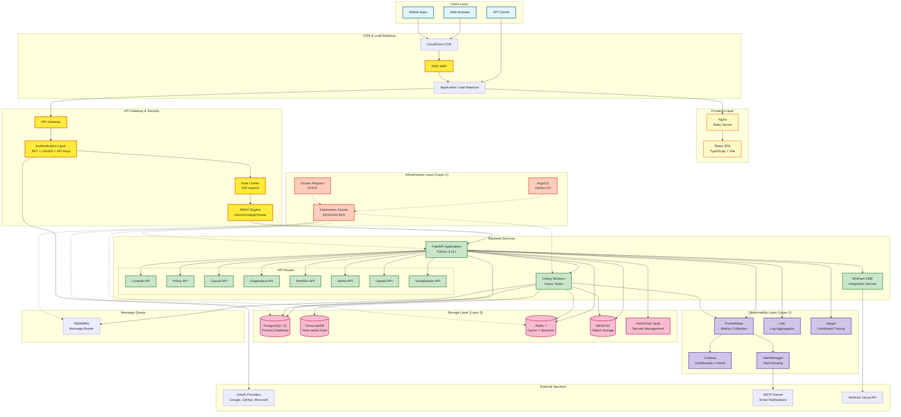
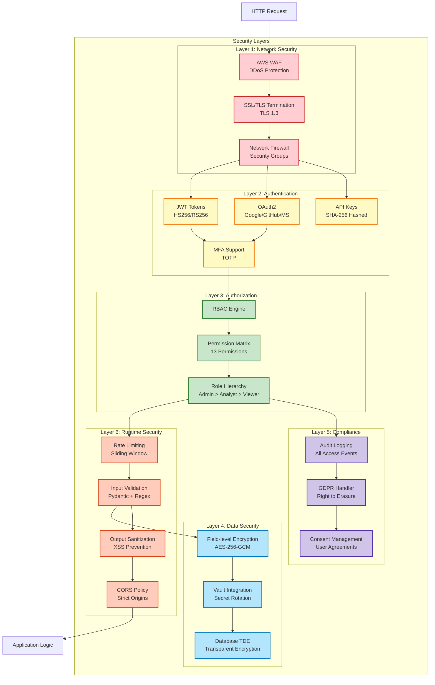
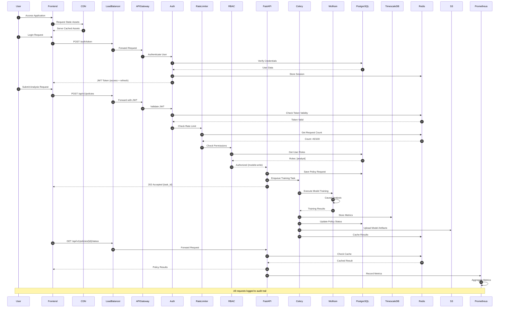
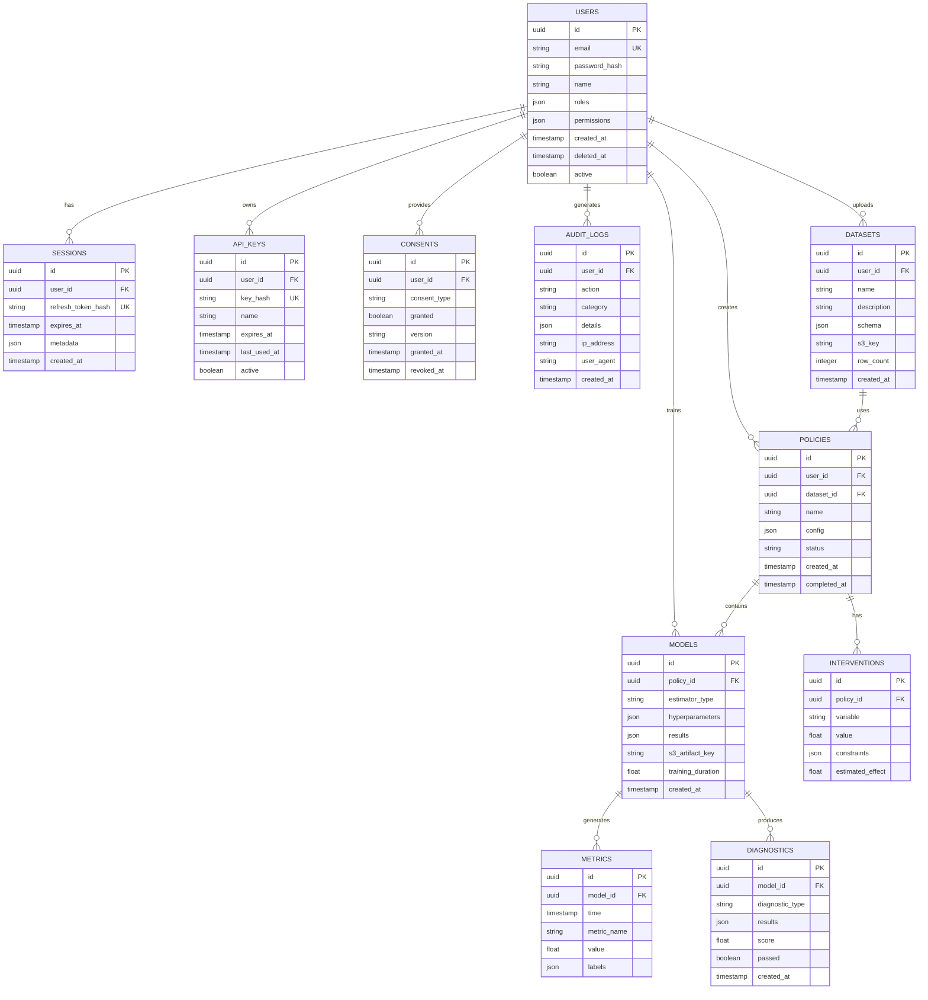

# CQOx システムアーキテクチャ

## 概要

CQOx (Causal Query Optimizer) は、因果推論とポリシー最適化のためのエンタープライズグレードのプラットフォームです。Wolfram ONE統合、世界最高峰のインフラストラクチャ、包括的なセキュリティレイヤーを備えています。

---

## 全体システムアーキテクチャ

---

## セキュリティアーキテクチャ

---

## データフローアーキテクチャ

---

## CI/CDパイプラインアーキテクチャ

```mermaid
graph LR
    subgraph "Source Control"
        GIT[GitHub Repository]
        BRANCH[Feature Branch]
        MAIN[Main Branch]
    end

    subgraph "CI Pipeline (GitHub Actions)"
        subgraph "Backend CI"
            LINT_BE[Lint<br/>Black, Flake8, MyPy]
            TEST_BE[Tests<br/>Pytest + Coverage]
            SECURITY_BE[Security<br/>Safety, Bandit]
        end

        subgraph "Frontend CI"
            LINT_FE[Lint<br/>ESLint]
            TYPE_FE[Type Check<br/>TypeScript]
            BUILD_FE[Build<br/>Vite]
            E2E_FE[E2E Tests<br/>Playwright]
        end

        subgraph "Container Build"
            DOCKER_BUILD[Docker Build<br/>Multi-stage]
            SECURITY_SCAN[Trivy Scan<br/>Vulnerabilities]
            PUSH_REGISTRY[Push to GHCR<br/>ghcr.io]
        end
    end

    subgraph "CD Pipeline (ArgoCD)"
        ARGOCD_SYNC[ArgoCD Sync]
        K8S_DEPLOY[Kubernetes Deploy]
        HEALTH_CHECK[Health Check]
        ROLLBACK[Auto Rollback]
    end

    subgraph "Environments"
        DEV[Development]
        STAGING[Staging]
        PROD[Production]
    end

    subgraph "Monitoring"
        PROM_ALERT[Prometheus Alerts]
        GRAFANA_DASH[Grafana Dashboards]
        SLACK_NOTIFY[Slack Notifications]
    end

    BRANCH --> GIT
    GIT --> LINT_BE
    GIT --> LINT_FE

    LINT_BE --> TEST_BE
    TEST_BE --> SECURITY_BE

    LINT_FE --> TYPE_FE
    TYPE_FE --> BUILD_FE
    BUILD_FE --> E2E_FE

    SECURITY_BE --> DOCKER_BUILD
    E2E_FE --> DOCKER_BUILD

    DOCKER_BUILD --> SECURITY_SCAN
    SECURITY_SCAN --> PUSH_REGISTRY

    PUSH_REGISTRY --> ARGOCD_SYNC
    ARGOCD_SYNC --> K8S_DEPLOY
    K8S_DEPLOY --> HEALTH_CHECK
    HEALTH_CHECK --> DEV

    DEV --> STAGING
    STAGING --> PROD

    HEALTH_CHECK -.->|Failed| ROLLBACK
    ROLLBACK -.-> MAIN

    PROD --> PROM_ALERT
    PROM_ALERT --> GRAFANA_DASH
    GRAFANA_DASH --> SLACK_NOTIFY

    classDef source fill:#e1f5ff,stroke:#01579b,stroke-width:2px
    classDef ci fill:#c8e6c9,stroke:#2e7d32,stroke-width:2px
    classDef cd fill:#fff9c4,stroke:#f57f17,stroke-width:2px
    classDef env fill:#f8bbd0,stroke:#c2185b,stroke-width:2px
    classDef monitor fill:#d1c4e9,stroke:#512da8,stroke-width:2px

    class GIT,BRANCH,MAIN source
    class LINT_BE,TEST_BE,SECURITY_BE,LINT_FE,TYPE_FE,BUILD_FE,E2E_FE,DOCKER_BUILD,SECURITY_SCAN,PUSH_REGISTRY ci
    class ARGOCD_SYNC,K8S_DEPLOY,HEALTH_CHECK,ROLLBACK cd
    class DEV,STAGING,PROD env
    class PROM_ALERT,GRAFANA_DASH,SLACK_NOTIFY monitor
```

---

## データベーススキーマアーキテクチャ

---

## Kubernetesデプロイメントアーキテクチャ

```mermaid
graph TB
    subgraph "Kubernetes Cluster"
        subgraph "Ingress Layer"
            INGRESS[Ingress Controller<br/>nginx-ingress]
            CERT[Cert Manager<br/>Let's Encrypt]
        end

        subgraph "Application Namespace"
            subgraph "Frontend Deployment"
                FE_POD1[Frontend Pod 1<br/>Nginx + React]
                FE_POD2[Frontend Pod 2<br/>Nginx + React]
                FE_SVC[Frontend Service<br/>ClusterIP]
                FE_HPA[HPA<br/>2-10 replicas]
            end

            subgraph "Backend Deployment"
                BE_POD1[Backend Pod 1<br/>FastAPI + Uvicorn]
                BE_POD2[Backend Pod 2<br/>FastAPI + Uvicorn]
                BE_POD3[Backend Pod 3<br/>FastAPI + Uvicorn]
                BE_SVC[Backend Service<br/>ClusterIP]
                BE_HPA[HPA<br/>3-20 replicas]
            end

            subgraph "Celery Workers"
                CELERY_POD1[Celery Worker 1]
                CELERY_POD2[Celery Worker 2]
                CELERY_POD3[Celery Worker 3]
                CELERY_HPA[HPA<br/>2-10 replicas]
            end
        end

        subgraph "Data Namespace"
            PG_STATEFUL[PostgreSQL StatefulSet<br/>3 replicas]
            PG_PVC[PersistentVolumeClaim<br/>100Gi SSD]
            PG_SVC[PostgreSQL Service<br/>Headless]

            REDIS_STATEFUL[Redis StatefulSet<br/>3 replicas - Cluster]
            REDIS_PVC[PersistentVolumeClaim<br/>50Gi SSD]
            REDIS_SVC[Redis Service]

            RABBITMQ_STATEFUL[RabbitMQ StatefulSet<br/>3 replicas - Cluster]
            RABBITMQ_PVC[PersistentVolumeClaim<br/>20Gi]
            RABBITMQ_SVC[RabbitMQ Service]
        end

        subgraph "Monitoring Namespace"
            PROM_DEPLOY[Prometheus Deployment]
            PROM_PVC[PVC - 200Gi]
            GRAFANA_DEPLOY[Grafana Deployment]
            LOKI_DEPLOY[Loki Deployment]
            JAEGER_DEPLOY[Jaeger Deployment]
        end

        subgraph "Configuration"
            CONFIGMAP[ConfigMaps<br/>App Configuration]
            SECRETS[Secrets<br/>Credentials]
            VAULT_AGENT[Vault Agent<br/>Injector]
        end
    end

    INTERNET[Internet] --> INGRESS
    INGRESS --> CERT
    INGRESS --> FE_SVC
    INGRESS --> BE_SVC

    FE_SVC --> FE_POD1
    FE_SVC --> FE_POD2
    FE_HPA -.->|Scale| FE_POD1
    FE_HPA -.->|Scale| FE_POD2

    BE_SVC --> BE_POD1
    BE_SVC --> BE_POD2
    BE_SVC --> BE_POD3
    BE_HPA -.->|Scale| BE_POD1
    BE_HPA -.->|Scale| BE_POD2
    BE_HPA -.->|Scale| BE_POD3

    BE_POD1 --> PG_SVC
    BE_POD2 --> PG_SVC
    BE_POD3 --> PG_SVC
    BE_POD1 --> REDIS_SVC
    BE_POD2 --> REDIS_SVC
    BE_POD3 --> REDIS_SVC

    BE_POD1 --> RABBITMQ_SVC
    BE_POD2 --> RABBITMQ_SVC
    BE_POD3 --> RABBITMQ_SVC

    CELERY_POD1 --> RABBITMQ_SVC
    CELERY_POD2 --> RABBITMQ_SVC
    CELERY_POD3 --> RABBITMQ_SVC
    CELERY_HPA -.->|Scale| CELERY_POD1

    CELERY_POD1 --> PG_SVC
    CELERY_POD2 --> PG_SVC
    CELERY_POD3 --> PG_SVC

    PG_SVC --> PG_STATEFUL
    PG_STATEFUL --> PG_PVC
    REDIS_SVC --> REDIS_STATEFUL
    REDIS_STATEFUL --> REDIS_PVC
    RABBITMQ_SVC --> RABBITMQ_STATEFUL
    RABBITMQ_STATEFUL --> RABBITMQ_PVC

    BE_POD1 --> PROM_DEPLOY
    PROM_DEPLOY --> PROM_PVC
    PROM_DEPLOY --> GRAFANA_DEPLOY
    BE_POD1 --> LOKI_DEPLOY
    BE_POD1 --> JAEGER_DEPLOY

    CONFIGMAP -.->|Mount| BE_POD1
    SECRETS -.->|Mount| BE_POD1
    VAULT_AGENT -.->|Inject| SECRETS

    classDef ingress fill:#e1f5ff,stroke:#01579b,stroke-width:2px
    classDef app fill:#c8e6c9,stroke:#2e7d32,stroke-width:2px
    classDef data fill:#f8bbd0,stroke:#c2185b,stroke-width:2px
    classDef monitor fill:#d1c4e9,stroke:#512da8,stroke-width:2px
    classDef config fill:#fff9c4,stroke:#f57f17,stroke-width:2px

    class INGRESS,CERT ingress
    class FE_POD1,FE_POD2,FE_SVC,FE_HPA,BE_POD1,BE_POD2,BE_POD3,BE_SVC,BE_HPA,CELERY_POD1,CELERY_POD2,CELERY_POD3,CELERY_HPA app
    class PG_STATEFUL,PG_PVC,PG_SVC,REDIS_STATEFUL,REDIS_PVC,REDIS_SVC,RABBITMQ_STATEFUL,RABBITMQ_PVC,RABBITMQ_SVC data
    class PROM_DEPLOY,PROM_PVC,GRAFANA_DEPLOY,LOKI_DEPLOY,JAEGER_DEPLOY monitor
    class CONFIGMAP,SECRETS,VAULT_AGENT config
```

---

## 技術スタック詳細

### Frontend
- **Framework**: React 18.2 with TypeScript 5.2
- **Build Tool**: Vite 5.0
- **Routing**: React Router v6
- **State Management**: TanStack Query (React Query) v5
- **HTTP Client**: Axios 1.6 with JWT interceptors
- **Charts**: Recharts 2.10
- **Testing**: Playwright 1.40 (E2E), Vitest (Unit)
- **Styling**: CSS Modules + Tailwind-compatible utilities
- **Authentication**: JWT with automatic refresh

### Backend
- **Framework**: FastAPI 0.104+ (Python 3.11+)
- **ASGI Server**: Uvicorn with Gunicorn
- **Async ORM**: AsyncPG (PostgreSQL), AioRedis (Redis)
- **Task Queue**: Celery 5.3 with RabbitMQ broker
- **Validation**: Pydantic v2
- **Authentication**: Python-JOSE (JWT), Authlib (OAuth2)
- **Testing**: Pytest 7.4 with pytest-asyncio
- **Integration**: Wolfram Client API

### Storage
- **Primary DB**: PostgreSQL 15 with TimescaleDB extension
- **Cache**: Redis 7 (Cluster mode, 3 nodes)
- **Object Storage**: MinIO (S3-compatible)
- **Secrets**: HashiCorp Vault 1.15
- **Message Queue**: RabbitMQ 3.12 (Cluster mode)

### Observability
- **Metrics**: Prometheus 2.47 + AlertManager
- **Visualization**: Grafana 10.2
- **Logging**: Loki 2.9 + Promtail
- **Tracing**: Jaeger 1.51 (OpenTelemetry compatible)
- **APM**: Custom metrics with Python prometheus-client

### Infrastructure
- **Orchestration**: Kubernetes 1.28+ (EKS/GKE/AKS)
- **GitOps**: ArgoCD 2.9
- **Container Runtime**: Docker 24.0
- **Registry**: GitHub Container Registry (ghcr.io)
- **Load Balancer**: AWS ALB / GCP Load Balancer
- **CDN**: CloudFront / Cloud CDN
- **WAF**: AWS WAF / Cloud Armor

### CI/CD
- **CI**: GitHub Actions
- **CD**: ArgoCD (Declarative GitOps)
- **Security Scanning**: Trivy (containers), Safety (Python), Bandit (SAST)
- **Code Quality**: Black, Flake8, MyPy, ESLint
- **Coverage**: Pytest-cov, Codecov

---

## スケーラビリティ戦略

### 水平スケーリング
- **Frontend**: CDN + Multi-region deployment (2-10 replicas)
- **Backend API**: Auto-scaling based on CPU/Memory (3-20 replicas)
- **Celery Workers**: Queue-based scaling (2-10 replicas)
- **PostgreSQL**: Read replicas (1 primary + 2 read replicas)
- **Redis**: Cluster mode (3 master nodes, 3 replica nodes)

### 垂直スケーリング
- **Database**: Upgradable to larger instance types
- **Cache**: Memory expansion for hot data
- **Workers**: CPU-intensive tasks on compute-optimized nodes

### パフォーマンス最適化
- **Caching Strategy**: Multi-layer (Browser → CDN → Redis → Database)
- **Database Indexing**: B-tree indexes on query fields, GIN indexes for JSON
- **Query Optimization**: Connection pooling (50-200 connections), prepared statements
- **Async I/O**: Non-blocking I/O for all network operations
- **Compression**: Gzip/Brotli for API responses, LZ4 for storage

---

## セキュリティ対策詳細

### 認証・認可
- **JWT**: HS256 (dev), RS256 (prod), 1-hour access token, 7-day refresh token
- **OAuth2**: PKCE flow for Google/GitHub/Microsoft
- **API Keys**: SHA-256 hashed, scoped permissions, rate limited
- **MFA**: TOTP support (future enhancement)

### データ保護
- **Encryption at Rest**: AES-256-GCM for sensitive fields, PostgreSQL TDE
- **Encryption in Transit**: TLS 1.3, HSTS enabled
- **Key Management**: HashiCorp Vault with auto-rotation
- **PII Handling**: Field-level encryption, GDPR-compliant erasure

### アプリケーションセキュリティ
- **Input Validation**: Pydantic models, regex patterns, length limits
- **Output Sanitization**: HTML escaping, JSON encoding
- **CSRF Protection**: SameSite cookies, CSRF tokens
- **XSS Prevention**: Content Security Policy, sanitized outputs
- **SQL Injection**: Parameterized queries only, no raw SQL
- **Rate Limiting**: 100 req/min per IP, exponential backoff

### コンプライアンス
- **GDPR**: Right to access, erasure, portability, consent management
- **Audit Logging**: All data access logged with IP, user agent, timestamp
- **Data Retention**: 90-day log retention, configurable per regulation
- **Consent Tracking**: Granular consent with version control

---

## 災害復旧計画

### バックアップ戦略
- **PostgreSQL**: Daily full backups + WAL archiving (PITR)
- **Redis**: RDB snapshots every 5 minutes, AOF enabled
- **S3 Objects**: Cross-region replication
- **Configuration**: Git-based (ArgoCD), versioned

### RPO/RTO目標
- **RPO (Recovery Point Objective)**: 5 minutes
- **RTO (Recovery Time Objective)**: 15 minutes
- **Backup Retention**: 30 days (production), 7 days (staging)

### 高可用性
- **Multi-AZ Deployment**: All stateful services across 3 availability zones
- **Health Checks**: Kubernetes liveness/readiness probes
- **Auto-healing**: Failed pods automatically restarted
- **Circuit Breaker**: Graceful degradation on dependency failures

---

## 監視・アラート戦略

### 主要メトリクス

#### RED Metrics (Request-level)
- **Rate**: Requests per second by endpoint
- **Errors**: Error rate (4xx, 5xx) with threshold alerts
- **Duration**: p50/p95/p99 latency percentiles

#### Business Metrics
- **Model Training**: Active runs, duration, success rate
- **CAS Score**: Average score across policies
- **Policy ROI**: Distribution and trends
- **User Activity**: DAU/MAU, feature usage

#### Infrastructure Metrics
- **Cache Performance**: Redis hit rate (target: >80%)
- **Database**: Connection pool usage, query latency
- **Storage**: S3 upload rate, disk usage
- **System**: CPU, memory, network I/O

### アラートルール
- **Critical**: Error rate >5%, p95 latency >2s, DB connections >90%
- **Warning**: Error rate >1%, p95 latency >1s, Cache hit rate <70%
- **Info**: Deployment events, scaling events

### ダッシュボード
- **Overview**: High-level system health
- **Detailed**: Comprehensive RED + business + infrastructure metrics
- **Admin**: User management, audit logs, system stats

---

## 将来的な拡張計画

### Phase 2 (Next 6 months)
- **Multi-tenancy**: Organization-level isolation
- **Advanced Analytics**: Real-time streaming with Apache Kafka
- **ML Model Registry**: MLflow integration
- **A/B Testing**: Feature flags with LaunchDarkly

### Phase 3 (Next 12 months)
- **Global Deployment**: Multi-region active-active
- **GraphQL API**: Apollo Server for flexible queries
- **WebSocket**: Real-time updates with Socket.IO
- **Mobile Apps**: Native iOS/Android apps

### Phase 4 (Future)
- **AI-powered Recommendations**: GPT-4 integration
- **Federated Learning**: Privacy-preserving model training
- **Blockchain Integration**: Immutable audit trail
- **Quantum-ready Encryption**: Post-quantum cryptography
