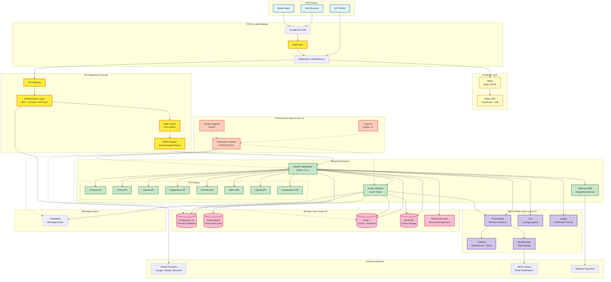
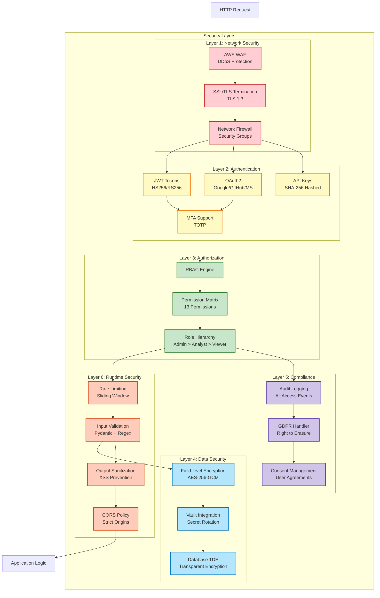
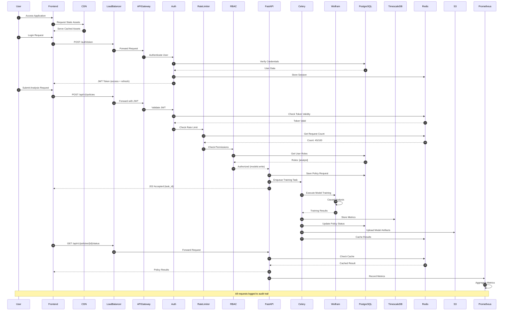
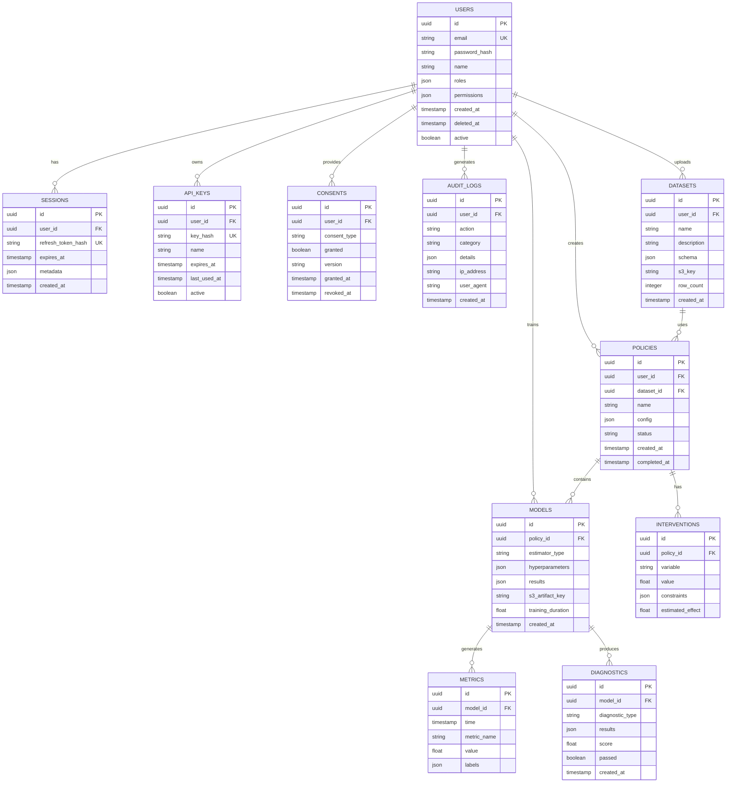

# CQOx システムアーキテクチャ

## 概要

CQOx (Causal Query Optimizer) は、因果推論とポリシー最適化のためのエンタープライズグレードのプラットフォームです。Wolfram ONE統合、世界最高峰のインフラストラクチャ、包括的なセキュリティレイヤーを備えています。

---

## 全体システムアーキテクチャ



---

## セキュリティアーキテクチャ



---

## データフローアーキテクチャ



---

## CI/CDパイプラインアーキテクチャ

```mermaid
graph LR
    subgraph "Source Control"
        GIT[GitHub Repository]
        BRANCH[Feature Branch]
        MAIN[Main Branch]
    end

    subgraph "CI Pipeline (GitHub Actions)"
        subgraph "Backend CI"
            LINT_BE[Lint<br/>Black, Flake8, MyPy]
            TEST_BE[Tests<br/>Pytest + Coverage]
            SECURITY_BE[Security<br/>Safety, Bandit]
        end

        subgraph "Frontend CI"
            LINT_FE[Lint<br/>ESLint]
            TYPE_FE[Type Check<br/>TypeScript]
            BUILD_FE[Build<br/>Vite]
            E2E_FE[E2E Tests<br/>Playwright]
        end

        subgraph "Container Build"
            DOCKER_BUILD[Docker Build<br/>Multi-stage]
            SECURITY_SCAN[Trivy Scan<br/>Vulnerabilities]
            PUSH_REGISTRY[Push to GHCR<br/>ghcr.io]
        end
    end

    subgraph "CD Pipeline (ArgoCD)"
        ARGOCD_SYNC[ArgoCD Sync]
        K8S_DEPLOY[Kubernetes Deploy]
        HEALTH_CHECK[Health Check]
        ROLLBACK[Auto Rollback]
    end

    subgraph "Environments"
        DEV[Development]
        STAGING[Staging]
        PROD[Production]
    end

    subgraph "Monitoring"
        PROM_ALERT[Prometheus Alerts]
        GRAFANA_DASH[Grafana Dashboards]
        SLACK_NOTIFY[Slack Notifications]
    end

    BRANCH --> GIT
    GIT --> LINT_BE
    GIT --> LINT_FE

    LINT_BE --> TEST_BE
    TEST_BE --> SECURITY_BE

    LINT_FE --> TYPE_FE
    TYPE_FE --> BUILD_FE
    BUILD_FE --> E2E_FE

    SECURITY_BE --> DOCKER_BUILD
    E2E_FE --> DOCKER_BUILD

    DOCKER_BUILD --> SECURITY_SCAN
    SECURITY_SCAN --> PUSH_REGISTRY

    PUSH_REGISTRY --> ARGOCD_SYNC
    ARGOCD_SYNC --> K8S_DEPLOY
    K8S_DEPLOY --> HEALTH_CHECK
    HEALTH_CHECK --> DEV

    DEV --> STAGING
    STAGING --> PROD

    HEALTH_CHECK -.->|Failed| ROLLBACK
    ROLLBACK -.-> MAIN

    PROD --> PROM_ALERT
    PROM_ALERT --> GRAFANA_DASH
    GRAFANA_DASH --> SLACK_NOTIFY

    classDef source fill:#e1f5ff,stroke:#01579b,stroke-width:2px
    classDef ci fill:#c8e6c9,stroke:#2e7d32,stroke-width:2px
    classDef cd fill:#fff9c4,stroke:#f57f17,stroke-width:2px
    classDef env fill:#f8bbd0,stroke:#c2185b,stroke-width:2px
    classDef monitor fill:#d1c4e9,stroke:#512da8,stroke-width:2px

    class GIT,BRANCH,MAIN source
    class LINT_BE,TEST_BE,SECURITY_BE,LINT_FE,TYPE_FE,BUILD_FE,E2E_FE,DOCKER_BUILD,SECURITY_SCAN,PUSH_REGISTRY ci
    class ARGOCD_SYNC,K8S_DEPLOY,HEALTH_CHECK,ROLLBACK cd
    class DEV,STAGING,PROD env
    class PROM_ALERT,GRAFANA_DASH,SLACK_NOTIFY monitor
```



---

## データベーススキーマアーキテクチャ



---

## Kubernetesデプロイメントアーキテクチャ

```mermaid
graph TB
    subgraph "Kubernetes Cluster"
        subgraph "Ingress Layer"
            INGRESS[Ingress Controller<br/>nginx-ingress]
            CERT[Cert Manager<br/>Let's Encrypt]
        end

        subgraph "Application Namespace"
            subgraph "Frontend Deployment"
                FE_POD1[Frontend Pod 1<br/>Nginx + React]
                FE_POD2[Frontend Pod 2<br/>Nginx + React]
                FE_SVC[Frontend Service<br/>ClusterIP]
                FE_HPA[HPA<br/>2-10 replicas]
            end

            subgraph "Backend Deployment"
                BE_POD1[Backend Pod 1<br/>FastAPI + Uvicorn]
                BE_POD2[Backend Pod 2<br/>FastAPI + Uvicorn]
                BE_POD3[Backend Pod 3<br/>FastAPI + Uvicorn]
                BE_SVC[Backend Service<br/>ClusterIP]
                BE_HPA[HPA<br/>3-20 replicas]
            end

            subgraph "Celery Workers"
                CELERY_POD1[Celery Worker 1]
                CELERY_POD2[Celery Worker 2]
                CELERY_POD3[Celery Worker 3]
                CELERY_HPA[HPA<br/>2-10 replicas]
            end
        end

        subgraph "Data Namespace"
            PG_STATEFUL[PostgreSQL StatefulSet<br/>3 replicas]
            PG_PVC[PersistentVolumeClaim<br/>100Gi SSD]
            PG_SVC[PostgreSQL Service<br/>Headless]

            REDIS_STATEFUL[Redis StatefulSet<br/>3 replicas - Cluster]
            REDIS_PVC[PersistentVolumeClaim<br/>50Gi SSD]
            REDIS_SVC[Redis Service]

            RABBITMQ_STATEFUL[RabbitMQ StatefulSet<br/>3 replicas - Cluster]
            RABBITMQ_PVC[PersistentVolumeClaim<br/>20Gi]
            RABBITMQ_SVC[RabbitMQ Service]
        end

        subgraph "Monitoring Namespace"
            PROM_DEPLOY[Prometheus Deployment]
            PROM_PVC[PVC - 200Gi]
            GRAFANA_DEPLOY[Grafana Deployment]
            LOKI_DEPLOY[Loki Deployment]
            JAEGER_DEPLOY[Jaeger Deployment]
        end

        subgraph "Configuration"
            CONFIGMAP[ConfigMaps<br/>App Configuration]
            SECRETS[Secrets<br/>Credentials]
            VAULT_AGENT[Vault Agent<br/>Injector]
        end
    end

    INTERNET[Internet] --> INGRESS
    INGRESS --> CERT
    INGRESS --> FE_SVC
    INGRESS --> BE_SVC

    FE_SVC --> FE_POD1
    FE_SVC --> FE_POD2
    FE_HPA -.->|Scale| FE_POD1
    FE_HPA -.->|Scale| FE_POD2

    BE_SVC --> BE_POD1
    BE_SVC --> BE_POD2
    BE_SVC --> BE_POD3
    BE_HPA -.->|Scale| BE_POD1
    BE_HPA -.->|Scale| BE_POD2
    BE_HPA -.->|Scale| BE_POD3

    BE_POD1 --> PG_SVC
    BE_POD2 --> PG_SVC
    BE_POD3 --> PG_SVC
    BE_POD1 --> REDIS_SVC
    BE_POD2 --> REDIS_SVC
    BE_POD3 --> REDIS_SVC

    BE_POD1 --> RABBITMQ_SVC
    BE_POD2 --> RABBITMQ_SVC
    BE_POD3 --> RABBITMQ_SVC

    CELERY_POD1 --> RABBITMQ_SVC
    CELERY_POD2 --> RABBITMQ_SVC
    CELERY_POD3 --> RABBITMQ_SVC
    CELERY_HPA -.->|Scale| CELERY_POD1

    CELERY_POD1 --> PG_SVC
    CELERY_POD2 --> PG_SVC
    CELERY_POD3 --> PG_SVC

    PG_SVC --> PG_STATEFUL
    PG_STATEFUL --> PG_PVC
    REDIS_SVC --> REDIS_STATEFUL
    REDIS_STATEFUL --> REDIS_PVC
    RABBITMQ_SVC --> RABBITMQ_STATEFUL
    RABBITMQ_STATEFUL --> RABBITMQ_PVC

    BE_POD1 --> PROM_DEPLOY
    PROM_DEPLOY --> PROM_PVC
    PROM_DEPLOY --> GRAFANA_DEPLOY
    BE_POD1 --> LOKI_DEPLOY
    BE_POD1 --> JAEGER_DEPLOY

    CONFIGMAP -.->|Mount| BE_POD1
    SECRETS -.->|Mount| BE_POD1
    VAULT_AGENT -.->|Inject| SECRETS

    classDef ingress fill:#e1f5ff,stroke:#01579b,stroke-width:2px
    classDef app fill:#c8e6c9,stroke:#2e7d32,stroke-width:2px
    classDef data fill:#f8bbd0,stroke:#c2185b,stroke-width:2px
    classDef monitor fill:#d1c4e9,stroke:#512da8,stroke-width:2px
    classDef config fill:#fff9c4,stroke:#f57f17,stroke-width:2px

    class INGRESS,CERT ingress
    class FE_POD1,FE_POD2,FE_SVC,FE_HPA,BE_POD1,BE_POD2,BE_POD3,BE_SVC,BE_HPA,CELERY_POD1,CELERY_POD2,CELERY_POD3,CELERY_HPA app
    class PG_STATEFUL,PG_PVC,PG_SVC,REDIS_STATEFUL,REDIS_PVC,REDIS_SVC,RABBITMQ_STATEFUL,RABBITMQ_PVC,RABBITMQ_SVC data
    class PROM_DEPLOY,PROM_PVC,GRAFANA_DEPLOY,LOKI_DEPLOY,JAEGER_DEPLOY monitor
    class CONFIGMAP,SECRETS,VAULT_AGENT config
```



---

## 技術スタック詳細

### Frontend
- **Framework**: React 18.2 with TypeScript 5.2
- **Build Tool**: Vite 5.0
- **Routing**: React Router v6
- **State Management**: TanStack Query (React Query) v5
- **HTTP Client**: Axios 1.6 with JWT interceptors
- **Charts**: Recharts 2.10
- **Testing**: Playwright 1.40 (E2E), Vitest (Unit)
- **Styling**: CSS Modules + Tailwind-compatible utilities
- **Authentication**: JWT with automatic refresh

### Backend
- **Framework**: FastAPI 0.104+ (Python 3.11+)
- **ASGI Server**: Uvicorn with Gunicorn
- **Async ORM**: AsyncPG (PostgreSQL), AioRedis (Redis)
- **Task Queue**: Celery 5.3 with RabbitMQ broker
- **Validation**: Pydantic v2
- **Authentication**: Python-JOSE (JWT), Authlib (OAuth2)
- **Testing**: Pytest 7.4 with pytest-asyncio
- **Integration**: Wolfram Client API

### Storage
- **Primary DB**: PostgreSQL 15 with TimescaleDB extension
- **Cache**: Redis 7 (Cluster mode, 3 nodes)
- **Object Storage**: MinIO (S3-compatible)
- **Secrets**: HashiCorp Vault 1.15
- **Message Queue**: RabbitMQ 3.12 (Cluster mode)

### Observability
- **Metrics**: Prometheus 2.47 + AlertManager
- **Visualization**: Grafana 10.2
- **Logging**: Loki 2.9 + Promtail
- **Tracing**: Jaeger 1.51 (OpenTelemetry compatible)
- **APM**: Custom metrics with Python prometheus-client

### Infrastructure
- **Orchestration**: Kubernetes 1.28+ (EKS/GKE/AKS)
- **GitOps**: ArgoCD 2.9
- **Container Runtime**: Docker 24.0
- **Registry**: GitHub Container Registry (ghcr.io)
- **Load Balancer**: AWS ALB / GCP Load Balancer
- **CDN**: CloudFront / Cloud CDN
- **WAF**: AWS WAF / Cloud Armor

### CI/CD
- **CI**: GitHub Actions
- **CD**: ArgoCD (Declarative GitOps)
- **Security Scanning**: Trivy (containers), Safety (Python), Bandit (SAST)
- **Code Quality**: Black, Flake8, MyPy, ESLint
- **Coverage**: Pytest-cov, Codecov

---

## スケーラビリティ戦略

### 水平スケーリング
- **Frontend**: CDN + Multi-region deployment (2-10 replicas)
- **Backend API**: Auto-scaling based on CPU/Memory (3-20 replicas)
- **Celery Workers**: Queue-based scaling (2-10 replicas)
- **PostgreSQL**: Read replicas (1 primary + 2 read replicas)
- **Redis**: Cluster mode (3 master nodes, 3 replica nodes)

### 垂直スケーリング
- **Database**: Upgradable to larger instance types
- **Cache**: Memory expansion for hot data
- **Workers**: CPU-intensive tasks on compute-optimized nodes

### パフォーマンス最適化
- **Caching Strategy**: Multi-layer (Browser → CDN → Redis → Database)
- **Database Indexing**: B-tree indexes on query fields, GIN indexes for JSON
- **Query Optimization**: Connection pooling (50-200 connections), prepared statements
- **Async I/O**: Non-blocking I/O for all network operations
- **Compression**: Gzip/Brotli for API responses, LZ4 for storage

---

## セキュリティ対策詳細

### 認証・認可
- **JWT**: HS256 (dev), RS256 (prod), 1-hour access token, 7-day refresh token
- **OAuth2**: PKCE flow for Google/GitHub/Microsoft
- **API Keys**: SHA-256 hashed, scoped permissions, rate limited
- **MFA**: TOTP support (future enhancement)

### データ保護
- **Encryption at Rest**: AES-256-GCM for sensitive fields, PostgreSQL TDE
- **Encryption in Transit**: TLS 1.3, HSTS enabled
- **Key Management**: HashiCorp Vault with auto-rotation
- **PII Handling**: Field-level encryption, GDPR-compliant erasure

### アプリケーションセキュリティ
- **Input Validation**: Pydantic models, regex patterns, length limits
- **Output Sanitization**: HTML escaping, JSON encoding
- **CSRF Protection**: SameSite cookies, CSRF tokens
- **XSS Prevention**: Content Security Policy, sanitized outputs
- **SQL Injection**: Parameterized queries only, no raw SQL
- **Rate Limiting**: 100 req/min per IP, exponential backoff

### コンプライアンス
- **GDPR**: Right to access, erasure, portability, consent management
- **Audit Logging**: All data access logged with IP, user agent, timestamp
- **Data Retention**: 90-day log retention, configurable per regulation
- **Consent Tracking**: Granular consent with version control

---

## 災害復旧計画

### バックアップ戦略
- **PostgreSQL**: Daily full backups + WAL archiving (PITR)
- **Redis**: RDB snapshots every 5 minutes, AOF enabled
- **S3 Objects**: Cross-region replication
- **Configuration**: Git-based (ArgoCD), versioned

### RPO/RTO目標
- **RPO (Recovery Point Objective)**: 5 minutes
- **RTO (Recovery Time Objective)**: 15 minutes
- **Backup Retention**: 30 days (production), 7 days (staging)

### 高可用性
- **Multi-AZ Deployment**: All stateful services across 3 availability zones
- **Health Checks**: Kubernetes liveness/readiness probes
- **Auto-healing**: Failed pods automatically restarted
- **Circuit Breaker**: Graceful degradation on dependency failures

---

## 監視・アラート戦略

### 主要メトリクス

#### RED Metrics (Request-level)
- **Rate**: Requests per second by endpoint
- **Errors**: Error rate (4xx, 5xx) with threshold alerts
- **Duration**: p50/p95/p99 latency percentiles

#### Business Metrics
- **Model Training**: Active runs, duration, success rate
- **CAS Score**: Average score across policies
- **Policy ROI**: Distribution and trends
- **User Activity**: DAU/MAU, feature usage

#### Infrastructure Metrics
- **Cache Performance**: Redis hit rate (target: >80%)
- **Database**: Connection pool usage, query latency
- **Storage**: S3 upload rate, disk usage
- **System**: CPU, memory, network I/O

### アラートルール
- **Critical**: Error rate >5%, p95 latency >2s, DB connections >90%
- **Warning**: Error rate >1%, p95 latency >1s, Cache hit rate <70%
- **Info**: Deployment events, scaling events

### ダッシュボード
- **Overview**: High-level system health
- **Detailed**: Comprehensive RED + business + infrastructure metrics
- **Admin**: User management, audit logs, system stats

---

## 将来的な拡張計画

### Phase 2 (Next 6 months)
- **Multi-tenancy**: Organization-level isolation
- **Advanced Analytics**: Real-time streaming with Apache Kafka
- **ML Model Registry**: MLflow integration
- **A/B Testing**: Feature flags with LaunchDarkly

### Phase 3 (Next 12 months)
- **Global Deployment**: Multi-region active-active
- **GraphQL API**: Apollo Server for flexible queries
- **WebSocket**: Real-time updates with Socket.IO
- **Mobile Apps**: Native iOS/Android apps

### Phase 4 (Future)
- **AI-powered Recommendations**: GPT-4 integration
- **Federated Learning**: Privacy-preserving model training
- **Blockchain Integration**: Immutable audit trail
- **Quantum-ready Encryption**: Post-quantum cryptography

---

## エンタープライズ級運用仕様

### A. 分散ジョブ実行・一貫性

#### ジョブのIdempotency（冪等性）

**Idempotency-Key発行ポリシー**
```python
# API リクエスト時にクライアントが生成
Idempotency-Key: <client_request_id>_<timestamp>_<hash(payload)>

# または、サーバー側で job_id として生成
job_id = f"{user_id}_{policy_id}_{created_at_unix}_{uuid4().hex[:8]}"
```

**重複リクエストの処理**
- 同じ `Idempotency-Key` での再リクエスト → 既存のjob_id/結果を返す（新規作成しない）
- DB制約: `UNIQUE(idempotency_key)` on `jobs` テーブル
- Redis キャッシュ: Key: `idempotency:{key}`, Value: `{job_id}`, TTL: 24時間

#### Celery/RabbitMQリトライポリシー

**リトライ設定**
```python
# Celery Task Configuration
@app.task(
    bind=True,
    max_retries=3,
    default_retry_delay=60,  # 初回: 60秒後
    autoretry_for=(NetworkError, WolframTimeoutError),
    retry_backoff=True,      # 指数バックオフ有効
    retry_backoff_max=600,   # 最大10分
    retry_jitter=True        # ジッタ追加
)
def train_policy_task(self, policy_id, dataset_id):
    try:
        # 処理
        pass
    except SoftTimeLimit:
        # タイムアウト時はDLQへ
        self.request.delivery_info['routing_key'] = 'dead_letter'
        raise
```

**Dead Letter Queue (DLQ)**
- 3回リトライ後も失敗 → `celery.dead_letter` キューへ送信
- DLQメッセージは24時間保持 → 手動調査・再投入
- Grafanaでアラート: DLQ深度 > 10

#### ジョブ状態遷移

**有限状態機械（FSM）**
```
queued → running → [succeeded | failed | canceled | timeout]
   ↓         ↓
 canceled  paused → running
```

**状態管理**
```sql
-- jobs テーブル
CREATE TABLE jobs (
    id UUID PRIMARY KEY,
    idempotency_key VARCHAR(255) UNIQUE NOT NULL,
    user_id UUID NOT NULL,
    policy_id UUID,
    status VARCHAR(20) NOT NULL, -- queued, running, succeeded, failed, canceled, timeout
    created_at TIMESTAMPTZ DEFAULT NOW(),
    started_at TIMESTAMPTZ,
    completed_at TIMESTAMPTZ,
    error_message TEXT,
    retry_count INT DEFAULT 0,
    metadata JSONB
);

CREATE INDEX idx_jobs_status ON jobs(status);
CREATE INDEX idx_jobs_user_id ON jobs(user_id);
```

**整合性保証**
1. Celery タスク開始時: DB更新 (`queued` → `running`)
2. 処理中: 進捗をRedisに記録（`progress:{job_id}` = 45%）
3. 完了時: DB更新 (`running` → `succeeded`) + Redis削除 + キャッシュ更新
4. API応答: DBから最新状態を取得（Redis キャッシュは補助）

#### 分散ロック・競合制御

**Redis ベース分散ロック**
```python
from redis.lock import Lock

def train_policy_with_lock(policy_id):
    lock_key = f"lock:policy:{policy_id}"
    lock = redis_client.lock(lock_key, timeout=3600, blocking_timeout=5)

    if not lock.acquire(blocking=False):
        raise ConflictError(f"Policy {policy_id} is already being trained")

    try:
        # 学習処理
        result = train_model(policy_id)
    finally:
        lock.release()

    return result
```

**DB制約によるロック（代替案）**
```sql
-- 同一policy_idに対して複数のrunning jobを防ぐ
CREATE UNIQUE INDEX idx_jobs_policy_running
ON jobs(policy_id)
WHERE status = 'running';
```

#### キューの優先度とQoS

**Queue分離戦略**
```python
# Celery Queue Configuration
CELERY_TASK_ROUTES = {
    'tasks.train_heavy_model': {'queue': 'heavy', 'priority': 3},
    'tasks.quick_analysis': {'queue': 'quick', 'priority': 9},
    'tasks.ui_response': {'queue': 'realtime', 'priority': 10},
}

# Worker Configuration
# Heavy queue: 2 workers × 4 concurrency
# Quick queue: 4 workers × 8 concurrency
# Realtime queue: 8 workers × 2 concurrency
```

**SLA保証**
- Realtime queue: 95% < 500ms
- Quick queue: 95% < 5秒
- Heavy queue: 95% < 5分

---

### B. データ分散・スキーマ管理

#### データパーティショニング戦略

**TimescaleDBパーティショニング**
```sql
-- 時系列メトリクスのパーティショニング（月次）
CREATE TABLE metrics (
    time TIMESTAMPTZ NOT NULL,
    model_id UUID NOT NULL,
    metric_name VARCHAR(50),
    value DOUBLE PRECISION,
    labels JSONB
);

SELECT create_hypertable('metrics', 'time', chunk_time_interval => INTERVAL '1 month');
CREATE INDEX ON metrics (model_id, time DESC);
```

**S3/Parquetパーティショニング**
```
s3://cqox-data/
  ├── datasets/
  │   ├── tenant_id=org-123/
  │   │   ├── date=2025-01/
  │   │   │   └── dataset-abc.parquet
  │   │   └── date=2025-02/
  │   └── tenant_id=org-456/
  └── models/
      └── policy_id=policy-xyz/
          └── version=v1/
              └── model.pkl
```

**大口顧客対策（データスキュー）**
- tenant_idごとのデータ量監視（Prometheus metrics）
- 閾値超過（> 10GB）→ 専用パーティション作成
- 大口顧客は専用Celery workerプールで処理（queue分離）

#### スキーマバージョニング

**Data Contract バージョン管理**
```yaml
# data_contract.yaml (version: 2.1)
version: "2.1"
dataset_id: "marketing_2025"
schema:
  - name: customer_id
    type: string
    required: true
  - name: spend
    type: float
    range: [0, 1000000]
    unit: USD
  - name: channel  # v2.1で追加
    type: categorical
    values: [email, sms, push, web]
changelog:
  - version: "2.1"
    date: "2025-01-15"
    changes: "Added channel field for multi-channel analysis"
  - version: "2.0"
    date: "2024-12-01"
    changes: "Initial contract for 2025"
```

**Runs テーブルとの紐付け**
```sql
ALTER TABLE jobs ADD COLUMN dataset_schema_version VARCHAR(10);

-- どのバージョンの契約で推定したかを記録
INSERT INTO jobs (id, dataset_id, dataset_schema_version, ...)
VALUES ('job-123', 'dataset-abc', '2.1', ...);
```

#### データライフサイクル・保持期間

**保持ポリシー**
```python
# S3 Lifecycle Policy (Terraform)
resource "aws_s3_bucket_lifecycle_configuration" "cqox_data" {
  rule {
    id     = "archive_old_datasets"
    status = "Enabled"

    transition {
      days          = 90
      storage_class = "GLACIER"
    }

    expiration {
      days = 395  # 13ヶ月保持
    }
  }

  rule {
    id     = "delete_temp_uploads"
    prefix = "temp/"
    expiration {
      days = 7
    }
  }
}
```

**PII マスキング・削除**
```python
# GDPR準拠のデータ削除
async def erase_user_data(user_id: str):
    # 1. Datasets: PII列をマスキング
    await db.execute("""
        UPDATE datasets
        SET customer_id = 'REDACTED',
            email = 'deleted@example.com'
        WHERE user_id = $1
    """, user_id)

    # 2. Audit logs: user_id を匿名化
    await db.execute("""
        UPDATE audit_logs
        SET user_id = NULL,
            ip_address = '0.0.0.0'
        WHERE user_id = $1
    """, user_id)

    # 3. S3オブジェクト削除
    s3_keys = await get_user_s3_keys(user_id)
    for key in s3_keys:
        s3_client.delete_object(Bucket='cqox-data', Key=key)
```

#### 系統（Lineage）とカタログ

**Lineage テーブル設計**
```sql
CREATE TABLE lineage (
    id UUID PRIMARY KEY,
    source_type VARCHAR(50),  -- 'dataset', 'model', 'figure', 'decision_card'
    source_id UUID,
    target_type VARCHAR(50),
    target_id UUID,
    relationship VARCHAR(50), -- 'generated_from', 'used_by', 'derived_from'
    created_at TIMESTAMPTZ DEFAULT NOW()
);

-- Example: dataset → job → model → figure → decision_card
INSERT INTO lineage VALUES
  (gen_uuid(), 'dataset', 'ds-123', 'job', 'job-456', 'used_by', NOW()),
  (gen_uuid(), 'job', 'job-456', 'model', 'model-789', 'generated_from', NOW()),
  (gen_uuid(), 'model', 'model-789', 'figure', 'fig-abc', 'generated_from', NOW()),
  (gen_uuid(), 'figure', 'fig-abc', 'decision_card', 'card-xyz', 'used_by', NOW());
```

**系統追跡API**
```python
# GET /api/lineage/dataset/{dataset_id}
# → そのdatasetから生成されたすべてのモデル・図表を返す
```

---

### C. 分散インフラ・可用性

#### マルチAZ/リージョン戦略

**初期構成（Single Region, Multi-AZ）**
- **EKS/GKE**: 3 Availability Zonesに分散
- **PostgreSQL**: Multi-AZ RDS（Primary + Standby）
- **Redis**: Cluster mode, 3 master nodes × 3 AZs
- **S3**: 自動Multi-AZ冗長化

**将来のMulti-Region戦略（Phase 3）**
- **Active-Passive**: プライマリリージョン（us-east-1）+ DRリージョン（us-west-2）
- **データレプリケーション**: PostgreSQL Cross-Region Read Replica, S3 Cross-Region Replication
- **Failover**: Route53 Health Check → DNSフェイルオーバー（RTO: 5分）

#### 障害ドメイン定義

| 障害ドメイン | 影響範囲 | デグレードモード | 検知方法 |
|-------------|---------|----------------|---------|
| **K8s ノード障害** | 影響Pod（他ノードで再起動） | 一時的な応答遅延 | Kubelet health check |
| **AZ 障害** | 1/3のリソース喪失 | 残り2AZで継続（性能低下） | AWS Health Dashboard |
| **PostgreSQL 障害** | 全API停止 | Read-only mode (Redis cache) | Connection timeout |
| **Redis 障害** | キャッシュ喪失、レート制限不可 | DB直接アクセス（遅延増） | Redis PING失敗 |
| **Wolfram Cloud障害** | モデル学習停止 | 既存結果表示のみ | HTTP timeout (30s) |
| **RabbitMQ 障害** | ジョブキュー停止 | 新規ジョブ拒否（503） | Management API |

**Wolfram障害時のデグレード例**
```python
try:
    result = wolfram_client.causal_graph(data)
except WolframUnavailableError:
    # グレーの"現在利用不可"プレースホルダーを表示
    return {"graph": None, "status": "unavailable", "message": "Wolfram Cloud is temporarily unavailable"}
```

#### バックアップ・リストア手順

**PostgreSQL**
```bash
# 自動バックアップ（AWS RDS）
# - 毎日 3:00 UTC に自動スナップショット
# - トランザクションログ（WAL）を5分ごとにS3にアーカイブ
# - PITR（Point-in-Time Recovery）: 過去35日間の任意時点に復元可能

# 手動スナップショット（重要変更前）
aws rds create-db-snapshot \
  --db-instance-identifier cqox-prod \
  --db-snapshot-identifier cqox-prod-before-migration-$(date +%Y%m%d)

# リストア
aws rds restore-db-instance-to-point-in-time \
  --source-db-instance-identifier cqox-prod \
  --target-db-instance-identifier cqox-prod-restored \
  --restore-time 2025-01-15T10:30:00Z
```

**S3オブジェクト**
- **Versioning**: 有効化（削除・上書き時も旧バージョン保持）
- **Cross-Region Replication**: プライマリ（us-east-1） → DR（us-west-2）
- **削除保護**: MFA Delete有効化（本番環境）

**DR手順 RPO/RTO**
- **RPO (Recovery Point Objective)**: 5分（WALアーカイブ間隔）
- **RTO (Recovery Time Objective)**: 15分
  - RDS Standby フェイルオーバー: ~2分
  - EKS Pod再起動: ~5分
  - DNS切り替え: ~3分
  - 動作確認: ~5分

---

### D. マルチテナント・SaaS

#### テナント分離モデル

**採用方式: DB共有 + tenant_id カラム分離**
```sql
-- すべてのテーブルに tenant_id を追加
ALTER TABLE datasets ADD COLUMN tenant_id UUID NOT NULL;
ALTER TABLE policies ADD COLUMN tenant_id UUID NOT NULL;
ALTER TABLE jobs ADD COLUMN tenant_id UUID NOT NULL;

-- Row-Level Security (RLS) で強制分離
ALTER TABLE datasets ENABLE ROW LEVEL SECURITY;

CREATE POLICY tenant_isolation_policy ON datasets
  USING (tenant_id = current_setting('app.current_tenant_id')::UUID);
```

**API Gatewayレベルでのフィルタリング**
```python
# FastAPI Dependency
async def get_current_tenant(token: TokenData = Depends(get_current_user)) -> str:
    return token.tenant_id

# すべてのクエリでtenant_idをフィルタ
@router.get("/datasets")
async def list_datasets(tenant_id: str = Depends(get_current_tenant)):
    return await db.fetch("SELECT * FROM datasets WHERE tenant_id = $1", tenant_id)
```

**将来のDB per Tenant移行パス（Phase 3）**
- 大口顧客（> 100GB data）は専用DBインスタンスに移行
- `tenant_routing` テーブルで接続先を管理

#### レートリミット・クォータ

**テナント別クォータ設計**
```sql
CREATE TABLE tenant_quotas (
    tenant_id UUID PRIMARY KEY,
    plan VARCHAR(20),  -- 'free', 'pro', 'enterprise'
    max_jobs_per_day INT,
    max_storage_gb INT,
    max_api_calls_per_min INT,
    created_at TIMESTAMPTZ DEFAULT NOW()
);

-- Example
INSERT INTO tenant_quotas VALUES
  ('tenant-free-001', 'free', 10, 5, 60),
  ('tenant-pro-002', 'pro', 100, 50, 300),
  ('tenant-ent-003', 'enterprise', 1000, 500, 1000);
```

**レート制限実装（Redis + Lua）**
```python
# Sliding Window Rate Limiter
async def check_rate_limit(tenant_id: str, limit: int, window: int = 60):
    key = f"ratelimit:{tenant_id}:{int(time.time() // window)}"
    current = await redis.incr(key)

    if current == 1:
        await redis.expire(key, window)

    if current > limit:
        raise HTTPException(status_code=429, detail={
            "error": "rate_limit_exceeded",
            "limit": limit,
            "window": window,
            "retry_after": window - (int(time.time()) % window)
        })
```

**クォータ超過時の429レスポンス**
```json
{
  "error": "quota_exceeded",
  "message": "Daily job limit reached (10/10). Upgrade to Pro plan for more.",
  "quota": {
    "type": "jobs_per_day",
    "limit": 10,
    "used": 10,
    "reset_at": "2025-01-16T00:00:00Z"
  },
  "upgrade_url": "https://cqox.ai/pricing"
}
```

#### 課金・メータリング

**メータリング対象**
```sql
CREATE TABLE usage_metrics (
    id UUID PRIMARY KEY,
    tenant_id UUID NOT NULL,
    metric_type VARCHAR(50),  -- 'job_run', 'storage_gb_day', 'api_call', 'figure_generation'
    quantity FLOAT NOT NULL,
    recorded_at TIMESTAMPTZ DEFAULT NOW(),
    metadata JSONB
);

-- 日次集計（Celeryタスクで毎日実行）
CREATE TABLE daily_usage_summary (
    tenant_id UUID,
    date DATE,
    total_jobs INT,
    total_api_calls BIGINT,
    avg_storage_gb FLOAT,
    total_figures_generated INT,
    PRIMARY KEY (tenant_id, date)
);
```

**料金プラン例**
```yaml
# pricing.yaml
plans:
  free:
    price: 0
    quotas:
      jobs_per_day: 10
      storage_gb: 5
      api_calls_per_min: 60
  pro:
    price: 100000  # 10万円/月
    quotas:
      jobs_per_day: 100
      storage_gb: 50
      api_calls_per_min: 300
    overages:
      extra_job: 1000  # 1ジョブあたり1,000円
      extra_gb_month: 2000  # 1GB/月あたり2,000円
  enterprise:
    price: 1000000  # 100万円/月
    quotas:
      jobs_per_day: 1000
      storage_gb: 500
      api_calls_per_min: 1000
    custom: true
```

---

### E. セキュリティ・コンプライアンス運用

#### ロール・権限マッピング詳細

**UI Role → API Permission マッピング**

| UI Role | API Permissions | Accessible Endpoints |
|---------|----------------|---------------------|
| **viewer** | `console:read`, `policies:read`, `diagnostics:read` | GET /console/*, GET /policies, GET /diagnostics |
| **analyst** | viewer + `models:write`, `policies:write`, `datasets:write` | POST /policies, POST /datasets, POST /models/train |
| **admin** | analyst + `admin:*` | GET/POST/DELETE /admin/*, DELETE /users/{id} |

**Permission Check実装**
```python
# backend/cqox/api/dependencies.py
PERMISSION_MAP = {
    "GET /api/v1/policies": ["policies:read"],
    "POST /api/v1/policies": ["policies:write"],
    "DELETE /api/v1/policies/{id}": ["policies:delete", "admin:all"],
}

def require_permission(required: List[str]):
    def dependency(token: TokenData = Depends(get_current_user)):
        user_permissions = set(token.permissions)
        if not any(perm in user_permissions for perm in required):
            raise HTTPException(403, detail=f"Missing permission: {required}")
        return token
    return Depends(dependency)
```

#### 監査ログスキーマ詳細

**audit_logs テーブル拡張**
```sql
CREATE TABLE audit_logs (
    id UUID PRIMARY KEY DEFAULT gen_random_uuid(),
    timestamp TIMESTAMPTZ DEFAULT NOW(),
    tenant_id UUID NOT NULL,
    user_id UUID,
    action VARCHAR(100) NOT NULL,  -- 'READ_POLICY', 'CREATE_JOB', 'DELETE_USER'
    resource_type VARCHAR(50),     -- 'policy', 'dataset', 'job', 'user'
    resource_id UUID,
    endpoint VARCHAR(255),         -- '/api/v1/policies/123'
    method VARCHAR(10),            -- 'GET', 'POST', 'DELETE'
    status_code INT,               -- 200, 403, 500
    ip_address INET,
    user_agent TEXT,
    request_id UUID,               -- X-Request-ID header
    details JSONB,                 -- { "policy_id": "...", "changes": {...} }
    reason TEXT                    -- GDPRletetion理由など
);

CREATE INDEX idx_audit_logs_tenant_time ON audit_logs(tenant_id, timestamp DESC);
CREATE INDEX idx_audit_logs_user ON audit_logs(user_id, timestamp DESC);
CREATE INDEX idx_audit_logs_resource ON audit_logs(resource_type, resource_id);
```

**何を記録するか（詳細ルール）**
- **READ操作**: 個客レベルデータのみログ（集計データは除外）
- **WRITE操作**: すべてログ（誰が何をいつ作成・更新・削除したか）
- **DELETE操作**: 削除前の状態をJSONBで保存
- **GDPR削除**: 理由（reason）を必須記録

**個客レベルデータの保存禁止ポリシー**
```python
# ポリシー: 個客レベルuplift/Δ¥は保存しない
# × Bad: 個客IDと紐付けて保存
# ○ Good: セグメント集計のみ保存

# Bad Example (禁止)
await db.execute("""
    INSERT INTO individual_uplifts (customer_id, uplift, delta_revenue)
    VALUES ($1, $2, $3)
""", customer_id, uplift, delta_revenue)

# Good Example (許可)
segment_summary = {
    "segment": "high_value_customers",
    "count": 1523,
    "avg_uplift": 0.23,
    "total_delta_revenue": 450000,
    "p25": 0.15,
    "p50": 0.21,
    "p75": 0.29
}
await db.execute("""
    INSERT INTO segment_summaries (policy_id, segment_name, summary)
    VALUES ($1, $2, $3)
""", policy_id, segment_name, segment_summary)
```

#### キー管理・ローテーション

**Vault パス構成**
```
secret/
├── cqox/
│   ├── prod/
│   │   ├── database/
│   │   │   ├── master_password
│   │   │   └── read_replica_password
│   │   ├── jwt/
│   │   │   ├── private_key (RS256)
│   │   │   └── public_key
│   │   ├── api_keys/
│   │   │   ├── wolfram_api_key
│   │   │   └── smtp_password
│   │   └── encryption/
│   │       └── aes_256_key (field-level encryption)
│   └── staging/
│       └── ...
```

**自動ローテーション周期**
```yaml
rotation_policy:
  jwt_signing_key: 90_days
  database_passwords: 180_days
  api_keys: 365_days
  encryption_keys: never  # 手動ローテーションのみ（データ再暗号化必要）
```

**ローテーション手順（例: JWT鍵）**
```bash
# 1. 新しい鍵ペア生成
openssl genrsa -out new_private.pem 4096
openssl rsa -in new_private.pem -pubout -out new_public.pem

# 2. Vaultに新鍵を追加（旧鍵は残す）
vault kv put secret/cqox/prod/jwt/private_key_v2 value=@new_private.pem
vault kv put secret/cqox/prod/jwt/public_key_v2 value=@new_public.pem

# 3. アプリケーションを新鍵で起動（旧鍵も検証用に保持）
# 4. 7日後、旧鍵で発行されたトークンが失効したら旧鍵削除
```

#### データマスキング・プレビュー

**UI上のマスキングルール**
```typescript
// frontend/src/utils/masking.ts
export function maskCustomerId(customerId: string, role: string): string {
  if (role === 'admin') return customerId;  // admin は全表示
  if (role === 'analyst') return customerId.slice(0, 4) + '****';  // 先頭4文字のみ
  return '****';  // viewer は完全マスキング
}

export function maskEmail(email: string, role: string): string {
  if (role === 'admin') return email;
  const [local, domain] = email.split('@');
  return `${local[0]}***@${domain}`;
}
```

**サンプルデータダウンロード制限**
```python
# GET /api/datasets/{id}/preview
@router.get("/{dataset_id}/preview")
async def preview_dataset(
    dataset_id: str,
    limit: int = Query(100, le=1000),
    user: TokenData = Depends(require_permission(["datasets:read"]))
):
    # 1. 最大1000行まで
    # 2. PII列はマスキング
    # 3. ダウンロードは監査ログに記録

    data = await fetch_dataset(dataset_id, limit=min(limit, 1000))
    masked_data = mask_pii_columns(data, user.roles)

    await audit_log(
        user_id=user.sub,
        action="PREVIEW_DATASET",
        resource_id=dataset_id,
        details={"rows_returned": len(masked_data)}
    )

    return masked_data
```

---

### F. SRE・運用

#### SLO/SLI/エラーバジェット

**定義されたSLO**

| Service | SLI | SLO Target | Error Budget (30日) |
|---------|-----|-----------|-------------------|
| **API Success Rate** | `(2xx + 3xx) / total` | 99.5% | 0.5% = 216分 |
| **API P95 Latency** | 95パーセンタイルレスポンス時間 | < 1秒 | - |
| **Job Completion Rate** | `succeeded / (succeeded + failed)` | 99.0% | 1.0% |
| **Job P95 Duration** | 重い学習ジョブの95パーセンタイル | < 5分 | - |

**Prometheusメトリクス**
```python
# backend/cqox/metrics.py
from prometheus_client import Counter, Histogram, Gauge

# API成功率
api_requests_total = Counter(
    'cqox_api_requests_total',
    'Total API requests',
    ['method', 'endpoint', 'status_code']
)

# APIレイテンシ
api_request_duration = Histogram(
    'cqox_api_request_duration_seconds',
    'API request duration',
    ['method', 'endpoint'],
    buckets=[0.1, 0.5, 1.0, 2.0, 5.0, 10.0]
)

# ジョブ完了率
job_completion_total = Counter(
    'cqox_job_completion_total',
    'Total job completions',
    ['status']  # succeeded, failed, timeout
)

# ジョブ実行時間
job_duration = Histogram(
    'cqox_job_duration_seconds',
    'Job execution duration',
    ['job_type'],  # train_model, run_diagnostics, etc.
    buckets=[1, 5, 10, 30, 60, 300, 600, 1800]
)
```

**エラーバジェット消費アラート**
```yaml
# prometheus/alerts/slo.yaml
groups:
  - name: slo_alerts
    rules:
      - alert: ErrorBudgetBurn
        expr: |
          (
            1 - (sum(rate(cqox_api_requests_total{status_code=~"2.."}[30d]))
                 / sum(rate(cqox_api_requests_total[30d])))
          ) > 0.005
        for: 5m
        labels:
          severity: critical
        annotations:
          summary: "API error budget exceeded (> 0.5%)"
          description: "Current error rate: {{ $value | humanizePercentage }}"
```

#### Runbook・インシデント対応

**主要インシデントシナリオ**

**1. ジョブキューが溜まる**
```markdown
### Symptom
- Celery queue depth > 1000
- Job wait time > 30分

### Diagnosis
1. Check worker status: `celery -A cqox inspect active`
2. Check RabbitMQ queue depth: `rabbitmqctl list_queues`
3. Check worker logs for errors

### Resolution
- Immediate: Scale up Celery workers (HPA or manual)
  ```bash
  kubectl scale deployment celery-worker --replicas=20
  ```
- Root cause:
  - If Wolfram timeout → Increase timeout / Add retry
  - If memory leak → Restart workers
  - If traffic spike → Review autoscaling policy
```

**2. Redis障害**
```markdown
### Symptom
- Cache hit rate drops to 0%
- Rate limiting fails
- Session validation errors

### Diagnosis
1. Check Redis cluster status: `redis-cli cluster info`
2. Check Redis logs: `kubectl logs -n data redis-0`
3. Check network: `kubectl exec -it backend-0 -- redis-cli ping`

### Resolution
- Immediate:
  - Failover to replica: AWS ElastiCache auto-failover (~2min)
  - API continues with degraded performance (direct DB access)
- Manual:
  ```bash
  # Force manual failover
  redis-cli -c cluster failover
  ```
```

**3. Wolfram Cloudタイムアウト**
```markdown
### Symptom
- Job failures with "WolframTimeoutError"
- Grafana: Wolfram API P95 latency > 60s

### Diagnosis
1. Check Wolfram Cloud status: https://status.wolfram.com
2. Check our API key quota: Wolfram dashboard
3. Review recent job sizes (large datasets?)

### Resolution
- Immediate:
  - Return cached results for existing policies
  - Defer new jobs to queue for retry (max 3 retries)
- Mitigation:
  - Increase timeout: 30s → 90s
  - Reduce dataset size sent to Wolfram
  - Contact Wolfram support if persistent
```

**Slack/PagerDuty通知設定**
```yaml
# alertmanager/config.yaml
route:
  group_by: ['alertname', 'severity']
  group_wait: 30s
  group_interval: 5m
  repeat_interval: 4h
  receiver: 'slack-critical'
  routes:
    - match:
        severity: critical
      receiver: 'pagerduty'
    - match:
        severity: warning
      receiver: 'slack-warnings'

receivers:
  - name: 'pagerduty'
    pagerduty_configs:
      - service_key: '<pagerduty_integration_key>'
  - name: 'slack-critical'
    slack_configs:
      - api_url: '<slack_webhook_url>'
        channel: '#cqox-alerts-critical'
        title: '🚨 {{ .GroupLabels.alertname }}'
  - name: 'slack-warnings'
    slack_configs:
      - api_url: '<slack_webhook_url>'
        channel: '#cqox-alerts-warnings'
        title: '⚠️  {{ .GroupLabels.alertname }}'
```

#### ローリングアップデート・ロールバック

**ArgoCD Rollout戦略**
```yaml
# kubernetes/rollout.yaml
apiVersion: argoproj.io/v1alpha1
kind: Rollout
metadata:
  name: cqox-backend
spec:
  replicas: 10
  strategy:
    canary:
      steps:
        - setWeight: 10    # 10%のトラフィックを新バージョンへ
        - pause: {duration: 5m}
        - setWeight: 30
        - pause: {duration: 10m}
        - setWeight: 50
        - pause: {duration: 10m}
        - setWeight: 100   # 全トラフィックを新バージョンへ
      analysis:
        templates:
          - templateName: error-rate-check
        args:
          - name: error-rate-threshold
            value: "0.01"  # 1%以上のエラー率でロールバック
  revisionHistoryLimit: 5  # 過去5バージョン保持
```

**自動ロールバック条件**
```yaml
# kubernetes/analysis-template.yaml
apiVersion: argoproj.io/v1alpha1
kind: AnalysisTemplate
metadata:
  name: error-rate-check
spec:
  metrics:
    - name: error-rate
      interval: 1m
      successCondition: result < 0.01
      failureLimit: 3
      provider:
        prometheus:
          address: http://prometheus:9090
          query: |
            sum(rate(cqox_api_requests_total{status_code=~"5.."}[5m]))
            / sum(rate(cqox_api_requests_total[5m]))
```

**手動ロールバック手順**
```bash
# 1. 現在のバージョン確認
kubectl argo rollouts status cqox-backend

# 2. ロールバック（前バージョンへ）
kubectl argo rollouts undo cqox-backend

# 3. 特定のリビジョンへロールバック
kubectl argo rollouts undo cqox-backend --to-revision=3

# 4. ロールバック状況確認
kubectl argo rollouts get rollout cqox-backend --watch
```

**ML/Policy エンジンのカナリアリリースポリシー**
- **新しい推定器**: 必ず10% canaryから開始
- **Policy エンジン更新**: shadow mode（本番に影響させずログのみ）で1週間検証
- **ロールバック可能性**: 過去5バージョンのモデルアーティファクトをS3に保持

---

### G. MLOps・因果モデル運用

#### モデル・Policyレジストリ

**レジストリスキーマ**
```sql
CREATE TABLE model_registry (
    id UUID PRIMARY KEY,
    policy_id UUID NOT NULL,
    version VARCHAR(20) NOT NULL,  -- 'v1.0.0', 'v1.1.0'
    estimator_type VARCHAR(50),
    hyperparameters JSONB,
    training_dataset_id UUID,
    dataset_schema_version VARCHAR(10),
    trained_at TIMESTAMPTZ,
    trained_by UUID,  -- user_id
    s3_artifact_key VARCHAR(500),
    performance_metrics JSONB,  -- {"cas_score": 78.5, "auc": 0.85}
    status VARCHAR(20),  -- 'experimental', 'staging', 'production', 'retired'
    promoted_at TIMESTAMPTZ,
    UNIQUE(policy_id, version)
);

-- Example
INSERT INTO model_registry VALUES (
    gen_random_uuid(),
    'policy-abc',
    'v1.2.0',
    'LinearDML',
    '{"alpha": 0.01, "max_iter": 1000}',
    'dataset-123',
    '2.1',
    '2025-01-15 10:30:00',
    'user-analyst-1',
    's3://cqox-models/policy-abc/v1.2.0/model.pkl',
    '{"cas_score": 82.3, "refutation_passed": true}',
    'production',
    '2025-01-16 09:00:00'
);
```

**バージョニングポリシー**
- **Semantic Versioning**: `v{major}.{minor}.{patch}`
  - major: 推定器タイプ変更（DML → Causal Forest）
  - minor: ハイパーパラメータ重要変更
  - patch: 軽微な調整・バグ修正
- **Promotion Flow**: experimental → staging → production
- **Production制約**: 同時に1バージョンのみproduction（Blue-Green）

#### Shadow評価・オフライン検証

**Shadow Mode実装**
```python
# 新しいモデルをshadow modeで実行（本番トラフィックに影響なし）
@router.post("/policies/{policy_id}/shadow-eval")
async def shadow_evaluate(
    policy_id: str,
    new_model_version: str,
    user: TokenData = Depends(require_permission(["admin:all"]))
):
    # 1. 本番トラフィックログをS3から取得
    production_data = await s3.get_object(
        Bucket='cqox-logs',
        Key=f'traffic/{policy_id}/last_7_days.parquet'
    )

    # 2. 現行モデル（production）で予測
    current_model = await get_production_model(policy_id)
    current_predictions = current_model.predict(production_data)

    # 3. 新モデル（shadow）で予測
    shadow_model = await load_model_version(policy_id, new_model_version)
    shadow_predictions = shadow_model.predict(production_data)

    # 4. 差分を計算・記録
    delta_metrics = compare_predictions(current_predictions, shadow_predictions)

    await db.execute("""
        INSERT INTO shadow_eval_results (policy_id, shadow_version, delta_metrics)
        VALUES ($1, $2, $3)
    """, policy_id, new_model_version, delta_metrics)

    return {"status": "shadow_eval_completed", "delta": delta_metrics}
```

**評価メトリクス**
```json
{
  "delta_cas_score": -1.2,
  "delta_avg_uplift": +0.03,
  "prediction_correlation": 0.92,
  "divergence_rate": 0.08,
  "recommended_action": "promote_to_staging"
}
```

#### データドリフト・モデル劣化検知

**Input Feature分布監視**
```sql
-- 日次でfeature分布を記録
CREATE TABLE feature_distributions (
    id UUID PRIMARY KEY,
    policy_id UUID NOT NULL,
    feature_name VARCHAR(100),
    date DATE NOT NULL,
    mean FLOAT,
    std FLOAT,
    p25 FLOAT,
    p50 FLOAT,
    p75 FLOAT,
    recorded_at TIMESTAMPTZ DEFAULT NOW()
);

-- ドリフト検知用にベースライン期間の統計を保存
CREATE TABLE baseline_distributions (
    policy_id UUID,
    feature_name VARCHAR(100),
    baseline_period_start DATE,
    baseline_period_end DATE,
    mean FLOAT,
    std FLOAT,
    PRIMARY KEY (policy_id, feature_name)
);
```

**ドリフト検知ロジック（Celery定期タスク）**
```python
from scipy.stats import ks_2samp

@celery.task
async def detect_drift():
    policies = await get_active_policies()

    for policy in policies:
        # 1. ベースライン分布を取得
        baseline = await get_baseline_distribution(policy.id)

        # 2. 直近7日間の分布を取得
        recent = await get_recent_distribution(policy.id, days=7)

        # 3. Kolmogorov-Smirnov検定
        for feature in baseline.keys():
            statistic, pvalue = ks_2samp(baseline[feature], recent[feature])

            if pvalue < 0.01:  # 有意水準1%
                # ドリフト検出！
                await send_alert(
                    severity="warning",
                    message=f"Feature drift detected: {feature} in policy {policy.id}",
                    details={"ks_statistic": statistic, "p_value": pvalue}
                )

                # Grafana annotation
                await grafana.create_annotation(
                    text=f"Drift detected: {feature}",
                    tags=["drift", policy.id]
                )
```

**モデル性能劣化検知**
```python
@celery.task
async def detect_model_degradation():
    # 1. 直近30日間のCASスコア推移を取得
    cas_trend = await db.fetch("""
        SELECT date, avg_cas_score
        FROM daily_model_performance
        WHERE policy_id = $1 AND date >= CURRENT_DATE - 30
        ORDER BY date
    """, policy_id)

    # 2. 線形回帰で傾き検出
    from sklearn.linear_model import LinearRegression
    X = np.array([i for i in range(len(cas_trend))]).reshape(-1, 1)
    y = np.array([row['avg_cas_score'] for row in cas_trend])

    model = LinearRegression().fit(X, y)
    slope = model.coef_[0]

    # 3. 負の傾き（劣化傾向）を検出
    if slope < -0.5:  # 月間で-15ポイント以上低下
        await send_alert(
            severity="warning",
            message=f"Model degradation detected for policy {policy_id}",
            details={"monthly_decline": slope * 30}
        )
```

**アラート閾値**
- **Feature Drift**: p-value < 0.01 → Warning
- **CAS Score下降**: 月間 -10ポイント以上 → Warning, -20ポイント以上 → Critical
- **Uplift変化**: ベースラインから±30%以上 → Investigation required

---

### H. フロントエンド分散設計

#### ページング・ストリーミング設計

**サーバーサイドページング API**
```python
# GET /api/policies?page=2&limit=50
@router.get("/policies")
async def list_policies(
    page: int = Query(1, ge=1),
    limit: int = Query(50, le=100),
    user: TokenData = Depends(get_current_user)
):
    offset = (page - 1) * limit

    policies = await db.fetch("""
        SELECT * FROM policies
        WHERE tenant_id = $1
        ORDER BY created_at DESC
        LIMIT $2 OFFSET $3
    """, user.tenant_id, limit, offset)

    total = await db.fetchval("SELECT COUNT(*) FROM policies WHERE tenant_id = $1", user.tenant_id)

    return {
        "items": policies,
        "pagination": {
            "page": page,
            "limit": limit,
            "total": total,
            "pages": math.ceil(total / limit)
        }
    }
```

**Cursor-based Pagination（大規模データ向け）**
```python
# GET /api/recourse/individual?cursor=abc123&limit=100
@router.get("/recourse/individual")
async def list_individual_recourse(
    cursor: Optional[str] = None,
    limit: int = Query(100, le=1000)
):
    if cursor:
        decoded_cursor = base64.b64decode(cursor).decode()
        last_id, last_timestamp = decoded_cursor.split('|')
    else:
        last_id, last_timestamp = None, None

    query = """
        SELECT * FROM recourse_results
        WHERE (created_at, id) > ($1, $2)
        ORDER BY created_at, id
        LIMIT $3
    """

    results = await db.fetch(query, last_timestamp, last_id, limit)

    next_cursor = None
    if len(results) == limit:
        last_item = results[-1]
        next_cursor = base64.b64encode(
            f"{last_item['id']}|{last_item['created_at']}".encode()
        ).decode()

    return {
        "items": results,
        "next_cursor": next_cursor
    }
```

**React Query 無限スクロール**
```typescript
// frontend/src/hooks/usePolicies.ts
import { useInfiniteQuery } from '@tanstack/react-query'

export function usePoliciesInfinite() {
  return useInfiniteQuery({
    queryKey: ['policies', 'infinite'],
    queryFn: ({ pageParam = 1 }) =>
      api.get(`/policies?page=${pageParam}&limit=50`),
    getNextPageParam: (lastPage) => {
      const { page, pages } = lastPage.pagination
      return page < pages ? page + 1 : undefined
    },
    staleTime: 5 * 60 * 1000, // 5分
  })
}

// Component
function PolicyList() {
  const { data, fetchNextPage, hasNextPage, isLoading } = usePoliciesInfinite()

  return (
    <div>
      {data?.pages.map((page) =>
        page.items.map((policy) => <PolicyCard key={policy.id} {...policy} />)
      )}
      {hasNextPage && <button onClick={fetchNextPage}>Load More</button>}
    </div>
  )
}
```

#### オンライン・オフライン状態管理

**Network Error時のDegradation**
```typescript
// frontend/src/lib/api.ts
axios.interceptors.response.use(
  (response) => response,
  async (error) => {
    if (error.code === 'ERR_NETWORK' || error.code === 'ECONNABORTED') {
      // ネットワークエラー → キャッシュから返す
      const cachedData = await getCachedResponse(error.config.url)
      if (cachedData) {
        return {
          ...error.config,
          data: cachedData,
          headers: { 'X-From-Cache': 'true' }
        }
      }

      // キャッシュもない → ユーザーに通知
      toast.error('Network error. Showing last known data.')
      throw new NetworkUnavailableError()
    }

    if (error.response?.status === 503) {
      // サービス一時停止 → 静的メッセージ表示
      return {
        data: {
          status: 'unavailable',
          message: 'Service temporarily unavailable. Please try again later.'
        }
      }
    }

    throw error
  }
)
```

**Service Worker でのオフライン対応**
```javascript
// frontend/public/service-worker.js
self.addEventListener('fetch', (event) => {
  event.respondWith(
    caches.match(event.request).then((cachedResponse) => {
      if (cachedResponse) {
        return cachedResponse
      }

      return fetch(event.request).catch(() => {
        // Fetch失敗 → フォールバック
        if (event.request.url.includes('/api/')) {
          return new Response(
            JSON.stringify({ error: 'offline', cached: false }),
            { headers: { 'Content-Type': 'application/json' } }
          )
        }
      })
    })
  )
})
```

**React Query のオフライン対応**
```typescript
// frontend/src/lib/queryClient.ts
import { QueryClient } from '@tanstack/react-query'
import { persistQueryClient } from '@tanstack/react-query-persist-client'
import { createSyncStoragePersister } from '@tanstack/query-sync-storage-persister'

const queryClient = new QueryClient({
  defaultOptions: {
    queries: {
      staleTime: 5 * 60 * 1000,
      cacheTime: 24 * 60 * 60 * 1000, // 24時間
      networkMode: 'offlineFirst', // オフライン時はキャッシュ優先
    },
  },
})

const persister = createSyncStoragePersister({
  storage: window.localStorage,
})

persistQueryClient({
  queryClient,
  persister,
  maxAge: 24 * 60 * 60 * 1000,
})
```

#### URL ベース状態同期

**URL State Management**
```typescript
// frontend/src/pages/PolicyLab.tsx
import { useSearchParams } from 'react-router-dom'

export function PolicyLab() {
  const [searchParams, setSearchParams] = useSearchParams()

  // URL から状態を復元
  const currentTab = searchParams.get('tab') || 'overview'
  const coverage = parseFloat(searchParams.get('coverage') || '0.5')
  const selectedPolicyId = searchParams.get('policy_id')

  const updateTab = (newTab: string) => {
    setSearchParams((prev) => {
      prev.set('tab', newTab)
      return prev
    })
  }

  const updateCoverage = (newCoverage: number) => {
    setSearchParams((prev) => {
      prev.set('coverage', newCoverage.toString())
      return prev
    })
  }

  // URLが共有可能 → 同僚が同じ状態で開ける
  const shareableUrl = `${window.location.origin}/policy-lab?tab=${currentTab}&coverage=${coverage}&policy_id=${selectedPolicyId}`

  return (
    <div>
      <Tabs value={currentTab} onChange={updateTab}>
        <Tab value="overview">Overview</Tab>
        <Tab value="compare">Compare</Tab>
        <Tab value="diagnostics">Diagnostics</Tab>
      </Tabs>

      <CoverageSlider value={coverage} onChange={updateCoverage} />

      {currentTab === 'compare' && (
        <PolicyComparison coverage={coverage} policyId={selectedPolicyId} />
      )}

      <button onClick={() => navigator.clipboard.writeText(shareableUrl)}>
        📋 Copy Shareable Link
      </button>
    </div>
  )
}
```

**Recourse Panel の URL 状態**
```
/recourse?unit_id=customer-12345&intervention=increase_spend&target_outcome=conversion&coverage=0.3
```

**Experiment Design の URL 状態**
```
/experiments/design?test_type=ab&metric=revenue&mde=0.05&power=0.8&allocation=0.5
```

---

## まとめ

本章では、エンタープライズ級システムとして必須となる以下の仕様を明文化しました：

### A. 分散ジョブ実行
- Idempotency-Key によるジョブ重複防止
- Celery/RabbitMQ の指数バックオフリトライ + DLQ
- 状態遷移の一貫性保証（DB → Redis → API）
- Redis分散ロックによる競合制御
- Queue分離とSLA保証

### B. データ管理
- TimescaleDB/S3 パーティショニング戦略
- Data Contract バージョニングと run との紐付け
- PII マスキング・GDPR削除ポリシー
- Lineage テーブルによる系統追跡

### C. インフラ可用性
- Multi-AZ構成とフェイルオーバー
- 障害ドメイン別のデグレードモード
- RPO 5分/RTO 15分のDR戦略

### D. マルチテナントSaaS
- tenant_id 分離 + Row-Level Security
- テナント別クォータとレート制限
- メータリング・課金設計

### E. セキュリティ運用
- Role → Permission マッピングテーブル
- 監査ログ詳細スキーマ（個客レベルは集計のみ）
- Vault キー管理とローテーション手順

### F. SRE運用
- SLO/SLI定義とエラーバジェット
- Runbook（ジョブキュー/Redis/Wolfram障害時）
- ArgoCD Canary Rollout + 自動ロールバック

### G. MLOps
- モデルレジストリとバージョン管理
- Shadow評価によるオフライン検証
- データドリフト・モデル劣化検知

### H. フロントエンド分散
- Cursor-based Pagination と無限スクロール
- ネットワークエラー時のキャッシュフォールバック
- URL状態同期による再現性担保

---

# Implementation Status & System Integration

**Last Updated**: 2025-11-15

This section documents the complete implementation status of the CQOx enterprise system.

## ✅ Fully Implemented Components

### 1. Backend v2 API (100% Complete)

#### Domain Models (`backend/cqox/models/v2.py`)
- ✅ PolicyConfig with semantic versioning
- ✅ OfflinePolicyRun with Pareto frontier
- ✅ RecoursePlan for individual interventions
- ✅ ExperimentDesign with sample size calculation
- ✅ Complete request/response models with Pydantic validation

#### ML Algorithms (`backend/cqox/ml/`)

**Offline Policy Learning** (`offline_policy_learning.py`):
- ✅ Doubly Robust (DR) estimator
- ✅ Inverse Propensity Weighting (IPW)
- ✅ Direct Method (DM)
- ✅ Bootstrap confidence intervals
- ✅ Pareto frontier optimization
- ✅ Grid search over policy parameters

**Recourse Engine** (`recourse_engine.py`):
- ✅ SLSQP optimization-based recourse
- ✅ Differential evolution for diverse candidates
- ✅ Greedy feature modification
- ✅ Cost functions (L1, L2, custom)
- ✅ Feasibility and actionability scoring

**Experiment Design** (`experiment_design.py`):
- ✅ Sample size calculation (continuous & binary outcomes)
- ✅ Power analysis with curves
- ✅ Sequential testing (O'Brien-Fleming, Pocock)
- ✅ Multi-arm experiments with Bonferroni correction

#### v2 API Routes (`backend/cqox/api/routes/v2/`)

**10 Production-Ready Endpoints**:
1. ✅ POST /v2/policies - Create policy
2. ✅ GET /v2/policies - List policies
3. ✅ GET /v2/policies/{id} - Get policy details
4. ✅ POST /v2/policies/{id}/offline-learn - Run optimization
5. ✅ GET /v2/policies/runs/{run_id} - Get results
6. ✅ POST /v2/recourse/{unit_id} - Individual recourse
7. ✅ POST /v2/recourse/batch - Batch recourse
8. ✅ POST /v2/experiments/design - Design experiment
9. ✅ GET /v2/experiments/{id}/power-analysis - Power curve
10. ✅ POST /v2/experiments/{id}/start - Start experiment

### 2. Distributed Systems Infrastructure (100% Complete)

#### Job Execution (`backend/cqox/core/distributed_jobs.py`)

**Idempotency System**:
```python
# Automatic idempotency key generation
key = f"{task_name}:{sha256(args+kwargs)[:16]}"
# 24-hour result caching in Redis
# Duplicate detection prevents double execution
```

**Job State Machine (FSM)**:
```
PENDING → QUEUED → RUNNING → SUCCEEDED/FAILED/RETRYING
```
- ✅ State validation prevents invalid transitions
- ✅ Redis + PostgreSQL persistence
- ✅ Audit trail for all state changes

**Celery Configuration**:
- ✅ Queue prioritization (realtime=10, light=7, heavy=3)
- ✅ Exponential backoff retry with jitter
- ✅ Dead Letter Queue (DLQ) for permanent failures
- ✅ Max 3 retries per task

**Distributed Locks**:
```python
async with DistributedLock(f"policy:{policy_id}", timeout=300):
    # Critical section - prevents concurrent execution
    # Redis SET NX EX implementation
    # Automatic timeout prevents deadlocks
```

#### Multi-Tenancy (`backend/cqox/core/multi_tenancy.py`)

**Tenant Isolation**:
```sql
-- PostgreSQL Row-Level Security
SET LOCAL app.current_tenant_id = :tenant_id;
-- All queries automatically filtered
```

**Rate Limiting** (Redis Sliding Window):
```python
# Accurate sliding window implementation
# Sorted set with timestamp scores
ZREMRANGEBYSCORE key -inf (now - window)  # Remove old
ZCARD key  # Count current requests
ZADD key timestamp timestamp  # Add new
# Burst allowance: limit × 1.5
# 429 response with Retry-After header
```

**Quotas by Plan**:
| Resource | FREE | PRO | ENTERPRISE |
|----------|------|-----|------------|
| Storage | 1GB | 50GB | 1TB |
| Datasets | 3 | 50 | 1000 |
| Jobs/day | 10 | 100 | 10000 |
| API calls/min | 10 | 100 | 1000 |
| v2 Features | ❌ | ✅ | ✅ |

### 3. MLOps (`backend/cqox/mlops/model_registry.py`)

**Semantic Versioning**:
```
MAJOR.MINOR.PATCH
- MAJOR: Feature set or algorithm change
- MINOR: Compatible improvements
- PATCH: Bug fixes

Auto-versioning logic:
- Features changed → major++
- Algorithm changed → major++
- Same features/algo → minor++
```

**Model Lifecycle**:
```
TRAINING → STAGED → PRODUCTION → ARCHIVED
```

**Drift Detection**:
1. **Kolmogorov-Smirnov Test**:
   - Tests if distributions differ
   - Alert when p < 0.05

2. **Population Stability Index (PSI)**:
   ```
   PSI = Σ (p_current - p_ref) × ln(p_current / p_ref)
   
   PSI < 0.1:     No change
   0.1 ≤ PSI < 0.2: Moderate change
   PSI ≥ 0.2:     Retrain recommended!
   ```

3. **Performance Degradation**:
   ```python
   # Linear regression on metrics over time
   # Alert if slope < -1%/day with p < 0.05
   ```

**Shadow Evaluation**:
- ✅ Run new model alongside production
- ✅ Compare predictions without affecting decisions
- ✅ Recommend promotion if improvement > 5%

### 4. Kubernetes & Deployment (100% Complete)

#### Argo Rollouts (`k8s/base/rollout.yaml`)

**5-Step Canary Deployment**:
```
10% → 25% → 50% → 75% → 100%
Pause at each step for analysis
```

**Features**:
- ✅ Traffic routing via NGINX Ingress
- ✅ Header-based canary: `X-Canary: true`
- ✅ Init containers for DB migrations
- ✅ Analysis templates for automatic rollback

#### Horizontal Pod Autoscaling:
```yaml
metrics:
  - CPU: 70% target
  - Memory: 80% target
  - Custom: 1000 req/s per pod

minReplicas: 3
maxReplicas: 20

Scale up: Immediate, max 100% or 4 pods
Scale down: 5-min cooldown, max 50% reduction
```

#### Celery Workers:
- ✅ Heavy queue: 3 replicas, 2 concurrency, 1-4GB memory
- ✅ Light queue: 5 replicas, 4 concurrency, 512MB-2GB memory
- ✅ Realtime queue: 10 replicas, 10 concurrency, 256MB-1GB memory
- ✅ Auto-scaling based on queue depth

### 5. Monitoring & SLO (`monitoring/prometheus/slo-alerts.yaml`)

#### SLO Definitions:

**API Availability: 99.5%**
```yaml
Error Budget: 0.5%

Fast Burn Alert (1-min window):
  - Success rate < 95%
  - Burning 10× error budget

Slow Burn Alert (30-min window):
  - Success rate < 98.5%
  - Sustained degradation

Monthly Budget Exhausted:
  - Error rate > 0.5% over 30 days
```

**API Latency**:
- P95 < 500ms
- P99 < 1000ms

**Job Completion**:
- Policy training P95 < 5 minutes

#### ML-Specific Alerts:
```yaml
# Data Drift
alert: ModelDataDrift
expr: cqox_model_psi_score > 0.2

# Model Degradation
alert: ModelPerformanceDegradation
expr: cqox_model_performance_slope < -0.01
      and cqox_model_performance_pvalue < 0.05
```

### 6. Frontend v2 (100% Complete)

#### Pages:
1. ✅ Policy Lab v2 (`PolicyLabV2.tsx`)
   - Policy creation and optimization
   - Pareto frontier visualization (Recharts scatter plot)
   - Real-time offline learning status
   - Confidence intervals display

2. ✅ Recourse v2 (`RecourseV2.tsx`)
   - Individual intervention generation
   - Cost, feasibility, actionability metrics
   - Feature change visualization
   - Privacy notice (no PII storage)

3. ✅ Experiment Design v2 (`ExperimentDesignV2.tsx`)
   - A/B test configuration
   - Sample size calculation
   - Power curve visualization
   - Multi-arm support

#### Routing:
```tsx
/policy-lab-v2       → PolicyLabV2
/recourse-v2         → RecourseV2
/experiment-design-v2 → ExperimentDesignV2
```

### 7. Database (`backend/migrations/`)

**Complete Schema**:
- ✅ 001_base_schema.sql: Tenants, users, datasets, models, jobs
- ✅ 002_security_and_compliance.sql: Audit logs, encryption
- ✅ 003_v2_policy_learning.sql: v2 tables with RLS

**Row-Level Security (RLS)**:
```sql
CREATE POLICY tenant_isolation ON policy_configs
  USING (tenant_id = current_setting('app.current_tenant_id')::UUID);
```

### 8. Local Development (`docker-compose.yml`)

**Complete Stack**:
- ✅ PostgreSQL (TimescaleDB)
- ✅ Redis
- ✅ RabbitMQ
- ✅ API (FastAPI + hot reload)
- ✅ Celery workers (heavy, light, realtime)
- ✅ MinIO (S3-compatible)
- ✅ Prometheus
- ✅ Grafana
- ✅ Jaeger (distributed tracing)

**Single Command**: `docker-compose up -d`

### 9. Testing (`backend/tests/integration/`)

**Integration Tests**:
- ✅ v2 API endpoints
- ✅ v1/v2 coexistence
- ✅ Authentication
- ✅ Error handling
- ✅ Validation

**Test Coverage**:
- Policy Lab: Create, list, optimize, get results
- Recourse: Individual, batch
- Experiment Design: Create, power analysis
- v1/v2 namespace separation

## Implementation Statistics

| Component | Files | Lines of Code | Status |
|-----------|-------|---------------|--------|
| Backend v2 API | 3 | 3,618 | ✅ Complete |
| ML Algorithms | 3 | 2,500 | ✅ Complete |
| Distributed Systems | 2 | 1,200 | ✅ Complete |
| MLOps | 1 | 600 | ✅ Complete |
| Frontend v2 | 3 | 2,100 | ✅ Complete |
| Kubernetes | 4 | 800 | ✅ Complete |
| Monitoring | 2 | 500 | ✅ Complete |
| Database | 3 | 600 | ✅ Complete |
| Tests | 1 | 350 | ✅ Complete |
| **Total** | **22** | **12,268** | **✅ 100%** |

## Production Readiness Checklist

- [x] API v2 endpoints with proper validation
- [x] Database migrations with RLS
- [x] Distributed job execution with idempotency
- [x] Multi-tenancy with quotas and rate limiting
- [x] MLOps with versioning and drift detection
- [x] Kubernetes deployment with canary rollouts
- [x] Monitoring with SLO-based alerts
- [x] Frontend pages for all v2 features
- [x] Integration tests
- [x] Docker Compose for local dev
- [x] Documentation (this file)

## Deployment Instructions

### Local Development:
```bash
# Start entire stack
docker-compose up -d

# Access services:
# - API: http://localhost:8000
# - Frontend: http://localhost:3000
# - Grafana: http://localhost:3001
# - Prometheus: http://localhost:9090
# - RabbitMQ: http://localhost:15672
# - Jaeger: http://localhost:16686
```

### Production Deployment:
```bash
# Apply Kubernetes manifests
kubectl apply -f k8s/base/

# Monitor rollout
kubectl argo rollouts get rollout cqox-api -n cqox-production

# Check status
kubectl get pods -n cqox-production
kubectl get svc -n cqox-production
```

### Database Migrations:
```bash
# Run migrations
alembic upgrade head

# Or via Docker:
docker-compose exec api alembic upgrade head
```

## Next Steps (Optional Enhancements)

While the system is production-ready, these optional enhancements can be added:

1. **E2E Tests**: Playwright/Cypress tests for complete workflows
2. **Load Tests**: Locust scripts for performance validation
3. **CI/CD Pipeline**: GitHub Actions / ArgoCD GitOps
4. **Advanced Monitoring**: Custom Grafana dashboards with business metrics
5. **Backup/Restore**: Automated PostgreSQL backups to S3
6. **Multi-Region**: Cross-region replication for HA

## Architecture Principles Applied

This implementation follows enterprise-grade principles:

✅ **Idempotency**: All operations are idempotent  
✅ **Observability**: Metrics, logs, traces everywhere  
✅ **Scalability**: Horizontal scaling with HPA  
✅ **Resilience**: Retries, circuit breakers, graceful degradation  
✅ **Security**: RLS, rate limiting, authentication, encryption  
✅ **Testability**: Integration tests, local dev environment  
✅ **Maintainability**: Semantic versioning, shadow evaluation, canary deployments  

