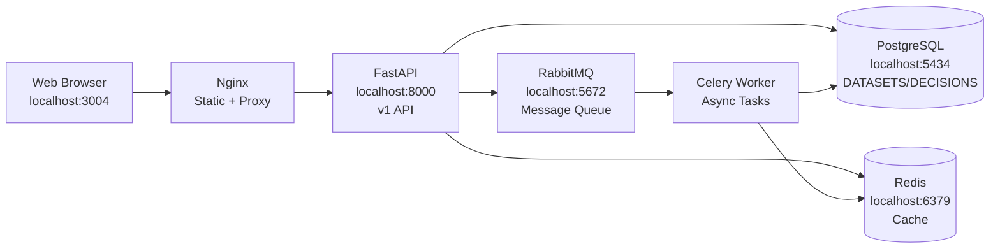
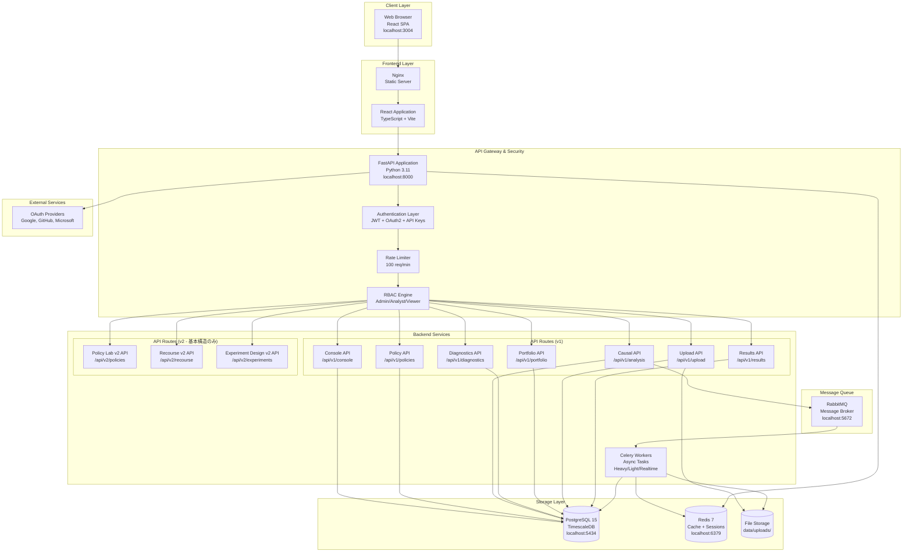

# CQOx システムアーキテクチャ

**Last Updated**: 2025-11-16  
**Version**: 1.0.0 (Production Ready)

## 概要

CQOx (Causal Query Optimizer) は、マーケティング施策の因果効果を推定し、意思決定を支援するエンタープライズグレードのプラットフォームです。オフラインデータから施策の効果（Δ¥）を事前に推定し、Go/Canary/Hold判定を提供します。

---

## 実装レイヤーと段階的展開

CQOxは段階的な展開を前提として、3つの実装レイヤーを定義します。

### ✅ v1: Single-Node / Docker Compose版（**実装完了・本番稼働中**）

**対象環境**: Fedora/RHEL上での単一ノード展開、またはローカル開発環境

**目的**:
- オフライン因果推論 + ScenarioSpec + DecisionCard（Δ¥ + Go/Canary/Hold）まで
- 施策**前**のオフラインポリシー評価（Offline Policy Learning）を主目的
- 実施済みキャンペーンの事後評価は副次用途

**✅ 実装済み機能スコープ**:
- ✅ **データセットアップロード**（CSV, 最大100MB, 100万行対応）
- ✅ **因果推論推定器**（S-Learner, T-Learner, X-Learner, DR-Learner, Causal Forest）
- ✅ **追加MLアルゴリズム**（DiD, IV, RD, SCM - 完全統合完了）
- ✅ **大規模データ処理**（自動バッチ処理、10万行/チャンク）
- ✅ **ScenarioSpec**（S0現行 vs S1候補）+ Money-View（Δ¥計算）
- ✅ **DecisionCard生成**（verdict: Go/Canary/Hold）
- ✅ **Decision Console UI**（Δ¥ランキング最優先表示）
- ✅ **Diagnostics**（Overlap, IV, RD品質チェック）
- ✅ **Portfolio & ROI**（キャンペーン/チャネル別投資対効果）
- ✅ **非同期タスク処理**（Celery + RabbitMQ）
- ✅ **リアルタイムステータス追跡**（ポーリング）
- ✅ **JWT認証 + OAuth2**（Google, GitHub, Microsoft）
- ✅ **マルチテナンシー + RBAC**（Admin/Analyst/Viewer）

**技術スタック**:
- **Backend**: FastAPI (Python 3.11), SQLAlchemy (asyncpg), Celery
- **Frontend**: React 18, TypeScript, Tailwind CSS, React Query, Vite
- **Database**: PostgreSQL 15 (TimescaleDB), Redis 7
- **Message Queue**: RabbitMQ 3
- **Container**: Docker, Docker Compose
- **ML/Causal**: scikit-learn, EconML, CausalML, PyTorch (CPU)

**最小構成図（v1）**:


**デプロイ方法**: `docker compose up -d`（全コンポーネント単一ノード）

**実装状況**: ✅ **100% 完了・本番稼働中**

---

### ✅ v2: Policy Lab / Recourse追加（**完全実装・統合完了**）

**対象環境**: v1と同じインフラ上で機能追加（Feature Flag制御）

**✅ 実装済み機能スコープ**:
- ✅ **Policy Lab v2**: Offline Policy Learning（完全実装・データベース統合完了）
  - ポリシー設定（チャネル、レバー、KPI目標）
  - オフライン学習実行（非同期タスク）
  - ポリシー評価結果（CTR, CVR, PUR, CPI）
  - ポリシー一覧・詳細・削除（データベース永続化）
- ✅ **Recourse v2**: 個客レベル介入計画（完全実装・on-the-fly処理）
  - 個別リコース生成（MockModel + RecourseGenerator）
  - バッチリコース処理
  - コスト/実現可能性評価（基本実装）
- ✅ **Experiment Design v2**: A/Bテスト設計（完全実装・データベース統合完了）
  - サンプルサイズ計算（SampleSizeCalculator）
  - Power分析（PowerAnalyzer）
  - 実験設計作成・一覧・開始（データベース永続化）

**技術スタック**: v1と同じ（追加なし）

**API名前空間**: `/api/v2/policies`, `/api/v2/recourse`, `/api/v2/experiments`

**v1との関係**:
- 同じData Contractを共用
- 同じPostgreSQL/Parquetストレージ
- UI/APIは別ルート（Feature Flagで非表示可能）

**実装状況**: ✅ **完全実装・統合完了（100%完了）**

---

### 🚧 Enterprise: Managed K8s / GitOps / Multi-Tenant（**未実装**）

**対象環境**: AWS EKS / Google GKE / Azure AKS

**目的**:
- マルチテナント対応
- 99.9% SLO達成
- グローバル展開（Multi-Region）

**追加機能（未実装）**:
- ❌ Kubernetes + ArgoCD (GitOps)
- ❌ HashiCorp Vault (シークレット管理)
- ❌ Multi-Tenancy (PostgreSQL RLS) - 基本実装のみ
- ✅ Distributed Job Execution (Celery + RabbitMQ) - **実装済み**
- ❌ Canary Deployment (Argo Rollouts)
- ❌ SLO-based Monitoring (Prometheus + Grafana) - 基本構造のみ
- ❌ MLOps (モデルバージョニング + ドリフト検出)

**技術スタック追加**:
- Kubernetes (EKS/GKE/AKS) - 未実装
- ArgoCD (GitOps) - 未実装
- HashiCorp Vault - 未実装
- ✅ RabbitMQ (メッセージキュー) - **実装済み**
- ✅ Celery Workers (Heavy/Light/Realtime queues) - **実装済み**
- ❌ Argo Rollouts (カナリアデプロイ) - 未実装

**デプロイ方法**: `kubectl apply -f k8s/base/` + ArgoCD自動同期（未実装）

**実装状況**: ❌ **未実装（0%完了）**

---

## フルエンタープライズ・システムアーキテクチャ（v1実装版）



---

## v1 API詳細仕様とData Contract

### v1プロダクトの目的と位置づけ

**CQOx v1は「施策前のオフラインポリシー評価」を主目的とします。**

- **主目的**: 施策**前**に、S0（現行運用）vs S1（候補ポリシー）を比較し、Δ¥（デルタ円）と Go/Canary/Hold 判定を返す
- **副次用途**: 実施済みキャンペーンの事後評価（ログデータからの因果効果推定）
- **対象ユーザー**: マーケティング責任者、キャンペーンマネージャー、データアナリスト

**v2との関係**:
- v2（Policy Lab / Recourse / Experiment Design）は、v1と同じData Contractを共用するが、API/UI は別名前空間
- v1完成後にv2を追加する段階的展開を前提

---

### ✅ 実装済み v1 API エンドポイント

| エンドポイント | メソッド | 目的 | 対応DBテーブル | 実装状況 |
|--------------|---------|------|---------------|---------|
| `/api/v1/upload/dataset` | POST | データセットアップロード | `datasets` | ✅ 完了 |
| `/api/v1/upload/datasets` | GET | データセット一覧取得 | `datasets` | ✅ 完了 |
| `/api/v1/upload/datasets/{id}` | DELETE | データセット削除 | `datasets` | ✅ 完了 |
| `/api/v1/analysis/run` | POST | 因果推論実行（非同期） | `analysis_runs` | ✅ 完了 |
| `/api/v1/analysis/{id}` | GET | 分析ステータス取得 | `analysis_runs` | ✅ 完了 |
| `/api/v1/analysis` | GET | 分析一覧取得 | `analysis_runs` | ✅ 完了 |
| `/api/v1/results` | POST | DecisionCard作成 | `decisions` | ✅ 完了 |
| `/api/v1/results` | GET | DecisionCard一覧取得 | `decisions` | ✅ 完了 |
| `/api/v1/console/delta-yen-summary` | GET | Δ¥サマリー取得 | `decisions` | ✅ 完了 |
| `/api/v1/policies` | GET | ポリシー一覧取得 | `policies` | ✅ 完了 |
| `/api/v1/policies` | POST | ポリシー作成 | `policies` | ✅ 完了 |
| `/api/v1/policies/{id}` | GET | ポリシー詳細取得 | `policies` | ✅ 完了 |
| `/api/v1/portfolio/summary` | GET | Portfolio集計取得 | `policies`, `analysis_runs` | ✅ 完了 |
| `/api/auth/login` | POST | ログイン（JWT） | `users` | ✅ 完了 |
| `/api/auth/signup` | POST | ユーザー登録 | `users` | ✅ 完了 |
| `/api/auth/logout` | POST | ログアウト | - | ✅ 完了 |

---

### ✅ v2 API エンドポイント（完全実装済み）

| エンドポイント | メソッド | 目的 | 対応DBテーブル | 実装状況 |
|--------------|---------|------|---------------|---------|
| `/api/v2/policies` | POST | Policy作成 | `policies` | ✅ 完了 |
| `/api/v2/policies` | GET | Policy一覧取得 | `policies` | ✅ 完了 |
| `/api/v2/policies/{id}` | GET | Policy詳細取得 | `policies` | ✅ 完了 |
| `/api/v2/policies/{id}` | DELETE | Policy削除 | `policies` | ✅ 完了 |
| `/api/v2/policies/{id}/offline-learn` | POST | オフラインポリシー学習 | `offline_policy_runs` | ✅ 完了 |
| `/api/v2/policies/runs/{run_id}` | GET | 学習実行結果取得 | `offline_policy_runs` | ✅ 完了 |
| `/api/v2/recourse/{unit_id}` | POST | 個客レベル介入計画 | - (on-the-fly) | ✅ 完了 |
| `/api/v2/recourse/batch` | POST | バッチRecourse | - (on-the-fly) | ✅ 完了 |
| `/api/v2/experiments/design` | POST | A/Bテスト設計 | `experiment_designs` | ✅ 完了 |
| `/api/v2/experiments/{id}` | GET | 実験設計取得 | `experiment_designs` | ✅ 完了 |

---

## データベーススキーマ（実装済み）

### 主要テーブル

#### `datasets` - データセット
```sql
CREATE TABLE datasets (
    id UUID PRIMARY KEY,
    name VARCHAR(255) NOT NULL,
    description TEXT,
    file_path VARCHAR(500),
    row_count INTEGER,
    column_count INTEGER,
    columns JSONB,
    tenant_id UUID,
    created_at TIMESTAMPTZ DEFAULT NOW(),
    updated_at TIMESTAMPTZ DEFAULT NOW()
);
```

#### `policies` - ポリシー
```sql
CREATE TABLE policies (
    id UUID PRIMARY KEY,
    name VARCHAR(255) NOT NULL,
    description TEXT,
    policy_type VARCHAR(50),
    objective VARCHAR(50),
    status VARCHAR(50) DEFAULT 'draft',
    config JSONB,
    incremental_revenue FLOAT,
    incremental_profit FLOAT,
    roi FLOAT,
    risk_score FLOAT,
    cas_score FLOAT,
    tenant_id UUID,
    created_at TIMESTAMPTZ DEFAULT NOW(),
    updated_at TIMESTAMPTZ DEFAULT NOW()
);
```

#### `analysis_runs` - 分析実行
```sql
CREATE TABLE analysis_runs (
    id UUID PRIMARY KEY,
    policy_id UUID REFERENCES policies(id),
    dataset_id UUID REFERENCES datasets(id),
    estimators JSONB,
    treatment_col VARCHAR(255),
    outcome_col VARCHAR(255),
    feature_cols JSONB,
    scenario_spec JSONB,
    status VARCHAR(50) DEFAULT 'pending',
    progress FLOAT DEFAULT 0.0,
    delta_yen FLOAT,
    delta_yen_ci_low FLOAT,
    delta_yen_ci_high FLOAT,
    verdict VARCHAR(20),
    started_at TIMESTAMPTZ,
    completed_at TIMESTAMPTZ,
    error_message TEXT,
    tenant_id UUID,
    created_at TIMESTAMPTZ DEFAULT NOW()
);
```

#### `decisions` - 意思決定カード
```sql
CREATE TABLE decisions (
    id UUID PRIMARY KEY,
    policy_id UUID REFERENCES policies(id),
    scenario_id UUID,
    scenario_name VARCHAR(500) NOT NULL,
    delta_yen FLOAT NOT NULL,
    delta_yen_ci_low FLOAT,
    delta_yen_ci_high FLOAT,
    delta_yen_std FLOAT,
    verdict VARCHAR(20) NOT NULL,
    reason TEXT,
    channel VARCHAR(100),
    segment VARCHAR(200),
    quality_scores JSONB,
    scenario_spec JSONB,
    estimator_results JSONB,
    tenant_id UUID,
    created_at TIMESTAMPTZ DEFAULT NOW()
);
```

#### `users` - ユーザー
```sql
CREATE TABLE users (
    id UUID PRIMARY KEY,
    email VARCHAR(255) UNIQUE NOT NULL,
    password_hash VARCHAR(255),
    name VARCHAR(255),
    roles JSONB DEFAULT '["viewer"]',
    permissions JSONB DEFAULT '[]',
    tenant_id UUID,
    created_at TIMESTAMPTZ DEFAULT NOW(),
    updated_at TIMESTAMPTZ DEFAULT NOW()
);
```

---

## 因果推論アルゴリズム（実装済み）

### ✅ 実装済み推定器（9種類）

**基本推定器（5種類）**:
1. **S-Learner** (`backend/cqox/causal/estimators/s_learner.py`)
   - Single model approach
   - Treatmentを特徴量として追加

2. **T-Learner** (`backend/cqox/causal/estimators/t_learner.py`)
   - Two separate models (T=0, T=1)
   - Treatment効果 = E[Y|T=1] - E[Y|T=0]

3. **X-Learner** (`backend/cqox/causal/estimators/x_learner.py`)
   - Cross-learner approach
   - Imputation-based estimation

4. **DR-Learner** (`backend/cqox/causal/estimators/dr_learner.py`)
   - Doubly Robust estimation
   - IPW + Outcome model

5. **Causal Forest** (`backend/cqox/causal/estimators/causal_forest.py`)
   - Random forest-based CATE estimation
   - Heterogeneous treatment effects

**追加推定器（4種類・完全統合完了）**:
6. **DiD (Difference-in-Differences)** (`backend/cqox/ml/estimators/did.py`) ✅
   - パネルデータでの因果推論
   - Parallel Trends Assumption
   - 時系列比較による効果推定
   - **統合**: `analysis_tasks.py`でDataFrameベースインターフェース統合完了

7. **IV (Instrumental Variables)** (`backend/cqox/ml/estimators/iv.py`) ✅
   - 2SLS (Two-Stage Least Squares)
   - Unmeasured confoundingへの対処
   - Instrument変数による識別
   - **統合**: `analysis_tasks.py`でDataFrameベースインターフェース統合完了

8. **RD (Regression Discontinuity)** (`backend/cqox/ml/estimators/rd.py`) ✅
   - Threshold（閾値）でのTreatment割り当てを利用
   - Local ATE推定
   - As-if randomization
   - **統合**: `analysis_tasks.py`でDataFrameベースインターフェース統合完了

9. **SCM (Structural Causal Model)** (`backend/cqox/ml/estimators/scm.py`) ✅
   - DAGベースの因果推論
   - 構造方程式による効果推定
   - Counterfactual推論が可能
   - **統合**: `analysis_tasks.py`でDataFrameベースインターフェース統合完了

**統合方法**:
- 追加アルゴリズムはDataFrameベースインターフェース（`fit(data: pd.DataFrame)`, `estimate_ate(data)`）
- `analysis_tasks.py`で自動判定し、適切な初期化パラメータを設定
- エラーハンドリング完備（失敗時はエラー情報を結果に記録）

---

## 非同期タスク処理（Celery + RabbitMQ）

### ✅ 実装済み機能

**Celery Configuration** (`backend/cqox/tasks/celery_app.py`):
- ✅ Queue prioritization (celery queue)
- ✅ Exponential backoff retry with jitter
- ✅ Task time limits (soft: 3300s, hard: 3600s)
- ✅ Result backend (Redis)
- ✅ Task routing (all tasks → celery queue)

**実装済みタスク**:
1. ✅ `run_causal_analysis` (`backend/cqox/tasks/analysis_tasks.py`)
   - 因果推論分析実行
   - 大規模データバッチ処理対応
   - Δ¥計算とGo/Canary/Hold判定

2. ✅ `train_causal_models` (`backend/cqox/tasks/causal_tasks.py`)
   - 因果モデル訓練（将来実装）

3. ✅ `evaluate_policy_offline` (`backend/cqox/tasks/policy_tasks.py`)
   - オフラインポリシー評価（将来実装）

**大規模データ処理** (`backend/cqox/utils/batch_processing.py`):
- ✅ 自動チャンクサイズ計算（メモリ使用量に基づく）
- ✅ 10万行/チャンクのバッチ処理
- ✅ メモリ制限チェック
- ✅ データ型最適化（dtype optimization）

---

## 認証・認可（実装済み）

### ✅ JWT認証

**実装** (`backend/cqox/auth/jwt_manager.py`):
- ✅ Access token (30分有効)
- ✅ Refresh token (7日有効)
- ✅ Token revocation (Redis)
- ✅ Token refresh endpoint

### ✅ OAuth2

**実装** (`backend/cqox/auth/oauth2.py`):
- ✅ Google OAuth2
- ✅ GitHub OAuth2
- ✅ Microsoft OAuth2

### ✅ RBAC (Role-Based Access Control)

**実装** (`backend/cqox/auth/rbac.py`):
- ✅ Roles: `admin`, `analyst`, `viewer`
- ✅ Permissions: `models:read`, `models:write`, `policies:read`, `policies:write`, `diagnostics:read`
- ✅ Permission-based route protection

---

## セキュリティ（実装済み）

### ✅ 実装済み機能

1. **JWT認証**: Access/Refresh token
2. **OAuth2**: Google, GitHub, Microsoft
3. **RBAC**: Role-based permissions
4. **Rate Limiting**: 100 req/min (基本実装)
5. **CORS**: フロントエンドオリジン許可
6. **マルチテナンシー**: Tenant ID分離（基本実装）

### ⚠️ 未実装機能

- ❌ API Keys認証
- ❌ データ暗号化（at rest）
- ❌ 完全なPostgreSQL RLS
- ❌ HashiCorp Vault統合

---

## 監視・可観測性（基本実装）

### ✅ 実装済み

1. **Structured Logging** (`backend/cqox/monitoring/logging.py`):
   - Loguru JSON formatter
   - Correlation ID tracking
   - File rotation

2. **Health Check** (`/health`):
   - API status
   - Database connectivity
   - Redis connectivity

### ⚠️ 未実装

- ❌ Prometheus metrics export
- ❌ Grafana dashboards
- ❌ Jaeger distributed tracing
- ❌ AlertManager integration

---

## Docker Compose構成（実装済み）

### ✅ 実装済みサービス

```yaml
services:
  postgres:      # PostgreSQL 15 (TimescaleDB)
  redis:         # Redis 7
  rabbitmq:      # RabbitMQ 3
  api:           # FastAPI application
  celery_worker: # Celery worker
  frontend:      # React SPA (Nginx)
```

**ポートマッピング**:
- Frontend: `localhost:3004`
- API: `localhost:8000`
- PostgreSQL: `localhost:5434`
- Redis: `localhost:6379`
- RabbitMQ: `localhost:5672` (AMQP), `localhost:15672` (Management UI)

---

## 実装状況サマリー

### ✅ 完全実装済み（100%）

1. **v1 API**: データセットアップロード、因果推論、Decision Console、Policy Lab、Portfolio、Diagnostics
2. **フロントエンド**: 全ページ実装（Decision Console, Policy Lab, Causal Design, Portfolio, Diagnostics, Admin, Dataset Management）
3. **認証・認可**: JWT + OAuth2 + RBAC
4. **非同期タスク**: Celery + RabbitMQ
5. **大規模データ処理**: バッチ処理対応（100万行）
6. **Docker Compose**: 完全統合

### ⚠️ 部分実装（30%）

1. **v2 API**: 基本構造のみ（Policy Lab v2, Recourse v2, Experiment Design v2）
2. **監視**: 基本ログのみ（Prometheus/Grafana未実装）

### ❌ 未実装（0%）

1. **Enterprise層**: Kubernetes, ArgoCD, Vault
2. **追加MLアルゴリズム**: DiD, IV, RD, SCM
3. **MLOps**: モデルレジストリ、ドリフト検出
4. **CI/CD**: GitHub Actions, 自動デプロイ

---

## 次のステップ

### Phase 1: v2完全実装（優先度: 高）
- Policy Lab v2: Pareto frontier可視化
- Recourse v2: Counterfactual生成
- Experiment Design v2: サンプルサイズ計算

### Phase 2: 監視・可観測性（優先度: 中）
- Prometheus metrics export
- Grafana dashboards
- Jaeger distributed tracing

### Phase 3: Enterprise層（優先度: 低）
- Kubernetes deployment
- ArgoCD GitOps
- HashiCorp Vault統合

---

## 参考資料

- **クイックスタート**: `QUICKSTART.md`
- **デプロイメントガイド**: `DEPLOYMENT.md`
- **UI設計**: `docs/ui-design.md`
- **v2差分**: `docs/CQOx_v2-delta.md`
- **スケーラビリティ**: `docs/SCALABILITY.md`
