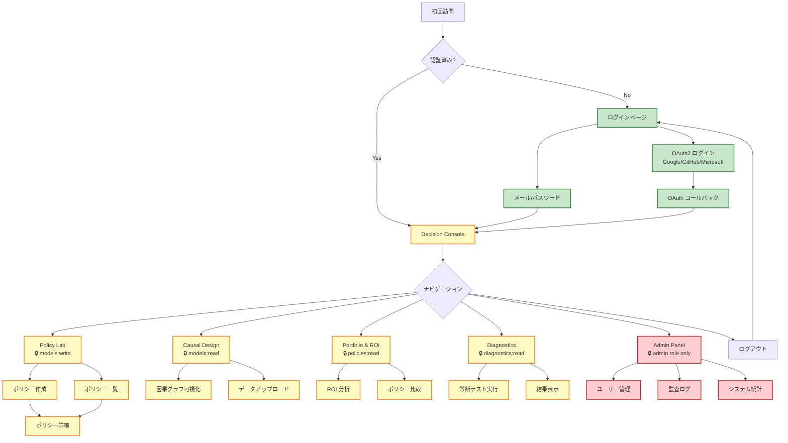
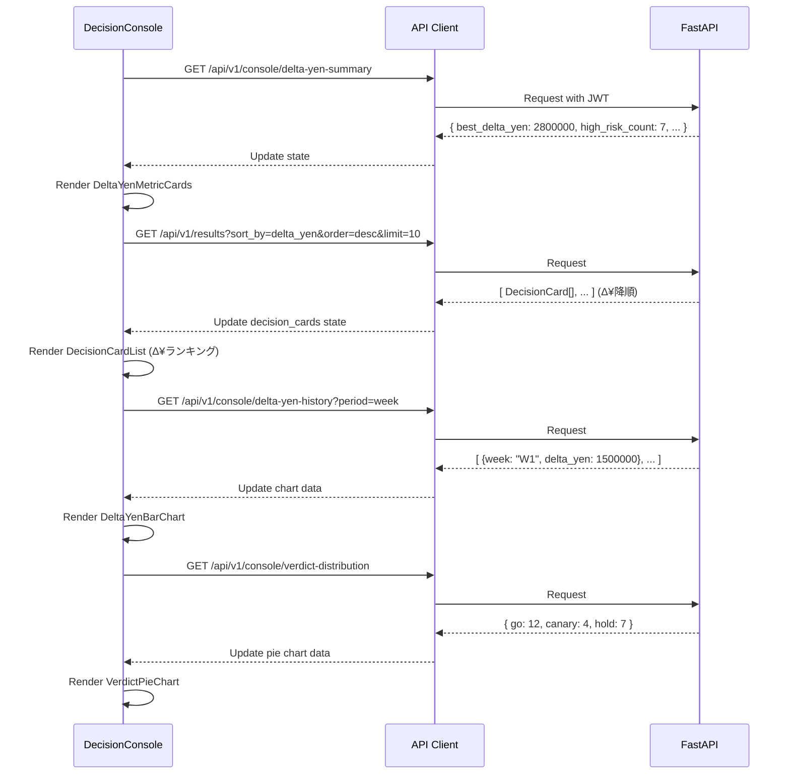
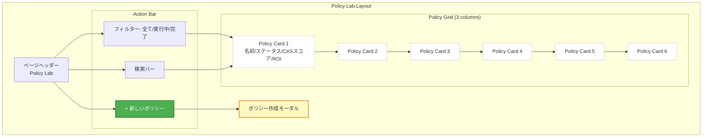
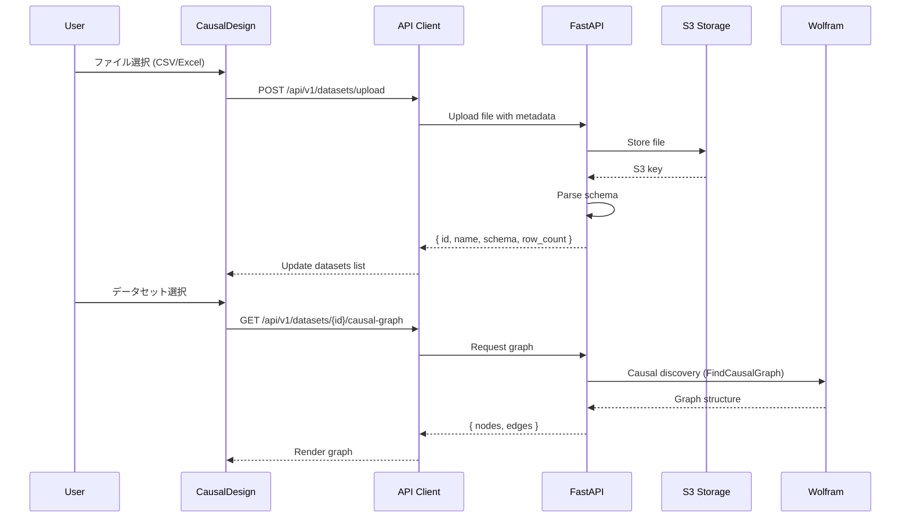
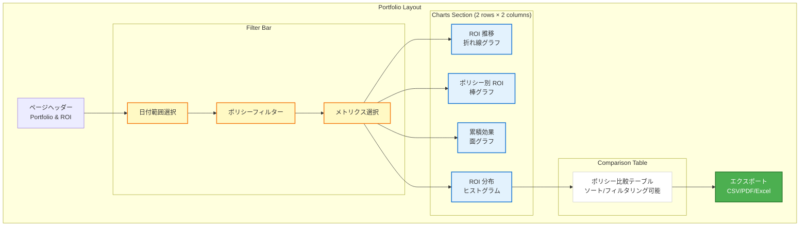
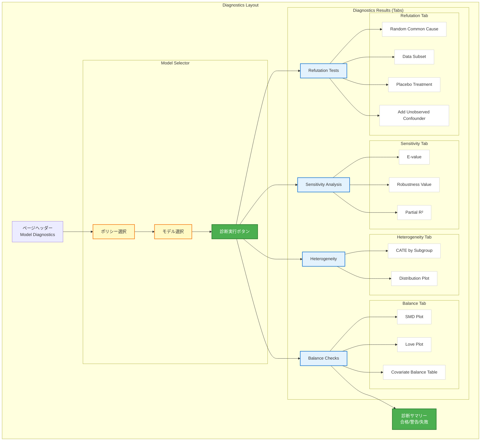
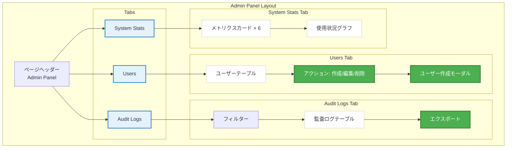
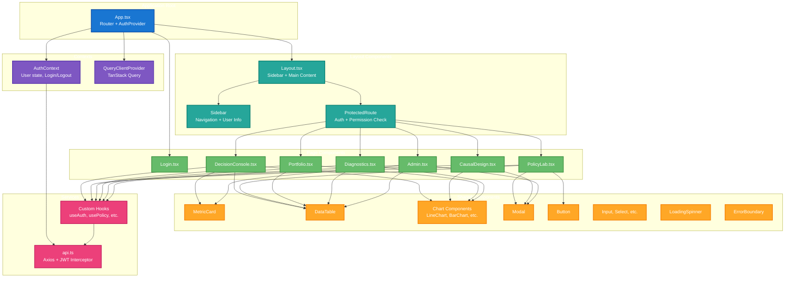
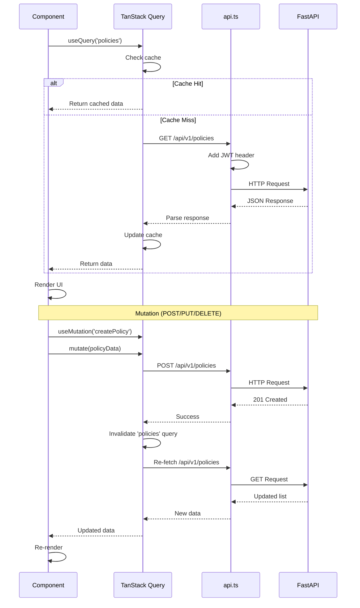

# CQOx UI/UX 設計書

## 概要

CQOx フロントエンドは、React + TypeScript で構築された Single Page Application (SPA) です。直感的で使いやすく、アクセシブルなインターフェースを提供し、因果推論とポリシー最適化の複雑なワークフローを簡素化します。

---

## ナビゲーション構造



---

## レイアウト構造

### グローバルレイアウト (認証後)

```
┌─────────────────────────────────────────────────────────────┐
│ Sidebar (250px)                │ Main Content Area          │
│                                 │                             │
│ ┌─────────────────────────┐    │ ┌─────────────────────────┐ │
│ │ CQOx Logo               │    │ │ Page Header             │ │
│ │ Causal Query Optimizer  │    │ │ Breadcrumb Navigation   │ │
│ └─────────────────────────┘    │ └─────────────────────────┘ │
│                                 │                             │
│ ┌─────────────────────────┐    │ ┌─────────────────────────┐ │
│ │ User Info               │    │ │                         │ │
│ │ ─────────────────────── │    │ │                         │ │
│ │ Signed in as            │    │ │                         │ │
│ │ user@example.com        │    │ │                         │ │
│ │ [analyst] [viewer]      │    │ │    Page Content         │ │
│ └─────────────────────────┘    │ │    (Dynamic)            │ │
│                                 │ │                         │ │
│ ┌─────────────────────────┐    │ │                         │ │
│ │ Navigation              │    │ │                         │ │
│ │ ─────────────────────── │    │ │                         │ │
│ │ ▶ Decision Console      │    │ │                         │ │
│ │   Policy Lab            │    │ │                         │ │
│ │   Causal Design         │    │ │                         │ │
│ │   Portfolio & ROI       │    │ │                         │ │
│ │   Diagnostics           │    │ │                         │ │
│ │   Admin Panel*          │    │ │                         │ │
│ └─────────────────────────┘    │ └─────────────────────────┘ │
│                                 │                             │
│ ┌─────────────────────────┐    │ ┌─────────────────────────┐ │
│ │ [Logout]                │    │ │ Footer (optional)       │ │
│ └─────────────────────────┘    │ └─────────────────────────┘ │
│                                 │                             │
└─────────────────────────────────────────────────────────────┘

* Admin Panel: admin ロールのみ表示
```

---

## 画面別詳細設計

### 1. ログインページ (Login.tsx)

```mermaid
graph TB
    subgraph "Login Page Layout"
        HEADER[ヘッダー<br/>CQOx ロゴ + タイトル]

        subgraph "Login Form Card"
            TITLE[サインイン]
            EMAIL[メールアドレス入力<br/>type: email, required]
            PASSWORD[パスワード入力<br/>type: password, required]
            REMEMBER[ログイン状態を保持<br/>checkbox]
            SUBMIT[サインインボタン<br/>primary color]

            DIVIDER[または]

            OAUTH_BTN[OAuth2 ボタン群]
            GOOGLE[Google でサインイン<br/>brand color: #4285F4]
            GITHUB[GitHub でサインイン<br/>brand color: #333]
            MICROSOFT[Microsoft でサインイン<br/>brand color: #00A4EF]
        end

        FOOTER[利用規約 | プライバシーポリシー]
    end

    HEADER --> TITLE
    TITLE --> EMAIL
    EMAIL --> PASSWORD
    PASSWORD --> REMEMBER
    REMEMBER --> SUBMIT
    SUBMIT --> DIVIDER
    DIVIDER --> OAUTH_BTN
    OAUTH_BTN --> GOOGLE
    OAUTH_BTN --> GITHUB
    OAUTH_BTN --> MICROSOFT
    MICROSOFT --> FOOTER

    classDef input fill:#e3f2fd,stroke:#1976d2,stroke-width:2px
    classDef button fill:#4caf50,stroke:#2e7d32,stroke-width:2px
    classDef oauth fill:#fff9c4,stroke:#f57f17,stroke-width:2px

    class EMAIL,PASSWORD input
    class SUBMIT button
    class GOOGLE,GITHUB,MICROSOFT oauth
```

#### 詳細仕様

**レイアウト**
```
┌───────────────────────────────────────────────┐
│                                               │
│           ┌─────────────────┐                 │
│           │   CQOx Logo     │                 │
│           │ Causal Query    │                 │
│           │   Optimizer     │                 │
│           └─────────────────┘                 │
│                                               │
│     ┌─────────────────────────────────┐       │
│     │                                 │       │
│     │   サインイン                    │       │
│     │   ─────────────────────────     │       │
│     │                                 │       │
│     │   メールアドレス                │       │
│     │   [____________________]        │       │
│     │                                 │       │
│     │   パスワード                    │       │
│     │   [____________________]        │       │
│     │                                 │       │
│     │   [ ] ログイン状態を保持        │       │
│     │                                 │       │
│     │   [    サインイン    ]          │       │
│     │                                 │       │
│     │   ─────── または ───────        │       │
│     │                                 │       │
│     │   [ Google でサインイン  ]      │       │
│     │   [ GitHub でサインイン  ]      │       │
│     │   [ Microsoft でサインイン ]    │       │
│     │                                 │       │
│     └─────────────────────────────────┘       │
│                                               │
│       利用規約 | プライバシーポリシー          │
│                                               │
└───────────────────────────────────────────────┘
```

**バリデーション**
- メール: RFC 5322 準拠、最大 254 文字
- パスワード: 最小 8 文字、最大 128 文字
- エラー表示: フォーム下部に赤色でメッセージ表示

**フロー**
1. ユーザーが資格情報を入力 → POST /auth/token
2. 成功: JWT トークン保存 → /console へリダイレクト
3. 失敗: エラーメッセージ表示 (「メールアドレスまたはパスワードが正しくありません」)
4. OAuth2 ボタンクリック → GET /auth/oauth/{provider}/login → プロバイダーサイトへリダイレクト

**アクセシビリティ**
- ARIA ラベル: すべての入力フィールドに aria-label
- キーボードナビゲーション: Tab キーで移動、Enter でサブミット
- フォーカスインジケーター: 青色のアウトライン (2px)

---

### 2. Decision Console (DecisionConsole.tsx) 【v1】

**機能スコープ**: Δ¥（デルタ円）と Go/Canary/Hold 判定を最優先表示するマーケティング意思決定ダッシュボード

```mermaid
graph TB
    subgraph "Decision Console Layout"
        HEADER[ページヘッダー<br/>Decision Console - マーケ施策意思決定]

        subgraph "Metrics Overview Cards (4 columns)"
            CARD1[今週のベストシナリオ Δ¥<br/>数値 + レンジ + Go/Canary]
            CARD2[リスク高シナリオ数<br/>Hold判定数 + 理由内訳]
            CARD3[実行推奨キャンペーン<br/>Go判定数 + 期待収益合計]
            CARD4[A/Bテスト候補<br/>Canary判定数]
        end

        subgraph "Main Content (2 columns)"
            LEFT[左カラム (65%)]
            RIGHT[右カラム (35%)]

            subgraph "Left Column"
                DECISION_CARDS[最新 Decision Cards 一覧<br/>Δ¥ランキング順（降順）]
                QUICK_ACTIONS[クイックアクション]
            end

            subgraph "Right Column"
                DELTA_YEN_CHART[Δ¥推移（週次）<br/>棒グラフ]
                VERDICT_DISTRIBUTION[判定内訳<br/>円グラフ: Go/Canary/Hold]
            end
        end
    end

    HEADER --> CARD1
    HEADER --> CARD2
    HEADER --> CARD3
    HEADER --> CARD4

    CARD1 --> LEFT
    CARD2 --> RIGHT

    LEFT --> DECISION_CARDS
    DECISION_CARDS --> QUICK_ACTIONS

    RIGHT --> DELTA_YEN_CHART
    DELTA_YEN_CHART --> VERDICT_DISTRIBUTION

    classDef header fill:#1976d2,stroke:#0d47a1,stroke-width:2px,color:#fff
    classDef metric fill:#4caf50,stroke:#2e7d32,stroke-width:2px,color:#fff
    classDef content fill:#fff,stroke:#ccc,stroke-width:1px

    class HEADER header
    class CARD1,CARD2,CARD3,CARD4 metric
    class DECISION_CARDS,QUICK_ACTIONS,DELTA_YEN_CHART,VERDICT_DISTRIBUTION content
```

#### 詳細仕様

**レイアウト（マーケティング意思決定最優先版）**
```
┌───────────────────────────────────────────────────────────────────────┐
│ Decision Console - マーケ施策意思決定                      [↻ 更新]  │
├───────────────────────────────────────────────────────────────────────┤
│                                                                        │
│ ┌───────────┐ ┌───────────┐ ┌───────────┐ ┌───────────┐             │
│ │今週のベスト│ │リスク高   │ │実行推奨   │ │A/Bテスト  │             │
│ │シナリオΔ¥ │ │シナリオ数 │ │キャンペーン│ │候補       │             │
│ │ +¥2.8M    │ │    7      │ │    12     │ │    4      │             │
│ │¥2.1M〜3.5M│ │Overlap低3 │ │期待+¥18M  │ │CI幅広4    │             │
│ │🟢 Go      │ │🔴 Hold    │ │🟢 Go      │ │🟡 Canary  │             │
│ └───────────┘ └───────────┘ └───────────┘ └───────────┘             │
│                                                                        │
├──────────────────────────────────────┬────────────────────────────────┤
│ 📊 Decision Cards（Δ¥ランキング順） │ 📈 Δ¥推移（週次）             │
│ ──────────────────────────────────── │ ───────────────────────────── │
│                                       │                                │
│ ┌───────────────────────────────────┐│   4M│         ▅                │
│ │ 🟢 Go | Push通知 最適化 #1       ││   3M│       ▅ █                │
│ │ ────────────────────────────────  ││   2M│     ▅ █ █   ▅            │
│ │ Δ¥: +¥2.8M (¥2.1M〜¥3.5M)        ││   1M│   ▅ █ █ █ ▅ █            │
│ │ チャネル: アプリPush               ││   0 └─────────────────────    │
│ │ セグメント: RFM High-Value        ││      W1 W2 W3 W4 W5 今週       │
│ │ 品質: Overlap 0.92, IV F=48.3     ││                                │
│ └───────────────────────────────────┘│ ───────────────────────────── │
│                                       │ 判定内訳（今週）               │
│ ┌───────────────────────────────────┐│      ┌───────┐                │
│ │ 🟢 Go | メール配信 A/Bテスト後 #2 ││      │  Go   │   52%          │
│ │ ────────────────────────────────  ││      │ 🟢    │                │
│ │ Δ¥: +¥1.9M (¥1.5M〜¥2.3M)        ││  🟡  │       │  🔴            │
│ │ チャネル: Email                    ││ 26%  │       │ 22%            │
│ │ セグメント: 30-40代女性            ││Canary│       │Hold            │
│ └───────────────────────────────────┘│      └───────┘                │
│                                       │                                │
│ ┌───────────────────────────────────┐│ クイックアクション             │
│ │ 🟡 Canary | LINE配信 Budget+10% #3││ ───────────────────────────── │
│ │ ────────────────────────────────  ││ [+ 新シナリオ作成]             │
│ │ Δ¥: +¥1.2M (¥0.3M〜¥2.1M)        ││ [📊 週次レポート]              │
│ │ チャネル: LINE                     ││ [📁 データアップロード]        │
│ │ 理由: CI幅広い → A/Bテスト推奨    ││                                │
│ └───────────────────────────────────┘│                                │
│                                       │                                │
│ ┌───────────────────────────────────┐│                                │
│ │ 🔴 Hold | Web広告 予算2倍 #4      ││                                │
│ │ ────────────────────────────────  ││                                │
│ │ Δ¥: +¥0.5M (-¥0.2M〜¥1.2M)       ││                                │
│ │ チャネル: Google Ads               ││                                │
│ │ 理由: Overlap低0.58 → 識別不可    ││                                │
│ └───────────────────────────────────┘│                                │
│                                       │                                │
│ [全て表示（24件）]                   │                                │
└──────────────────────────────────────┴────────────────────────────────┘
```

**コンポーネント構成（マーケティング特化）**
- `DeltaYenMetricCard`: Δ¥メトリクスカード（数値、レンジ、verdict色分け）
- `DecisionCardList`: Decision Card一覧（Δ¥ランキング順、Go/Canary/Holdバッジ付き）
- `DecisionCardItem`: 個別Decision Cardコンポーネント
  - フィールド: verdict（🟢Go / 🟡Canary / 🔴Hold）、Δ¥、CI、チャネル、セグメント、品質スコア
  - カラー: Go=緑、Canary=黄、Hold=赤のボーダー
- `DeltaYenBarChart`: Recharts棒グラフ（週次Δ¥推移）
- `VerdictPieChart`: Recharts円グラフ（Go/Canary/Hold内訳）

**Decision Card データモデル**
```typescript
interface DecisionCard {
  id: string
  scenario_name: string              // 例: "Push通知 最適化 #1"
  verdict: "Go" | "Canary" | "Hold"  // 判定
  delta_yen: number                  // Δ¥期待値
  delta_yen_ci_low: number           // 95%信頼区間下限
  delta_yen_ci_high: number          // 95%信頼区間上限
  channel: string                    // チャネル: "アプリPush", "Email", etc.
  segment: string                    // セグメント: "RFM High-Value", etc.
  quality_scores: {
    overlap_coverage: number         // 0.92
    iv_f_stat: number                // 48.3
    rd_mccrary_p?: number            // 0.12 (RDの場合)
  }
  reason?: string                    // Hold/Canary理由
  created_at: string
}
```

**データフロー**


**インタラクション（マーケ責任者視点）**
- Δ¥メトリクスカードクリック → 該当判定（Go/Canary/Hold）のDecision Card一覧にフィルタ
- Decision Cardクリック → 詳細ページ（ScenarioSpec比較、推定器結果、Diagnostics詳細）
- 🟢 Go判定カード → 「このシナリオを実行」ボタン表示（v2で実装予定）
- 🟡 Canary判定カード → 「A/Bテスト設計」ボタン表示（Experiment Design v2へ遷移）
- 🔴 Hold判定カード → 理由表示（Overlap低、IV弱、RD不合格等）
- 更新ボタン → すべてのデータを再取得（5秒ポーリング）
- クイックアクション → 新シナリオ作成、週次レポート生成、データアップロード

---

### 3. Policy Lab (PolicyLab.tsx) 【v1】

**機能スコープ**: ポリシー（施策）の作成・一覧・詳細表示
**権限**: `models:write` 必須
**v2との違い**: v2 (PolicyLabV2.tsx)ではOffline Policy LearningとPareto frontier可視化を追加



#### 詳細仕様

**レイアウト**
```
┌─────────────────────────────────────────────────────────────┐
│ Policy Lab                                      [+ 新規作成] │
├─────────────────────────────────────────────────────────────┤
│                                                               │
│ [全て ▼]  [🔍 ポリシー検索........................]          │
│                                                               │
├──────────────────┬──────────────────┬──────────────────────┤
│ Marketing Opt.   │ Sales Channel    │ Product Mix          │
│ ──────────────── │ ──────────────── │ ────────────────     │
│ ✅ 完了          │ ⏳ 実行中 (67%)  │ ✅ 完了              │
│                  │                  │                      │
│ CAS: 82.3        │ CAS: --          │ CAS: 76.1            │
│ ROI: +28.4%      │ ROI: --          │ ROI: +15.2%          │
│                  │                  │                      │
│ Models: 3        │ Models: 2/3      │ Models: 3            │
│ Created: Jan 15  │ Created: Jan 20  │ Created: Jan 10      │
│                  │                  │                      │
│ [詳細] [削除]    │ [詳細] [停止]    │ [詳細] [削除]        │
├──────────────────┼──────────────────┼──────────────────────┤
│ Pricing Strat.   │ Customer Seg.    │ Inventory Opt.       │
│ ──────────────── │ ──────────────── │ ────────────────     │
│ 📝 作成中        │ ✅ 完了          │ ❌ 失敗              │
│                  │                  │                      │
│ CAS: --          │ CAS: 79.8        │ CAS: --              │
│ ROI: --          │ ROI: +22.1%      │ ROI: --              │
│                  │                  │                      │
│ Models: 0/3      │ Models: 3        │ Models: 1/3          │
│ Created: Jan 21  │ Created: Jan 12  │ Created: Jan 18      │
│                  │                  │                      │
│ [編集] [削除]    │ [詳細] [削除]    │ [再実行] [削除]      │
└──────────────────┴──────────────────┴──────────────────────┘
```

**ポリシー作成モーダル**
```
┌──────────────────────────────────────────┐
│ 新しいポリシーを作成           [✕]      │
├──────────────────────────────────────────┤
│                                          │
│ ポリシー名 *                             │
│ [_________________________________]      │
│                                          │
│ 説明                                     │
│ [_________________________________]      │
│ [_________________________________]      │
│                                          │
│ データセット *                           │
│ [データセットを選択... ▼]               │
│                                          │
│ 目的変数 *                               │
│ [変数を選択... ▼]                       │
│                                          │
│ エスティメーター (複数選択可)            │
│ [ ] Linear DML                           │
│ [ ] Forest DML                           │
│ [ ] Causal Forest                        │
│ [ ] Double ML                            │
│ [ ] Metalearners (S/T/X)                 │
│                                          │
│ ハイパーパラメーター                     │
│ [デフォルト ▼] [カスタム]               │
│                                          │
│              [キャンセル] [作成して実行] │
└──────────────────────────────────────────┘
```

**状態表示**
- ✅ 完了 (緑): すべてのモデルが正常に完了
- ⏳ 実行中 (青): モデルトレーニング進行中、進捗率表示
- 📝 作成中 (黄): ポリシー設定中、未実行
- ❌ 失敗 (赤): エラーが発生、エラーメッセージ表示
- ⏸️ 停止 (グレー): ユーザーによって停止

**データフロー**
1. ユーザーが「新規作成」クリック → モーダル表示
2. データセット選択 → GET /api/v1/datasets → ドロップダウン表示
3. 目的変数選択 → データセットスキーマから変数一覧表示
4. 「作成して実行」クリック → POST /api/v1/policies → Celery タスク開始
5. ポーリング (5秒ごと) → GET /api/v1/policies/{id}/status → 進捗更新
6. 完了通知 → ブラウザ通知 + カード更新

---

### 4. Causal Design (CausalDesign.tsx) 【v1】

**機能スコープ**: 因果グラフ可視化・データアップロード（v1では基本機能のみ）

**権限**: `models:read` 必須

```mermaid
graph TB
    subgraph "Causal Design Layout"
        HEADER[ページヘッダー<br/>Causal Design]

        subgraph "Top Panel"
            UPLOAD[データアップロード]
            SELECT[データセット選択]
            CONFIG[因果グラフ設定]
        end

        subgraph "Main Visualization (2 panels)"
            LEFT_PANEL[因果グラフ可視化<br/>D3.js / Cytoscape]
            RIGHT_PANEL[変数詳細パネル]

            subgraph "Graph Features"
                NODES[ノード (変数)]
                EDGES[エッジ (因果関係)]
                LEGEND[凡例]
            end

            subgraph "Variable Panel"
                VAR_NAME[変数名]
                VAR_TYPE[型 (連続/カテゴリ)]
                VAR_STATS[統計情報]
                VAR_EFFECTS[因果効果]
            end
        end

        subgraph "Bottom Panel"
            INTERVENTIONS[介入シミュレーション]
            RESULTS[推定効果]
        end
    end

    HEADER --> UPLOAD
    UPLOAD --> SELECT
    SELECT --> CONFIG

    CONFIG --> LEFT_PANEL
    CONFIG --> RIGHT_PANEL

    LEFT_PANEL --> NODES
    LEFT_PANEL --> EDGES
    LEFT_PANEL --> LEGEND

    RIGHT_PANEL --> VAR_NAME
    RIGHT_PANEL --> VAR_TYPE
    RIGHT_PANEL --> VAR_STATS
    RIGHT_PANEL --> VAR_EFFECTS

    LEFT_PANEL --> INTERVENTIONS
    RIGHT_PANEL --> RESULTS

    classDef upload fill:#4caf50,stroke:#2e7d32,stroke-width:2px,color:#fff
    classDef viz fill:#e3f2fd,stroke:#1976d2,stroke-width:2px
    classDef panel fill:#fff,stroke:#ccc,stroke-width:1px

    class UPLOAD upload
    class LEFT_PANEL viz
    class RIGHT_PANEL,VAR_NAME,VAR_TYPE,VAR_STATS,VAR_EFFECTS,INTERVENTIONS,RESULTS panel
```

#### 詳細仕様

**レイアウト**
```
┌─────────────────────────────────────────────────────────────┐
│ Causal Design                                  [📤 アップロード] │
├─────────────────────────────────────────────────────────────┤
│                                                               │
│ データセット: [Q4_2024.csv ▼]   [因果グラフ設定]           │
│                                                               │
├────────────────────────────┬─────────────────────────────────┤
│                            │ 変数詳細                        │
│                            │ ──────────────────────────────  │
│                            │                                 │
│                            │ 変数名: marketing_spend         │
│         Outcome            │ 型: 連続変数                    │
│            ▲               │ 範囲: $1,000 - $50,000          │
│            │               │ 平均: $15,234                   │
│            │               │ 標準偏差: $8,123                │
│     Treatment ─────> X     │                                 │
│            │               │ 因果効果:                       │
│            │               │ • Outcome への効果: +0.43       │
│            ▼               │   (95% CI: [0.32, 0.54])        │
│        Confounder          │ • Sales への間接効果: +0.28     │
│                            │                                 │
│  凡例:                     │ ─────────────────────────────── │
│  ○ 変数                   │ 関連する変数:                   │
│  → 因果関係               │ • Treatment (原因)              │
│  ⚪ 選択中                 │ • Outcome (結果)                │
│                            │ • Confounder (交絡因子)         │
│                            │                                 │
├────────────────────────────┴─────────────────────────────────┤
│ 介入シミュレーション                                         │
│ ──────────────────────────────────────────────────────────── │
│                                                               │
│ 介入変数: [marketing_spend ▼]                                │
│ 介入値: [$ 25,000 ]  (現在: $15,234)                         │
│                                                               │
│ 推定効果:                                                     │
│ • Sales の変化: +$12,450 (95% CI: [$9,200, $15,700])         │
│ • ROI: 49.8% (95% CI: [36.8%, 62.8%])                        │
│                                                               │
│                                 [シミュレーション実行]        │
└───────────────────────────────────────────────────────────────┘
```

**因果グラフの可視化機能**
- **ズーム/パン**: マウスホイールでズーム、ドラッグでパン
- **ノード選択**: クリックで変数詳細を右パネルに表示
- **エッジ強度**: 線の太さで因果効果の大きさを表現
- **レイアウト**: 階層的レイアウト (トポロジカルソート)
- **ハイライト**: マウスオーバーで関連ノード/エッジをハイライト

**データアップロードフロー**


---

### 5. Portfolio & ROI (Portfolio.tsx) 【v1/v1.5】

**機能スコープ**: キャンペーン/チャネル別の投資対効果分析
**マーケ用別名**: 「施策別ROI分析 - どの打ち手が最も効率的か」

**権限**: `policies:read` 必須



#### 詳細仕様

**レイアウト**
```
┌─────────────────────────────────────────────────────────────┐
│ Portfolio & ROI Analysis                      [📥 エクスポート] │
├─────────────────────────────────────────────────────────────┤
│                                                               │
│ [過去30日 ▼]  [全ポリシー ▼]  [ROI ▼]  [CAS Score ▼]       │
│                                                               │
├────────────────────────────┬─────────────────────────────────┤
│ ROI 推移                   │ ポリシー別 ROI                  │
│ ────────────────────────── │ ──────────────────────────────  │
│  50%│        ╱─╲           │                                 │
│  40%│      ╱     ╲         │  ████████████ Marketing (45%)   │
│  30%│    ╱         ╲╱      │  ██████████ Sales (38%)         │
│  20%│  ╱                   │  ████████ Product (32%)         │
│  10%│╱                     │  ██████ Pricing (24%)           │
│   0%└──────────────────    │  ████ Customer (16%)            │
│     Week1 Week2 Week3 Week4│    0%  10%  20%  30%  40%  50%  │
├────────────────────────────┼─────────────────────────────────┤
│ 累積効果                   │ ROI 分布                        │
│ ────────────────────────── │ ──────────────────────────────  │
│ 100K│                      │  12│     ███                    │
│  80K│          ▓▓▓▓▓       │  10│    ██████                  │
│  60K│      ▓▓▓▓▓▓▓▓▓       │   8│   ████████                 │
│  40K│  ▓▓▓▓▓▓▓▓▓▓▓▓▓       │   6│  ██████████                │
│  20K│▓▓▓▓▓▓▓▓▓▓▓▓▓▓▓       │   4│ ████████████               │
│   0K└──────────────────    │   2│██████████████              │
│     Jan  Feb  Mar  Apr     │   0└────────────────────        │
│                            │     0% 10% 20% 30% 40% 50% 60%  │
├────────────────────────────┴─────────────────────────────────┤
│ ポリシー比較                                                  │
│ ──────────────────────────────────────────────────────────── │
│ Policy         CAS Score  ROI    Effect   Cost    Status     │
│ ──────────────────────────────────────────────────────────── │
│ Marketing Opt.   82.3    +45.2%  +$45.2K  $100K  ✅ Active   │
│ Sales Channel    79.1    +38.7%  +$38.7K  $100K  ✅ Active   │
│ Product Mix      76.1    +32.4%  +$32.4K  $100K  ✅ Active   │
│ Pricing Strat.   74.8    +24.1%  +$24.1K  $100K  📝 Draft    │
│ Customer Seg.    79.8    +16.3%  +$16.3K  $100K  ⏸️ Paused   │
│ ──────────────────────────────────────────────────────────── │
│ 合計                             +$156.7K  $500K             │
│ ──────────────────────────────────────────────────────────── │
│                                         [< 前へ] [次へ >]     │
└───────────────────────────────────────────────────────────────┘
```

**エクスポート機能**
- CSV: カンマ区切りのデータ
- PDF: グラフと表を含むレポート
- Excel: 複数シート (サマリー、詳細、グラフ)

**インタラクティブ機能**
- チャートクリック → ポリシー詳細ページへ遷移
- テーブルソート → 列ヘッダークリックで昇順/降順
- フィルタリング → 複数条件で絞り込み
- リアルタイム更新 → WebSocket で更新通知

---

### 6. Diagnostics (Diagnostics.tsx) 【v1】

**機能スコープ**: Overlap, IV, RD品質チェック・診断結果表示
**マーケ用説明**: 「施策が識別可能か・信頼できるか を事前診断」

**権限**: `diagnostics:read` 必須



#### 詳細仕様

**レイアウト**
```
┌─────────────────────────────────────────────────────────────┐
│ Model Diagnostics                                            │
├─────────────────────────────────────────────────────────────┤
│                                                               │
│ ポリシー: [Marketing Optimization ▼]                         │
│ モデル: [Linear DML ▼]                      [🔬 診断実行]   │
│                                                               │
├─────────────────────────────────────────────────────────────┤
│ [ Refutation Tests ] [ Sensitivity ] [ Heterogeneity ] [ Balance ] │
├─────────────────────────────────────────────────────────────┤
│                                                               │
│ Refutation Tests                                              │
│ ──────────────────────────────────────────────────────────── │
│                                                               │
│ ✅ Random Common Cause Test                                  │
│    Original Effect: 0.432 (p < 0.001)                        │
│    Refuted Effect: 0.008 (p = 0.823)                         │
│    Result: PASSED - Effect is robust to random confounding   │
│                                                               │
│ ✅ Data Subset Refuter                                       │
│    Subset Fraction: 80%                                       │
│    Original Effect: 0.432                                     │
│    Subset Effect: 0.419 (±0.034)                             │
│    Result: PASSED - Effect is stable across data subsets     │
│                                                               │
│ ✅ Placebo Treatment Refuter                                 │
│    Placebo Effect: 0.012 (p = 0.712)                         │
│    Result: PASSED - No effect with placebo treatment         │
│                                                               │
│ ⚠️  Add Unobserved Common Cause                              │
│    Confounding Strength: 0.3                                  │
│    Modified Effect: 0.287 (95% CI: [0.18, 0.39])            │
│    Result: WARNING - Effect reduces with strong confounder   │
│                                                               │
├─────────────────────────────────────────────────────────────┤
│ 診断サマリー                                                  │
│ ──────────────────────────────────────────────────────────── │
│ 合格: 3 tests    ⚠️ 警告: 1 test    ❌ 失敗: 0 tests        │
│                                                               │
│ 全体評価: GOOD - モデルは因果推論に適していますが、         │
│           観測されていない交絡因子の可能性に注意してください。│
│                                                               │
│                                 [レポートダウンロード]        │
└───────────────────────────────────────────────────────────────┘
```

**診断結果の表示**
- ✅ 合格 (緑): p値 > 0.05 または効果が安定
- ⚠️ 警告 (黄): 中程度の懸念事項
- ❌ 失敗 (赤): p値 < 0.05 または効果が不安定

**インタラクティブ機能**
- タブ切り替え → 異なる診断カテゴリーを表示
- 詳細表示 → 各テストの詳細結果を展開/折りたたみ
- グラフ表示 → プロットをインタラクティブに操作 (Plotly)
- レポート生成 → PDF/HTML形式でダウンロード

---

### 7. Admin Panel (Admin.tsx) 【v1】

**機能スコープ**: ユーザー管理・監査ログ・システム統計

**権限**: `admin` ロール必須



#### 詳細仕様

**Users Tab レイアウト**
```
┌─────────────────────────────────────────────────────────────┐
│ Admin Panel                                                  │
├─────────────────────────────────────────────────────────────┤
│ [ Users ] [ Audit Logs ] [ System Stats ]                    │
├─────────────────────────────────────────────────────────────┤
│                                                               │
│ Users Management                              [+ Create User] │
│ ──────────────────────────────────────────────────────────── │
│                                                               │
│ Email               Name        Roles          Status Actions│
│ ──────────────────────────────────────────────────────────── │
│ admin@ex.com        Admin User  [admin]        ✅ Active     │
│                                 [analyst]      [Edit] [-]    │
│                                                               │
│ analyst@ex.com      Data Pro    [analyst]      ✅ Active     │
│                                                [Edit] [Del]   │
│                                                               │
│ viewer@ex.com       View Only   [viewer]       ⏸️ Inactive  │
│                                                [Activate]     │
│                                                               │
│ test@ex.com         Test User   [viewer]       ✅ Active     │
│                                                [Edit] [Del]   │
│ ──────────────────────────────────────────────────────────── │
│                                         [< Prev] Page 1 [Next >] │
└───────────────────────────────────────────────────────────────┘
```

**User Creation Modal**
```
┌──────────────────────────────────────────┐
│ Create New User                [✕]      │
├──────────────────────────────────────────┤
│                                          │
│ Email *                                  │
│ [_________________________________]      │
│                                          │
│ Name *                                   │
│ [_________________________________]      │
│                                          │
│ Password *                               │
│ [_________________________________]      │
│ (Minimum 8 characters)                   │
│                                          │
│ Roles * (Select at least one)            │
│ [ ] Admin (Full access)                  │
│ [ ] Analyst (Read/write models/policies) │
│ [ ] Viewer (Read-only access)            │
│                                          │
│ Permissions (Optional, auto from roles)  │
│ [ ] models:read    [ ] models:write      │
│ [ ] policies:read  [ ] policies:write    │
│ [ ] datasets:read  [ ] datasets:write    │
│ [ ] diagnostics:read                     │
│ [ ] console:read                         │
│                                          │
│              [Cancel] [Create User]      │
└──────────────────────────────────────────┘
```

**Audit Logs Tab レイアウト**
```
┌─────────────────────────────────────────────────────────────┐
│ [ Users ] [ Audit Logs ] [ System Stats ]                    │
├─────────────────────────────────────────────────────────────┤
│                                                               │
│ Audit Logs                                     [📥 Export CSV] │
│ ──────────────────────────────────────────────────────────── │
│                                                               │
│ Filter: [All Users ▼] [All Actions ▼] [Last 7 days ▼]       │
│                                                               │
│ Timestamp         User            Action        Category  IP │
│ ──────────────────────────────────────────────────────────── │
│ 2025-01-21 14:32  admin@ex.com    CREATE_USER   auth      │
│                                                 192.168.1.1  │
│                   Details: Created user viewer@ex.com        │
│                                                               │
│ 2025-01-21 14:15  analyst@ex.com  READ_POLICY   policies  │
│                                                 192.168.1.5  │
│                   Details: Accessed policy "Marketing Opt."  │
│                                                               │
│ 2025-01-21 13:58  admin@ex.com    DELETE_USER   auth      │
│                                                 192.168.1.1  │
│                   Details: GDPR erasure for old_user@ex.com  │
│                   Reason: User requested data deletion       │
│                                                               │
│ 2025-01-21 13:45  analyst@ex.com  CREATE_POLICY policies  │
│                                                 192.168.1.5  │
│                   Details: Created "Sales Channel"           │
│ ──────────────────────────────────────────────────────────── │
│                                         [< Prev] Page 1 [Next >] │
└───────────────────────────────────────────────────────────────┘
```

**System Stats Tab レイアウト**
```
┌─────────────────────────────────────────────────────────────┐
│ [ Users ] [ Audit Logs ] [ System Stats ]                    │
├─────────────────────────────────────────────────────────────┤
│                                                               │
│ System Statistics                                [🔄 Refresh] │
│ ──────────────────────────────────────────────────────────── │
│                                                               │
│ ┌──────────┐ ┌──────────┐ ┌──────────┐ ┌──────────┐        │
│ │Total     │ │Active    │ │Total     │ │Active    │        │
│ │Users     │ │Users     │ │Policies  │ │Policies  │        │
│ │   142    │ │   128    │ │   387    │ │   56     │        │
│ │ ↑ +12    │ │ (90%)    │ │ ↑ +23    │ │          │        │
│ └──────────┘ └──────────┘ └──────────┘ └──────────┘        │
│                                                               │
│ ┌──────────┐ ┌──────────┐ ┌──────────┐ ┌──────────┐        │
│ │Total     │ │API       │ │Storage   │ │Cache Hit │        │
│ │Models    │ │Requests  │ │Used      │ │Rate      │        │
│ │  1,245   │ │  45.2K   │ │  234 GB  │ │  87.3%   │        │
│ │          │ │ (24h)    │ │ /1TB     │ │  ━━━●━   │        │
│ └──────────┘ └──────────┘ └──────────┘ └──────────┘        │
│                                                               │
│ ──────────────────────────────────────────────────────────── │
│ API Usage (Last 7 Days)                                      │
│ ──────────────────────────────────────────────────────────── │
│  60K│                            ╱▀▀╲                        │
│  50K│                        ╱▀▀▀    ╲                       │
│  40K│                    ╱▀▀▀          ╲╲                    │
│  30K│                ╱▀▀▀                ╲                    │
│  20K│            ╱▀▀▀                      ╲╲╲               │
│  10K│        ╱▀▀▀                                            │
│   0K└───────────────────────────────────────────────         │
│     Mon  Tue  Wed  Thu  Fri  Sat  Sun                        │
│                                                               │
└───────────────────────────────────────────────────────────────┘
```

**GDPR Deletion Confirmation**
```
┌──────────────────────────────────────────┐
│ ⚠️  Confirm GDPR Data Erasure           │
├──────────────────────────────────────────┤
│                                          │
│ You are about to PERMANENTLY delete     │
│ all data for user:                       │
│                                          │
│ Email: test@example.com                  │
│ Name: Test User                          │
│                                          │
│ This action will:                        │
│ • Delete user account                    │
│ • Remove all personal data               │
│ • Anonymize audit logs                   │
│ • Delete uploaded datasets               │
│ • Remove all policies and models         │
│                                          │
│ ⚠️  THIS CANNOT BE UNDONE ⚠️             │
│                                          │
│ Reason for deletion:                     │
│ [___________________________]            │
│                                          │
│    [Cancel] [Confirm Permanent Delete]  │
└──────────────────────────────────────────┘
```

---

## コンポーネントアーキテクチャ



---

## データフロー (React Query)



---

## レスポンシブデザイン

### ブレークポイント

```css
/* Mobile */
@media (max-width: 640px) {
  /* サイドバーを折りたたみ、ハンバーガーメニュー表示 */
  /* カードを1列に配置 */
  /* テーブルをスクロール可能に */
}

/* Tablet */
@media (min-width: 641px) and (max-width: 1024px) {
  /* サイドバーを縮小表示 (アイコンのみ) */
  /* カードを2列に配置 */
}

/* Desktop */
@media (min-width: 1025px) {
  /* サイドバーをフル表示 */
  /* カードを3-4列に配置 */
}

/* Large Desktop */
@media (min-width: 1440px) {
  /* 最大幅を設定、中央寄せ */
}
```

### モバイル最適化

**ナビゲーション**
- ハンバーガーメニュー (☰) でサイドバーを開閉
- スワイプジェスチャーでメニュー操作

**タッチ操作**
- ボタンサイズ: 最小 44×44px (WCAG AA)
- タップターゲット間隔: 最小 8px

**レイアウト調整**
- グリッドを1列に変更
- フォントサイズを相対単位 (rem) で設定
- 画像を fluid に設定 (max-width: 100%)

---

## アクセシビリティ (WCAG 2.1 AA準拠)

### キーボードナビゲーション
- Tab: 次の要素へ移動
- Shift+Tab: 前の要素へ移動
- Enter/Space: ボタン/リンク実行
- Esc: モーダル閉じる
- Arrow keys: リスト/テーブル内移動

### ARIA属性
```html
<!-- ボタン -->
<button aria-label="新しいポリシーを作成">
  + Create
</button>

<!-- モーダル -->
<div role="dialog" aria-labelledby="modal-title" aria-modal="true">
  <h2 id="modal-title">Create New Policy</h2>
</div>

<!-- テーブル -->
<table role="table" aria-label="Policy list">
  <thead role="rowgroup">
    <tr role="row">
      <th role="columnheader">Policy Name</th>
    </tr>
  </thead>
</table>

<!-- ローディング -->
<div role="status" aria-live="polite">
  Loading policies...
</div>
```

### カラーコントラスト
- テキスト (通常): 4.5:1 以上
- テキスト (大): 3:1 以上
- UI コンポーネント: 3:1 以上

### スクリーンリーダー対応
- すべての画像に alt テキスト
- フォームラベルと入力フィールドの関連付け
- エラーメッセージを aria-describedby で関連付け
- フォーカスインジケーターの視覚化

---

## パフォーマンス最適化

### コード分割
```typescript
// Lazy loading for routes
const PolicyLab = lazy(() => import('./pages/PolicyLab'))
const CausalDesign = lazy(() => import('./pages/CausalDesign'))
const Portfolio = lazy(() => import('./pages/Portfolio'))
const Diagnostics = lazy(() => import('./pages/Diagnostics'))
const Admin = lazy(() => import('./pages/Admin'))

// Suspense for loading states
<Suspense fallback={<LoadingSpinner />}>
  <Route path="/policy" element={<PolicyLab />} />
</Suspense>
```

### 画像最適化
- WebP フォーマット (フォールバック: JPEG/PNG)
- レスポンシブ画像 (srcset, sizes)
- Lazy loading (loading="lazy")
- 適切なサイズにリサイズ

### キャッシュ戦略
- TanStack Query: 5分間のキャッシュ、staleTime設定
- Service Worker: 静的アセットのキャッシュ (PWA)
- CDN: グローバルエッジキャッシュ

### バンドルサイズ削減
- Tree shaking (Vite デフォルト)
- Dynamic imports for large libraries
- Recharts → visx (軽量な代替)
- Lodash → Lodash-es (個別インポート)

---

## エラーハンドリング

### エラーバウンダリ
```typescript
class ErrorBoundary extends React.Component {
  componentDidCatch(error, errorInfo) {
    // Log to monitoring service (Sentry, etc.)
    console.error('Error:', error, errorInfo)
  }

  render() {
    if (this.state.hasError) {
      return (
        <div role="alert">
          <h2>Something went wrong</h2>
          <button onClick={this.reset}>Try again</button>
        </div>
      )
    }
    return this.props.children
  }
}
```

### API エラー表示
```typescript
// React Query error handling
const { data, error, isLoading } = useQuery('policies', fetchPolicies, {
  retry: 3,
  retryDelay: (attemptIndex) => Math.min(1000 * 2 ** attemptIndex, 30000),
  onError: (error) => {
    toast.error(`Failed to load policies: ${error.message}`)
  }
})

if (error) {
  return (
    <ErrorMessage
      title="Failed to load policies"
      message={error.message}
      actionLabel="Retry"
      onAction={() => refetch()}
    />
  )
}
```

### バリデーションエラー
```typescript
// Form validation errors
<Input
  label="Email"
  error={errors.email?.message}
  aria-invalid={!!errors.email}
  aria-describedby={errors.email ? 'email-error' : undefined}
/>
{errors.email && (
  <span id="email-error" role="alert">
    {errors.email.message}
  </span>
)}
```

---

## テスト戦略

### E2E テスト (Playwright)
- 認証フロー (ログイン、ログアウト、OAuth2)
- 主要ユーザーフロー (ポリシー作成、診断実行)
- ロールベースアクセス制御
- レスポンシブ表示 (モバイル、タブレット)

### ビジュアルリグレッション
- Playwright スクリーンショット比較
- 主要ページのスナップショット
- 異なるビューポートサイズ

### アクセシビリティテスト
```typescript
// Playwright accessibility test
test('should have no accessibility violations', async ({ page }) => {
  await page.goto('/console')
  const accessibilityScanResults = await new AxeBuilder({ page }).analyze()
  expect(accessibilityScanResults.violations).toEqual([])
})
```

---

## デザインシステム

### カラーパレット

```css
:root {
  /* Primary Colors */
  --color-primary: #1976d2;
  --color-primary-light: #63a4ff;
  --color-primary-dark: #004ba0;

  /* Secondary Colors */
  --color-secondary: #f57c00;
  --color-secondary-light: #ffad42;
  --color-secondary-dark: #bb4d00;

  /* Status Colors */
  --color-success: #4caf50;
  --color-warning: #ff9800;
  --color-error: #f44336;
  --color-info: #2196f3;

  /* Neutral Colors */
  --color-gray-50: #fafafa;
  --color-gray-100: #f5f5f5;
  --color-gray-200: #eeeeee;
  --color-gray-300: #e0e0e0;
  --color-gray-400: #bdbdbd;
  --color-gray-500: #9e9e9e;
  --color-gray-600: #757575;
  --color-gray-700: #616161;
  --color-gray-800: #424242;
  --color-gray-900: #212121;

  /* Role Badge Colors */
  --color-admin-bg: #ffebee;
  --color-admin-text: #c62828;
  --color-analyst-bg: #e3f2fd;
  --color-analyst-text: #1565c0;
  --color-viewer-bg: #e8f5e9;
  --color-viewer-text: #2e7d32;
}
```

### タイポグラフィ

```css
:root {
  /* Font Families */
  --font-sans: -apple-system, BlinkMacSystemFont, 'Segoe UI', 'Roboto',
               'Oxygen', 'Ubuntu', 'Cantarell', sans-serif;
  --font-mono: 'Fira Code', 'Consolas', 'Monaco', monospace;

  /* Font Sizes */
  --text-xs: 0.75rem;   /* 12px */
  --text-sm: 0.875rem;  /* 14px */
  --text-base: 1rem;    /* 16px */
  --text-lg: 1.125rem;  /* 18px */
  --text-xl: 1.25rem;   /* 20px */
  --text-2xl: 1.5rem;   /* 24px */
  --text-3xl: 1.875rem; /* 30px */
  --text-4xl: 2.25rem;  /* 36px */

  /* Font Weights */
  --font-normal: 400;
  --font-medium: 500;
  --font-semibold: 600;
  --font-bold: 700;

  /* Line Heights */
  --leading-tight: 1.25;
  --leading-normal: 1.5;
  --leading-relaxed: 1.75;
}
```

### スペーシング

```css
:root {
  --space-1: 0.25rem;  /* 4px */
  --space-2: 0.5rem;   /* 8px */
  --space-3: 0.75rem;  /* 12px */
  --space-4: 1rem;     /* 16px */
  --space-5: 1.25rem;  /* 20px */
  --space-6: 1.5rem;   /* 24px */
  --space-8: 2rem;     /* 32px */
  --space-10: 2.5rem;  /* 40px */
  --space-12: 3rem;    /* 48px */
  --space-16: 4rem;    /* 64px */
}
```

### シャドウ

```css
:root {
  --shadow-sm: 0 1px 2px 0 rgba(0, 0, 0, 0.05);
  --shadow: 0 1px 3px 0 rgba(0, 0, 0, 0.1), 0 1px 2px 0 rgba(0, 0, 0, 0.06);
  --shadow-md: 0 4px 6px -1px rgba(0, 0, 0, 0.1), 0 2px 4px -1px rgba(0, 0, 0, 0.06);
  --shadow-lg: 0 10px 15px -3px rgba(0, 0, 0, 0.1), 0 4px 6px -2px rgba(0, 0, 0, 0.05);
  --shadow-xl: 0 20px 25px -5px rgba(0, 0, 0, 0.1), 0 10px 10px -5px rgba(0, 0, 0, 0.04);
}
```

---

## 今後の改善計画

### Phase 1 (Current)
- ✅ 基本的な UI/UX 実装
- ✅ 認証・認可フロー
- ✅ 主要機能 (Console, Policy, Causal, Portfolio, Diagnostics, Admin)
- ✅ レスポンシブデザイン
- ✅ アクセシビリティ (WCAG AA)

### Phase 2 (Next 3 months)
- 🔲 ダークモード対応
- 🔲 リアルタイム更新 (WebSocket)
- 🔲 オフライン対応 (PWA)
- 🔲 高度なフィルタリング・ソート
- 🔲 カスタマイズ可能なダッシュボード
- 🔲 データエクスポート機能拡充 (複数形式)

### Phase 3 (Next 6 months)
- 🔲 コラボレーション機能 (コメント、共有)
- 🔲 バージョン管理 (ポリシー履歴)
- 🔲 通知システム (ブラウザ通知、メール)
- 🔲 高度な可視化 (3D グラフ、アニメーション)
- 🔲 AI アシスタント (チャットボット)
- 🔲 モバイルネイティブアプリ (React Native)

### Phase 4 (Future)
- 🔲 ホワイトラベル対応
- 🔲 プラグインシステム
- 🔲 Jupyter Notebook統合
- 🔲 GraphQL API対応
- 🔲 多言語対応 (i18n)
- 🔲 アドバンストセキュリティ (生体認証、Zero Trust)

---

# v2 UI Design - Policy Lab, Recourse, Experiment Design

**Last Updated**: 2025-11-15

This section documents the v2 UI pages that have been implemented.

## 1. Policy Lab v2

**Route**: `/policy-lab-v2`  
**Permission**: `models:write`  
**File**: `frontend/src/pages/PolicyLabV2.tsx`

### Features

#### Policy Creation
- Form-based policy configuration
- Policy types: threshold, linear, multi-arm, custom
- Feature selection with validation
- Budget and coverage constraints

#### Offline Policy Learning
- Async job execution with real-time status updates
- Polling every 2 seconds while running
- Configuration options:
  - Objective: uplift, delta_revenue, roi, ate, att
  - Risk metric: std, var, cvar, worst_case
  - OPE method: DR, IPW, DM
  - Risk aversion: 0-1 slider
  - Number of candidates: 10-1000
  - Bootstrap samples: 100-10000

#### Pareto Frontier Visualization
- Recharts scatter plot
- X-axis: Risk (standard deviation)
- Y-axis: Expected Value
- Interactive tooltips showing:
  - Policy parameters (threshold, coefficients)
  - Utility score
  - Confidence intervals
- Color-coded points:
  - Blue: Frontier points
  - Green star: Selected (best) policy

#### Results Display
- Metrics cards:
  - Estimated Value with 95% CI
  - Estimated Risk
  - Number of frontier points
- Recommended policy details:
  - Optimal threshold/coefficients
  - Performance metrics
  - Deploy button (future: triggers production deployment)

### UI Components

```tsx
<PolicyLabV2>
  <PolicyList />           // Table with filters
  <PolicyDetails />        // Selected policy config
  <OfflineLearningStatus /> // Real-time job status
  <ParetoFrontier />       // Scatter chart
  <RecommendedPolicy />    // Best policy card
  <CreatePolicyModal />    // Form modal
</PolicyLabV2>
```

### Color Scheme
- Primary (actions): `#3b82f6` (blue-500)
- Success: `#10b981` (green-500)
- Warning: `#f59e0b` (amber-500)
- Error: `#ef4444` (red-500)
- Gray scale for text/borders

---

## 2. Recourse v2

**Route**: `/recourse-v2`  
**Permission**: `models:read`  
**File**: `frontend/src/pages/RecourseV2.tsx`

### Features

#### Input Form
- Individual ID (unit_id)
- Policy ID selection
- Current features (JSON editor with syntax highlighting)
- Target outcome (numerical input)
- Actionable features (comma-separated)
- Immutable features (optional)

#### Recourse Plan Display
- Current state metrics:
  - Current predicted outcome
  - Target outcome
  - Gap to close
- Candidate selector dropdown
- For each candidate:
  - **Metrics Cards** (4-up grid):
    1. Predicted Outcome (blue)
    2. Cost (green)
    3. Feasibility % (purple)
    4. Actionability % (orange)
  - **Interventions Table**:
    - Feature name
    - Current → New value
    - Absolute change
    - Percentage change
    - Color-coded (green=increase, red=decrease)
  - **Apply button** (future: triggers intervention workflow)

#### Privacy Notice
- Prominent blue banner at bottom
- Icon + text explaining:
  - "Individual-level recourse plans are computed on-the-fly"
  - "NOT stored in database"
  - "GDPR compliant"

### UI Components

```tsx
<RecourseV2>
  <InputForm />            // JSON editor for features
  <CurrentState />         // Current outcome display
  <CandidateSelector />    // Dropdown for options
  <MetricsGrid />          // 2×2 metrics cards
  <InterventionsTable />   // Feature changes
  <PrivacyNotice />        // GDPR banner
</RecourseV2>
```

### Visual Design

**Metrics Cards**:
```
┌────────────────────────┐
│ Predicted Outcome      │
│ 0.847                  │  // Large, bold number
└────────────────────────┘
```

**Interventions**:
```
Feature     Current → New      Change
─────────────────────────────────────
income      50000 → 55000     +5000 (+10.0%)  ← Green
score       0.6 → 0.75         +0.15 (+25.0%)  ← Green
```

---

## 3. Experiment Design v2

**Route**: `/experiment-design-v2`  
**Permission**: `policies:write`  
**File**: `frontend/src/pages/ExperimentDesignV2.tsx`

### Features

#### Experiment Creation
- Basic info:
  - Name, description
  - Treatment variable
  - Primary outcome variable
  - Outcome type (continuous/binary)
- Statistical configuration:
  - Baseline mean or proportion
  - Minimum Detectable Effect (MDE)
  - Significance level (α): 0.01-0.10
  - Power (1-β): 0.70-0.95
- Treatment arms:
  - Name, value, allocation %
  - Validation: allocations must sum to 100%
  - Support for 2+ arms (multi-arm testing)

#### Sample Size Display
- Three metric cards:
  1. **Sample Size per Arm**: e.g., 1,247
  2. **Total Sample Size**: e.g., 2,494
  3. **Expected Runtime**: e.g., 8.3 days
- Calculated using formulas:
  - Continuous: t-test formula
  - Binary: proportion test formula
  - Multi-arm: Bonferroni correction

#### Power Curve Visualization
- Recharts line chart
- X-axis: Effect Size
- Y-axis: Statistical Power (0-100%)
- Two lines:
  1. **Blue solid**: Actual power curve
  2. **Green dashed**: Target power (80%)
- Interpretation box below chart:
  - At MDE, power = target
  - Larger effects detected with higher confidence
  - Sample size breakdown

#### Experiment Management
- **Status badges**:
  - Gray: design
  - Blue: running
  - Green: completed
  - Yellow: stopped
- **Actions**:
  - View details
  - Start (design → running)
  - Stop (running → stopped)
  - Delete (design only)

### UI Components

```tsx
<ExperimentDesignV2>
  <ExperimentList />          // Table with filters
  <ExperimentConfig />        // Configuration display
  <SampleSizeCards />         // 3 metric cards
  <PowerCurve />              // Line chart
  <CreateExperimentModal />   // Multi-step form
</ExperimentDesignV2>
```

### Power Curve Formula

```
Continuous outcomes (t-test):
n = 2 × (z_α/2 + z_β)² × σ² / δ²

Binary outcomes (proportion test):
n = (z_α × √(p × (1-p) × (1+1/r)) + z_β × √(p1 × (1-p1) + p2 × (1-p2)/r))² / (p2-p1)²
```

---

## Navigation Updates

### Main Navigation

The main sidebar should include v2 routes:

```
Dashboard
├─ Console (/)
├─ Policy Lab v1 (/policy)
├─ Causal Design (/causal)
├─ Portfolio (/portfolio)
├─ Diagnostics (/diagnostics)
│
├─ ─────── v2 ───────
├─ Policy Lab v2 (/policy-lab-v2) ⭐
├─ Recourse v2 (/recourse-v2) ⭐
├─ Experiment Design v2 (/experiment-design-v2) ⭐
│
└─ Admin (/admin)
```

### Badges

Add "v2" badges to distinguish new features:
```tsx
<NavLink to="/policy-lab-v2">
  Policy Lab
  <span className="badge badge-blue ml-2">v2</span>
</NavLink>
```

---

## Responsive Design

All v2 pages follow mobile-first responsive design:

### Breakpoints
- **Mobile**: < 640px (1 column)
- **Tablet**: 640px-1024px (2 columns)
- **Desktop**: > 1024px (full layout)

### Grid System

```tsx
// 1 column on mobile, 2 on tablet, 3 on desktop
<div className="grid grid-cols-1 md:grid-cols-2 lg:grid-cols-3 gap-6">
```

### Charts
- ResponsiveContainer from Recharts
- Width: 100% (fluid)
- Height: Fixed (400px for main charts, 300px for cards)

---

## Accessibility

### ARIA Labels
```tsx
<button aria-label="Generate recourse plan">
  Generate
</button>
```

### Keyboard Navigation
- Tab order: Top to bottom, left to right
- Enter: Submit forms
- Escape: Close modals
- Arrow keys: Navigate charts (Recharts built-in)

### Screen Reader Support
- Semantic HTML (`<nav>`, `<main>`, `<article>`)
- Labels for all form inputs
- Status announcements for async operations:
  ```tsx
  <div role="status" aria-live="polite">
    {isLoading ? "Loading..." : "Loaded"}
  </div>
  ```

---

## Performance Optimizations

### Code Splitting
```tsx
// Lazy load v2 pages
const PolicyLabV2 = lazy(() => import('./pages/PolicyLabV2'))
const RecourseV2 = lazy(() => import('./pages/RecourseV2'))
const ExperimentDesignV2 = lazy(() => import('./pages/ExperimentDesignV2'))
```

### Data Fetching
- React Query for caching
- Stale time: 5 minutes
- Refetch on window focus: disabled for heavy queries
- Polling: Only when status is "pending" or "running"

### Chart Rendering
- Debounced resize handlers
- Memoized data transformations
- Virtualization for large datasets (future)

---

## Error Handling

### API Errors

```tsx
{generateRecourseMutation.isError && (
  <div className="alert alert-error">
    <Icon />
    <div>
      <h4>Error generating recourse plan</h4>
      <p>{error.message}</p>
    </div>
  </div>
)}
```

### Empty States

```tsx
{!recoursePlan && (
  <div className="empty-state">
    <Icon className="w-16 h-16 text-gray-400" />
    <h3>No Recourse Plan Yet</h3>
    <p>Fill in the form to get started</p>
  </div>
)}
```

### Loading States

```tsx
{isLoading && (
  <div className="loading-spinner">
    <Spinner />
    <p>Loading policies...</p>
  </div>
)}
```

---

## Component Library

All v2 pages use consistent components:

### Cards
```tsx
<div className="card">
  <div className="card-header">
    <h2 className="card-title">Title</h2>
    <p className="card-subtitle">Subtitle</p>
  </div>
  <div className="card-body">
    Content
  </div>
</div>
```

### Buttons
```tsx
<button className="btn btn-primary">Primary</button>
<button className="btn btn-secondary">Secondary</button>
<button className="btn btn-sm">Small</button>
```

### Badges
```tsx
<span className="badge badge-blue">Running</span>
<span className="badge badge-green">Completed</span>
<span className="badge badge-gray">Draft</span>
```

### Forms
```tsx
<div className="form-group">
  <label className="form-label">Label</label>
  <input type="text" className="form-input" />
</div>
```

### Modals
```tsx
<div className="modal-overlay" onClick={onClose}>
  <div className="modal-content">
    <div className="modal-header">
      <h2 className="modal-title">Title</h2>
      <button className="modal-close">×</button>
    </div>
    <div className="modal-body">...</div>
    <div className="modal-footer">
      <button className="btn btn-secondary">Cancel</button>
      <button className="btn btn-primary">Save</button>
    </div>
  </div>
</div>
```

---

## Future Enhancements

### Phase 2 (Optional):
1. **Batch Operations**: Upload CSV for batch recourse
2. **Experiment Monitoring**: Real-time results dashboard
3. **Policy Comparison**: Side-by-side policy comparison
4. **Export**: PDF reports for all v2 features
5. **Collaboration**: Share recourse plans via URL
6. **Notifications**: Email/Slack alerts for experiment completion

### Phase 3 (Advanced):
1. **Interactive Tuning**: Drag sliders to see power curve update
2. **What-If Analysis**: Real-time recourse preview
3. **AutoML**: Automatic policy hyperparameter tuning
4. **Multi-Objective**: Pareto frontier with 3+ objectives (3D viz)

